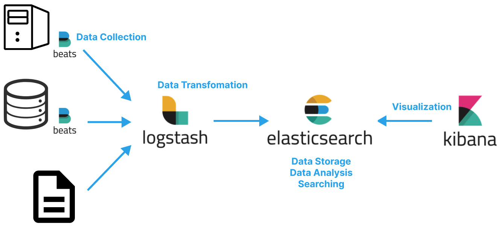

# Table of Contents
[[toc]]

# Logstash
`Logstash`는 데이터 소스의 데이터를 실시간으로 수집하여 Elastic Search로 전달하는 파이프 라인 엔진이다. 여러 데이터 소스로부터 발생하는 데이터를 적절하게 변환한다.



## 설치 및 설정
```
$ brew install elastic/tap/logstash-full
```
```
$ brew info elastic/tap/logstash-full
elastic/tap/logstash-full: stable 7.17.4
Tool for managing events and logs
https://www.elastic.co/products/logstash
Conflicts with:
  logstash
  logstash-oss
/usr/local/Cellar/logstash-full/7.17.4 (12,937 files, 600.8MB) *
  Built from source on 2022-06-07 at 03:25:25
From: https://github.com/elastic/homebrew-tap/blob/HEAD/Formula/logstash-full.rb
==> Caveats
Please read the getting started guide located at:
  https://www.elastic.co/guide/en/logstash/current/getting-started-with-logstash.html
```
Homebrew로 Logstash를 설치한 경우 설정 파일은 `/usr/local/etc/logstash`에 위치한다.
```
$ pwd
/usr/local/etc/logstash
 
$ ls
jvm.options          logstash-sample.conf pipelines.yml
log4j2.properties    logstash.yml         startup.options
```

## 사용법
먼저 `Logstash`가 데이터를 어떻게 변환하고 처리할지를 `.conf`확장자 파일에 정의해야한다. 표준입력과 표준출력을 사용하는 `logstash.conf`를 다음과 같이 정의해보자.
```
input {
	stdin { }
}
output {
	stdout { }
}
```
그리고 다음과 같이 Logstash를 실행한다. 이 때 `.conf`확장자 파일을 `-f`옵션으로 넘겨주면 된다.
```
$ logstash -f ./logstash-std.conf
```
```
logstash -f logstash-std.config         
Using bundled JDK: /usr/local/Cellar/logstash-full/7.17.4/libexec/jdk.app/Contents/Home
OpenJDK 64-Bit Server VM warning: Option UseConcMarkSweepGC was deprecated in version 9.0 and will likely be removed in a future release.
Sending Logstash logs to /usr/local/Cellar/logstash-full/7.17.4/libexec/logs which is now configured via log4j2.properties
[2022-06-07T16:33:15,128][INFO ][logstash.runner          ] Log4j configuration path used is: /usr/local/Cellar/logstash-full/7.17.4/libexec/config/log4j2.properties
[2022-06-07T16:33:15,139][INFO ][logstash.runner          ] Starting Logstash {"logstash.version"=>"7.17.4", "jruby.version"=>"jruby 9.2.20.1 (2.5.8) 2021-11-30 2a2962fbd1 OpenJDK 64-Bit Server VM 11.0.14.1+1 on 11.0.14.1+1 +indy +jit [darwin-x86_64]"}
[2022-06-07T16:33:15,142][INFO ][logstash.runner          ] JVM bootstrap flags: [-Xms1g, -Xmx1g, -XX:+UseConcMarkSweepGC, -XX:CMSInitiatingOccupancyFraction=75, -XX:+UseCMSInitiatingOccupancyOnly, -Djava.awt.headless=true, -Dfile.encoding=UTF-8, -Djdk.io.File.enableADS=true, -Djruby.compile.invokedynamic=true, -Djruby.jit.threshold=0, -Djruby.regexp.interruptible=true, -XX:+HeapDumpOnOutOfMemoryError, -Djava.security.egd=file:/dev/urandom, -Dlog4j2.isThreadContextMapInheritable=true]
[2022-06-07T16:33:15,245][WARN ][logstash.config.source.multilocal] Ignoring the 'pipelines.yml' file because modules or command line options are specified
[2022-06-07T16:33:16,424][INFO ][logstash.agent           ] Successfully started Logstash API endpoint {:port=>9600, :ssl_enabled=>false}
[2022-06-07T16:33:17,503][INFO ][org.reflections.Reflections] Reflections took 92 ms to scan 1 urls, producing 119 keys and 419 values 
[2022-06-07T16:33:18,438][INFO ][logstash.javapipeline    ][main] Starting pipeline {:pipeline_id=>"main", "pipeline.workers"=>8, "pipeline.batch.size"=>125, "pipeline.batch.delay"=>50, "pipeline.max_inflight"=>1000, "pipeline.sources"=>["/usr/local/etc/logstash/logstash-std.config"], :thread=>"#<Thread:0x256e3527 run>"}
[2022-06-07T16:33:19,231][INFO ][logstash.javapipeline    ][main] Pipeline Java execution initialization time {"seconds"=>0.79}
WARNING: An illegal reflective access operation has occurred
WARNING: Illegal reflective access by com.jrubystdinchannel.StdinChannelLibrary$Reader (file:/usr/local/Cellar/logstash-full/7.17.4/libexec/vendor/bundle/jruby/2.5.0/gems/jruby-stdin-channel-0.2.0-java/lib/jruby_stdin_channel/jruby_stdin_channel.jar) to field java.io.FilterInputStream.in
WARNING: Please consider reporting this to the maintainers of com.jrubystdinchannel.StdinChannelLibrary$Reader
WARNING: Use --illegal-access=warn to enable warnings of further illegal reflective access operations
WARNING: All illegal access operations will be denied in a future release
[2022-06-07T16:33:19,309][INFO ][logstash.javapipeline    ][main] Pipeline started {"pipeline.id"=>"main"}
The stdin plugin is now waiting for input:
[2022-06-07T16:33:19,364][INFO ][logstash.agent           ] Pipelines running {:count=>1, :running_pipelines=>[:main], :non_running_pipelines=>[]}
```
표준입력(키보드)로 데이터를 입력하면 표준출력(모니터)로 결과물이 출력되게된다.
```
hello
{
       "message" => "hello",
      "@version" => "1",
    "@timestamp" => 2022-06-07T07:34:36.059Z,
          "host" => "yologger-MacBookPro.local"
}
goodbye
{
       "message" => "goodbye",
      "@version" => "1",
    "@timestamp" => 2022-06-07T07:34:47.710Z,
          "host" => "yologger-MacBookPro.local"
}
```
파일에서 데이터를 읽어서 적절학게 필터링한 후 ElasticSearch로 전달하도록 `.conf`파일을 정의할 수도 있다.
```
input {
  file {
    path => "/home/yologger/Documents/data/stock.csv"
    start_position => "beginning"
    sincedb_path => "/dev/null"    
  }
}
filter {
  csv {
      separator => ","
      columns => ["Date","Open","High","Low","Close","Volume","Adj Close"]
  }
  mutate {convert => ["Open", "float"]}
  mutate {convert => ["High", "float"]}
  mutate {convert => ["Low", "float"]}
  mutate {convert => ["Close", "float"]}
}
output {  
    elasticsearch {
        hosts => "localhost"
        index => "stock"
    }
    stdout {}
}
```
`Filebeat`로 부터 데이터를 받아 조건에 따라 다른 형태로 결과를 보낼 수도 있다.
```
input { 
    beats {
        port => 5044
    }
}

output {
    if [beat][hostname] == "ip-172-31-30-178" or [beat][hostname] == "ip-172-31-30-179" {
        elasticsearch {
            hosts => "localhost:9200"
            manage_template => false
            index => "tomcat-%{+YYYY.MM.dd}"
            document_type => "%{[@metadata][type]}"
        }
    }
    else if [beat][hostname] == "ip-172-31-30-180" {
        elasticsearch {
            hosts => "localhost:9200"
            manage_template => false
            index => "database-%{+YYYY.MM.dd}"
            document_type => "%{[@metadata][type]}"
        }
    }
    else {
        elasticsearch {
            hosts => "localhost:9200"
            manage_template => false
            index => "%{[@metadata][beat]}-%{+YYYY.MM.dd}"
            document_type => "%{[@metadata][type]}"
        }
    }
}
```