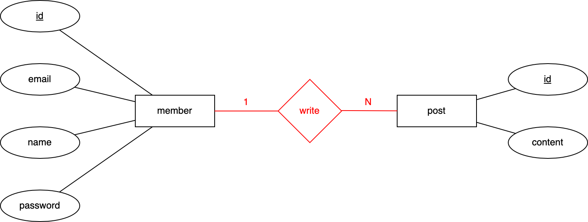

# Table of Contents
[[toc]]

## 데이터 모델링
<b>`데이터 모델링`</b>이란 도메인의 개념을 데이터베이스 테이블로 설계하는 작업이다. 데이터 모델링은 크게 세 단계로 이루어진다.

- 개념적 데이터 모델링
- 논리적 데이터 모델링
- 물리적 데이터 모델링

## 개념적 데이터 모델링
<b>`개념적 데이터 모델링`</b>은 <u>ER Diagram</u>의 <u>도형</u>으로 데이터의 관계를 표현하는 것을 의미한다.

예를 들어 하나의 사용자는 여러 게시글을 작성할 수 있다. 이를 개념적 데이터 모델링으로 표현하면 다음과 같다.


하나의 사용자는 여러 상품을 구매할 수 있다. 한 상품도 여러 사용자가 구매할 수 있다. 이를 개념적 데이터 모델링으로 표현하면 다음과 같다.


`ER Diagram`에서는 엔티티 사이의 관계를 여러가지 표기법으로 나타낼 수 있다.
- Peter Chen 표기법
- Crow's Feet 표기법
- UML 표기법

### Peter Chen 표기법
사용자와 게시글의 관계를 `Peter Chen 표기법`으로 표현하면 다음과 같다.



사용자와 상품의 관계를 `Peter Chen 표기법`으로 표현하면 다음과 같다.


### Crow's Feet 표기법
사용자와 게시글의 관계를 `Crow's Feet 표기법`으로 표현하면 다음과 같다.


사용자와 상품의 관계를 `Crow's Feet 표기법`으로 표현하면 다음과 같다.


선 끝 기호의 의미는 다음과 같다.


### UML 표기법
사용자와 게시글의 관계를 `UML 표기법`으로 표현하면 다음과 같다.


사용자와 상품의 관계를 `UML 표기법`으로 표현하면 다음과 같다.


## 논리적 데이터 모델링
<b>`논리적 데이터 모델링`</b>은 <u>테이블</u>로 데이터의 관계를 표현하는 것을 의미한다. 테이블의 컬럼의 자료형은 꼭 특정 데이터베이스에 종속될 필요는 없다. 또한 테이블 간 관계를 위에서 언급한 다양한 표기법으로 표현해도 된다.

예제에서는 `Crow's Feet 표기법`과 `UML 표기법`를 혼합해서 사용해보자.

하나의 사용자는 여러 게시글을 가질 수 있다. 이를 논리적 데이터 모델링으로 표현하면 다음과 같다.


하나의 사용자는 여러 상품을 구매할 수 있다. 한 상품도 여러 사용자가 구매할 수 있다. 이를 논리적 데이터 모델링으로 표현하면 다음과 같다.


## 물리적 데이터 모델링
<b>`물리적 데이터 모델링`</b>은 실제로 사용하는 데이터베이스에 종속되는 <u>DDL</u>로 모델링하는 것이다.

하나의 사용자는 여러 게시글을 가질 수 있다. 이를 물리적 데이터 모델링으로 표현하면 다음과 같다.
```
CREATE TABLE member (
    id BIGINT AUTO INCREMENT NOT NULL PRIMARY KEY,
    email VARCHAR(255),
    name VARCHAR(255),
    password VARCHAR(255)
);
```
```
CREATE TABLE post (
    id BIGINT AUTO INCREMENT NOT NULL PRIMARY KEY,
    content TEXT,
    writer_id BIGINT,
    FOREIGN KEY writer_id REFERENCES member(id)
);
```

하나의 사용자는 여러 상품을 구매할 수 있다. 한 상품도 여러 사용자가 구매할 수 있다. 이를 물리적 데이터 모델링으로 표현하면 다음과 같다.
```
CREATE TABLE member (
    id BIGINT AUTO INCREMENT NOT NULL PRIMARY KEY,
    email VARCHAR(255),
    name VARCHAR(255),
    password VARCHAR(255)
);
```
```
CREATE TABLE product (
    id BIGINT AUTO INCREMENT NOT NULL PRIMARY KEY,
    name VARCHAR(255)
);
```
```
CREATE TABLE order (
    id BIGINT AUTO INCREMENT NOT NULL PRIMARY KEY,
    member_id BIGINT,
    product_id BIGINT,
    FOREIGN KEY member_id REFERENCES member(id),
    FOREIGN KEY product_id REFERENCES product(id)
);
```


