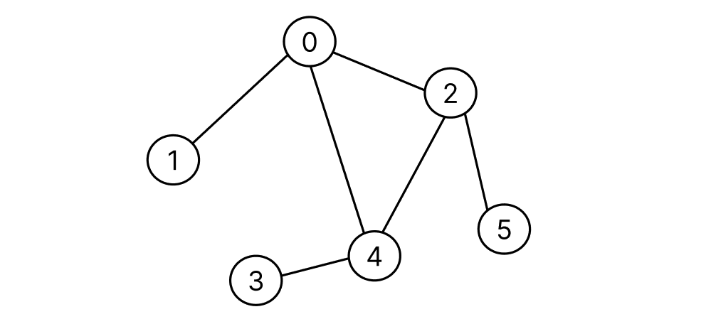

# Table of Contents
[[toc]]

## 자료 구조의 종류
`자료 구조`는 크게 `선형 구조`와 `비선형 구조`로 나뉜다.
- `선형 구조`
    - `Array`
    - `Dynamic Array`
    - `Stack`
    - `Queue`
    - `Deque`
    - `Linked List`
- `비선형 구조`
    - `Tree`
    - `Graph`

## Array

`배열(Array)`는 다음과 같은 특징이 있다.

- 배열이 생성될 때 크기가 고정되며, 크기를 변경할 수 없다.
- 데이터 읽기, 쓰기, 변경은 `Random Access`가 가능하므로 `O(1)`의 시간 복잡도를 갖는다.
- 물리적으로도 메모리 상에서 근접하게 위치하는 `지역성`을 갖는다.

`1차원 배열`은 다음과 같이 선언한다.
```java
int[] numbers = {1, 2, 3, 4, 5};
```

`2차원 배열`은 다음과 같이 선언한다.

```java 2차원 배열
int[][] numbers = {
    { 1, 2, 3 },
    { 4, 5, 6 },
    { 7, 8, 9 }
};
```

## Dynamic Array

`Dynamic Array`는 다음과 같은 특징이 있다.

- 배열의 크기를 변경할 수 있다.
- 일반적으로 `Array` 크기가 꽉 차면, 두 배 크기의 새로운 `Array`를 생성한 후 데이터를 복사한다.

`Java`에서는 `ArrayList`가 `Dynamic Array`의 역할을 한다.

``` java ArrayList
import java.util.ArrayList;

ArrayList<Integer> dArr = new ArrayList<Integer>();

// 데이터 추가
dArr.add(1);
dArr.add(2);
dArr.add(3);

// 데이터 변경
dArr.set(1, 5);

// 데이터 접근
dArr.get(1);

// 데이터 삭제
dArr.remove(2);
```

## LinkedList
`LinkedList`는 내부적으로 `Array` 대신 다음 노드의 주소값을 저장하는 `노드(Node)`를 사용한다.
``` java
import java.util.LinkedList;

public class LinkedList<T> {

    class Node<T> {
        private T data;
        public Node next;
    }

    // ...
}
```
Java에서는 다음과 같이 `LinkedList`를 사용할 수 있다.
``` java
List<Integer> linkedList = new LinkedList<Integer>();

// 데이터 추가
linkedList.add(1);
linkedList.add(2);
linkedList.add(3);
```

## Stack
`Stack`은 `FILO(First-in, Last-out)`의 자료구조다.
``` java Stack
import java.util.Stack;

Stack<Integer> stack = new Stack<Integer>();

stack.push(1);
stack.push(2);

stack.pop();    // 2
stack.pop();    // 1
```

## Queue
`Queue`는 `FIFO(First-in, Last-out)`의 자료구조다. `Queue`인터페이스와 `LinkedList`클래스로 구현할 수 있다.
``` java Queue
import java.util.Queue;
import java.util.LinkedList;

Queue<Integer> queue = new LinkedList<Integer>();

queue.add(1);
queue.add(2);

queue.remove();    // 1
queue.remove();    // 2
```

## Deque
<b>`Deque`</b>는 `Stack`과 `Queue`를 합친 자료구조다. Java에서는 `Deque`인터페이스와 `ArrayDeque`클래스로 구현한다.
``` java Deque
import java.util.Deque;
import java.util.ArrayDeque;

Deque<Integer> deque = new ArrayDeque<Integer>();

deque.addFirst(1);
deque.addLast(2);
deque.addLast(3);

deque.removeFirst();    // 1
deque.removeLast();     // 3
```


## Hash Table

### 특징
- `Key-Value`로 이루어진 자료구조다.
- `Key`와 `Hash Function`으로 데이터를 저장할 주소값을 계산한다. 
    - `HashFunction(key)` = `해시 함수의 반환값` = `해시 값` = `해시 주소` = `Hash Table의 인덱스`
- `Hash Table`은 보통 고정된 `배열`로 설계한다.
- `충돌(Collision)`이 발생하지 않도록 잘 설계해야한다.

### 장점
- 쓰기, 읽기, 검색이 빠르다.

### 단점
- 충돌

### 구현
``` java
public class MyHash {

    public class Slot {
        String value;
        Slot(String value) {
            this.value = value;
        }
    }

    public Slot[] hashTable;

    public MyHash(Integer size) {
        this.hashTable = new Slot[size];
    }

    public int hashFunction(String key) {
				// Division 기법
        return (int)(key.charAt(0)) % this.hashTable.length;
    }

    public boolean save(String key, String value) {
        Integer address = hashFunction(key);

        if (this.hashTable[address] != null) {
						// Overwrite
            this.hashTable[address].value = value;
        } else {
            this.hashTable[address] = new Slot(value);
        }
        return true;
    }

    public String get(String key) {
        Integer address = hashFunction(key);

        if (this.hashTable[address] != null) {
            return this.hashTable[address].value;
        } else {
            return null;
        }
    }

    public static void main(String[] args) {
        MyHash hash = new MyHash(20);
        hash.save("Paul", "01055555555");
        hash.save("Jonh", "01011111111");

        hash.get("Paul");  // 01055555555
    }
}
```

### 충돌
`Key`에 대한 `Hash Value`가 동일한 경우 `충돌(Collision)`이 발생한다. 
``` java
MyHash hash = new MyHash(20);

// 다른 Key이지만 Hash값 중복이 발생
hash.save("Paul", "01011111111");
hash.save("Paulo", "01022222222");
hash.save("Pogba", "01033333333");

hash.get("Paul");   // 01033333333
```
따라서 이를 해결하기 위한 별도의 `충돌 해결 알고리즘`이 필요하다.

- `Open Hashing`: 추가적인 공간을 사용한다.
    - `Chaining`: 충돌이 일어나면 연결 리스트로 데이터를 추가하여 뒤에 연결한다.
- `Closed Hashing`: 추가적인 공간을 사용하지 않는다.
    - `Linear Probing`: 충돌이 일어나면 빈 공간이 나오는 다음 공간에 데이터를 추가한다.

`Chaining` 예제는 다음과 같다.
``` java
public class MyHash {

    public class Slot {

        String value;
        String key;
        Slot next;

        Slot(String key, String value) {
            this.value = value;
            this.key = key;
            this.next = null;
        }
    }

    public Slot[] hashTable;

    public MyHash(Integer size) {
        this.hashTable = new Slot[size];
    }

    public int hashFunction(String key) {
        return (int)(key.charAt(0)) % this.hashTable.length;
    }

    public boolean save(String key, String value) {

        Integer address = this.hashFunction(key);

				// 충돌이 발생했다면
        if (this.hashTable[address] != null) {
						
            Slot findSlot = this.hashTable[address];
            Slot prevSlot = this.hashTable[address];

            // findSlot이 null이 아닐 때 까지, 즉 끝까지 반복
            while (findSlot != null) {
								 // Hash값이 동일하지만(충돌), key가 내가 찾는 key가 맞는 경우 
                 if (findSlot.key == key) {
                     findSlot.value = value;
                     return true;

								 // Hash 값이 동일하지만(충돌), key가 내가 찾는 key가 아닌 경우
                 } else {
                     prevSlot = findSlot;
										 // 다음 슬롯으로 이동
                     findSlot = findSlot.next;
                 }
            }
            prevSlot.next = new Slot(key, value);

				// 중복이 발생하지 않았다면
        } else {
            this.hashTable[address] = new Slot(key, value);
        }
        return true;
    }

    public String get(String key) {
        Integer address = this.hashFunction(key);

        if (this.hashTable[address] != null) {
            Slot findSlot = this.hashTable[address];
            while(findSlot!=null) {
                if (findSlot.key == key) {
                    return findSlot.value;
                } else {
                    findSlot = findSlot.next;
                }
            }
            return null;
        } else {
            return null;
        }
    }

    public static void main(String[] args) {
        MyHash hash = new MyHash(20);
        hash.save("Paul", "01011111111");
        hash.save("Paulo", "01022222222");
        hash.save("Pogba", "01033333333");

        System.out.println(hash.getData("Paul"));   // 01011111111
    }
}
```

`Linear Probing` 예제는 다음과 같다.
``` java
public class MyHash {

    public class Slot {
        String value;
        String key;

        Slot(String key, String value) {
            this.value = value;
            this.key = key;
        }
    }

    public Slot[] hashTable;

    public MyHash(Integer size) {
        this.hashTable = new Slot[size];
    }

    public int hashFunction(String key) {
        return (int)(key.charAt(0)) % this.hashTable.length;
    }

    public boolean save(String key, String value) {
        Integer address = this.hashFunction(key);

				// 충돌이 발생했다면
        if (this.hashTable[address] != null) {
            if (this.hashTable[address].key == key) {
                this.hashTable[address].value = value;
                return true;
            } else {
                Integer curAddress = address + 1;
                while (this.hashTable[curAddress] != null) {
                    if (this.hashTable[curAddress].key == key) {
                        this.hashTable[curAddress].value = value;
                        return true;
                    } else {
												// 다음 index로 이동
                        curAddress++;
                        if (curAddress >= this.hashTable.length) {
                            return false;
                        }
                    }
                }

                this.hashTable[curAddress] = new Slot(key, value);
            }
			
				// 충돌이 발생하지 않았다면
        } else {
            this.hashTable[address] = new Slot(key, value);
        }
        return true;
    }

    public String get(String key) {
        Integer address = this.hashFunction(key);

        if (this.hashTable[address] != null) {
            if (this.hashTable[address].key == key) {
                 return this.hashTable[address].value;
            } else {
                Integer currAddress = address + 1;
                while (this.hashTable[currAddress] != null) {
                    if (this.hashTable[currAddress] != null) {
                        return this.hashTable[currAddress].value;
                    } else {
                        currAddress++;
                        if (currAddress >= this.hashTable.length) {
                            return null;
                        }
                    }
                }

                return null;
            }
        } else {
            return null;
        }
    }

    public static void main(String[] args) {
        MyHash hash = new MyHash(20);
        hash.save("Paul", "01011111111");
        hash.save("Paulo", "01022222222");
        hash.save("Pogba", "01033333333");

        System.out.println(hash.getData("Paul"));   // 01011111111
    }
}
```

충돌을 개선하는 방법은 다음과 같다.
- 더 효율적인 `Hash Function`을 정의한다.
- `Hash Table`의 저장공간을 확대한다.


Java에서는 `Map`인터페이스를 사용한다.
``` java 
import java.util.Map;
import java.util.HashMap;

<Integer, String> map = new HashMap();

map.put(1, "Ronaldo");
map.put(2, "Kane");
map.put(3, "Paul");

map.get(2);
```

## Tree
### Tree의 구성요소
- Node
- Edge
- Root Node
- Leaf Node
- Level 0 ~ Level N
- Depth N

### Binary Tree
- 자식이 0, 1, 2개

### 완전 이진 트리
`완전 이진 트리(Complete Binary Tree)`는 다음과 같은 특성을 갖는다.
- 레벨의 왼쪽에서부터 순차적으로 노드를 추가한다.
- 레벨 N이 다 채워지지 않았는데 레벨 N+1에 노드를 추가할 수 있다.

### 이진 검색 트리
`BST(Binary Serach Tree, 이진 검색 트리)`는 다음과 같은 특성을 갖는다.
- 빠른 검색(`O(logn)`)에 사용된다. 
- Left < Root < Right


#### 구현
``` java
public class BST {

    Node root;

    public class Node {

        int element;
        Node left;
        Node right;

        public Node(int data) {
            this.element = data;
            this.left = null;
            this.right = null;
        }
    }

    public BST() {
        this.root = null;
    }

		// 삽입
    public void insertNode(int element) {
        // CASE 1: Node가 하나도 없을 때
        if (this.root == null) {
            this.root = new Node(element);

				// CASE 2: Node가 하나 이상 들어있을 때
        } else {
            
            Node current = this.root;
            while (true) {
								// CASE 2-1: 데이터가 현재 노드보다 작으면 왼쪽 노드에 삽입해야한다.
                if (element < current.element) {
                    
										// CASE 2-1-1: 왼쪽 노드가 null이 아니면 왼쪽 노드를 current 노드로 설정한다.
                    if (current.left != null) {
                        current = current.left;

										// CASE 2-1-1: 왼쪽 노드가 null이면 왼쪽 노드에 새로운 노드를 삽입하고 반복문을 종료한다.
                    } else {                        
                        current.left = new Node(element);
                        break;
                    }

								// CASE 2-2: 데이터가 현재 노드보다 크면 오른쪽 노드에 삽입해야 한다.
                } else {
                    
										// CASE 2-2-1: 오른쪽 노드가 null이 아니면 오른쪽 노드를 temp 노드로 설정한다.
                    if (current.right != null) {
                        current = current.right;

										// CASE 2-2-2: 오른쪽 노드가 null이면 오른쪽 노드에 새로운 노드를 삽입하고 반복문을 종료한다.
                    } else {
                        current.right = new Node(element);
                        break;
                    }
                }
            }
        }
    }

		// 검색
    public Node search(int element) {

        // CASE 1: Node가 하나도 없을 때
        if (this.root == null) {
            return null;

        // CASE 2: Node가 하나 이상 있을 때
        } else {
            Node current = this.root;

            while (current != null) {
				
								// CASE 2-1: 현재 노드가 찾는 노드일 때
                if (current.element == element) {
                    return current;

								// CASE 2-2: 찾는 노드가 현재 노드보다 작을 때
                } else if (element < current.element) {
                    current = current.left;

								// CASE 2-3: 찾는 노드가 현재 노드보다 클 때
                } else {                    
                    current = current.right;
                }
            }
            return null;
        }
    }

    public static void main(String[] args) {

        BST tree = new BST();

        System.out.println("================ 삽입 ================");

        tree.insertNode(5);
        tree.insertNode(3);
        tree.insertNode(9);
        tree.insertNode(1);
        tree.insertNode(7);
        tree.insertNode(10);
        tree.insertNode(8);

        System.out.println(tree.root.element);   // 5
        System.out.println(tree.root.left.element);   // 3
        System.out.println(tree.root.right.element);   // 9
        System.out.println(tree.root.left.left.element);   // 1
        System.out.println(tree.root.right.left.element);   // 7
        System.out.println(tree.root.right.right.element);   // 10
        System.out.println(tree.root.right.left.right.element);   // 8

        System.out.println("================ 삭제 ================");

        Node target = null;

        target = tree.search(8);
        System.out.println(target.element);   // 8

        target = tree.search(3);
        System.out.println(target.element);   // 3

        target = tree.search(10);
        System.out.println(target.element);   // 10

        target = tree.search(2);
        System.out.println(target);   // null

    }
}
```

#### 삭제 시 고려사항
- 삭제할 노드의 자식이 없는 경우
- 삭제할 노드가 자식이 1개 있는 경우
    - 자식 한개가 왼쪽에 있는 경우
    - 자식 한개가 오른쪽에 있는 경우
- 삭제할 노드가 자식이 2개가 있는 경우
    - 오른쪽 트리의 가장 왼쪽 요소 또는 왼쪽 트리의 가장 오른쪽 요소로 대체

#### 이진트리 순회
``` java
public class BST {

    Node root;

    public class Node {

        int element;
        Node left;
        Node right;

        public Node(int data) {
            this.element = data;
            this.left = null;
            this.right = null;
        }
    }

    public BST() {
        this.root = null;
    }

    public void preorder(Node root) {
        if (root != null) {
            System.out.print(root.element + " ");
            if(root.left != null) preorder(root.left);
            if(root.right != null) preorder(root.right);
        }
    }

    public void inorder(Node root) {
        if (root != null) {
            if(root.left != null) inorder(root.left);
            System.out.print(root.element + " ");
            if(root.right != null) inorder(root.right);
        }
    }

    public void postorder(Node root) {
        if (root != null) {
            if(root.left != null) postorder(root.left);
            if(root.right != null) postorder(root.right);
            System.out.print(root.element + " ");
        }
    }


    public static void main(String[] args) {

        BST tree = new BST();
        tree.insertNode(5);
        tree.insertNode(3);
        tree.insertNode(9);
        tree.insertNode(1);
        tree.insertNode(7);
        tree.insertNode(10);
        tree.insertNode(8);

        tree.preorder(tree.root);   // 5 3 1 9 7 8 10

        tree.inorder(tree.root);    // 1 3 5 7 8 9 10

        tree.postorder(tree.root);  // 1 3 8 7 10 9 5
    }
}
```

### Priority Quene & Heap
#### Proirity Queue
- 들어온 순서에 상관없이 우선순위가 높은 데이터가 먼저 나오는 자료구조
- 우선순위 큐는 보통 `힙(Heap)`이라는 자료구조로 구현한다.
- Java에서는 `PriorityQueue`클래스로 구현할 수 있다.

#### Heap
- 최대값과 최소값을 빠르게 찾기 위한 `완전이진트리`
- 힙의 특징
    - 최대 힙, 최소 힙이 존재한다.
    - 최대 힙의 경우, 부모 노드는 자식 노드들보다 값이 크거나 같다.
    - 최소 힙의 경우, 부모 노드는 자식 노드들보다 값이 작거나 같다.
    - 즉, 루트 노드는 값이 가장 크거나 가장 작다.
- 데이터 삽입 방법
    - 완전이진트리 끝에 노드 추가
    - 추가된 노드의 값이 부모 노드 값보다 크면 위로 계속 스왑
- 데이터 삭제
    - 힙의 삭제는 `루트 노드`를 삭제하는 것이 일반적
    - 데이터가 삭제되면 가장 높은 레벨의 끝 노드를 루트 노드로 옮긴다.
    - 그 다음 두 자식노드와 값을 비교하여 큰 노드와 스왑
    - `Collections.swap()`을 사용한다.
- 힙의 구현
    - 보통 `배열`을 사용한다.
    - `인덱스 0번`은 비워둔다.
    - 부모 노드의 인덱스 번호 = 자식 노드의 인덱스 번호 / 2
    - 왼쪽 자식의 인덱스 번호 = 부모 노드의 인덱스 번호 * 2
    - 오른쪽 자식의 인덱스 번호 = (부모 노드의 인덱스 번호 * 2) + 1

##### 최소힙
``` java
PriorityQueue<Integer> heap = new PriorityQueue<>();

heap.add(3);
heap.add(9);
heap.add(5);
heap.add(6);
heap.add(20);
heap.add(16);
heap.add(7);

System.out.println(heap.remove());    // 3
System.out.println(heap.remove());    // 5
System.out.println(heap.remove());    // 6
```

##### 최대힙
``` java
PriorityQueue<Integer> heap = new PriorityQueue<>(Collections.reverseOrder());

heap.add(3);
heap.add(9);
heap.add(5);
heap.add(6);
heap.add(20);
heap.add(16);
heap.add(7);

System.out.println(heap.poll());    // 20
System.out.println(heap.poll());    // 16
System.out.println(heap.poll());    // 9
```

## Graph

### 구성 요소
- Vertex
- Edge
- Adjacent Vertex(인접 노드)
- Degree(차수): 인접한 edge의 수
    
### 그래프의 종류
- 무방향 그래프
- 방향 그래프
- 가중치 그래프
    
### 그래프의 구현
`HashMap`과 `ArrayList`를 활용하여 그래프를 표현할 수 있다.


        
```java
import java.util.HashMap;
import java.util.ArrayList;
import java.util.Arrays;

HashMap<String, ArrayList<String>> graph = new HashMap<String, ArrayList<String>>();

graph.put("A", new ArrayList<String>(Arrays.asList("B", "C")));
graph.put("B", new ArrayList<String>(Arrays.asList("A", "D")));
graph.put("C", new ArrayList<String>(Arrays.asList("A", "G", "H", "I")));
graph.put("D", new ArrayList<String>(Arrays.asList("B", "E", "F")));
graph.put("E", new ArrayList<String>(Arrays.asList("D")));
graph.put("F", new ArrayList<String>(Arrays.asList("D")));
graph.put("G", new ArrayList<String>(Arrays.asList("C")));
graph.put("H", new ArrayList<String>(Arrays.asList("C")));
graph.put("I", new ArrayList<String>(Arrays.asList("C", "J")));
graph.put("J", new ArrayList<String>(Arrays.asList("I")));

System.out.println(graph);  
// {A=[B, C], B=[A, D], C=[A, G, H, I], D=[B, E, F], E=[D], F=[D], G=[C], H=[C], I=[C, J], J=[I]}

```

### 그래프 탐색
시작점으로부터 모든 정점을 한번씩 방문하는 방법을 `그래프 탐색`이라고 한다.
- BFS
- DFS

#### BFS(너비 우선 탐색)
        
```java
import java.util.ArrayList;
import java.util.Arrays;
import java.util.HashMap;
import java.util.Stack;

public ArrayList<String> bfs(HashMap<String, ArrayList<String>> graph, String start) {

    // 2개의 Queue를 사용한다.
    ArrayList<String> visited = new ArrayList<String>();
    ArrayList<String> needVisit = new ArrayList<String>();

    needVisit.add(start);

    while(needVisit.size() > 0) {
        String node = needVisit.remove(0);

        // 방문을 안했다면
        if (!visited.contains(node)) {
            visited.add(node);
            needVisit.addAll(graph.get(node));
        }
    }

    return visited;
}
```        
```java
HashMap<String, ArrayList<String>> graph = new HashMap<String, ArrayList<String>>();

graph.put("A", new ArrayList<String>(Arrays.asList("B", "C")));
graph.put("B", new ArrayList<String>(Arrays.asList("A", "D")));
graph.put("C", new ArrayList<String>(Arrays.asList("A", "G", "H", "I")));
graph.put("D", new ArrayList<String>(Arrays.asList("B", "E", "F")));
graph.put("E", new ArrayList<String>(Arrays.asList("D")));
graph.put("F", new ArrayList<String>(Arrays.asList("D")));
graph.put("G", new ArrayList<String>(Arrays.asList("C")));
graph.put("H", new ArrayList<String>(Arrays.asList("C")));
graph.put("I", new ArrayList<String>(Arrays.asList("C", "J")));
graph.put("J", new ArrayList<String>(Arrays.asList("I")));

System.out.println(graph);
// {A=[B, C], B=[A, D], C=[A, G, H, I], D=[B, E, F], E=[D], F=[D], G=[C], H=[C], I=[C, J], J=[I]}

System.out.println(bfs(graph, "A"));
// [A, B, C, D, G, H, I, E, F, J]
```
        
#### DFS(깊이 우선 탐색)
        
```java
import java.util.ArrayList;
import java.util.Arrays;
import java.util.HashMap;
import java.util.Stack;

public ArrayList<String> dfs(HashMap<String, ArrayList<String>> graph, String start) {

    // 1개의 Queue, 1개의 Stack을 사용한다.
    ArrayList<String> visited = new ArrayList<String>();
    Stack<String> needVisit = new Stack<String>();

    needVisit.push(start);

    while (needVisit.size() > 0) {
        String node = needVisit.pop();

        // 방문을 안했다면
        if (!visited.contains(node)) {
            visited.add(node);
            ArrayList<String> adjacent = graph.get(node);
            for(int i=0; i<adjacent.size(); i++) {
                needVisit.push(adjacent.get(i));
            }
        }
    }

    return visited;
}
```

```java
HashMap<String, ArrayList<String>> graph = new HashMap<String, ArrayList<String>>();

graph.put("A", new ArrayList<String>(Arrays.asList("B", "C")));
graph.put("B", new ArrayList<String>(Arrays.asList("A", "D")));
graph.put("C", new ArrayList<String>(Arrays.asList("A", "G", "H", "I")));
graph.put("D", new ArrayList<String>(Arrays.asList("B", "E", "F")));
graph.put("E", new ArrayList<String>(Arrays.asList("D")));
graph.put("F", new ArrayList<String>(Arrays.asList("D")));
graph.put("G", new ArrayList<String>(Arrays.asList("C")));
graph.put("H", new ArrayList<String>(Arrays.asList("C")));
graph.put("I", new ArrayList<String>(Arrays.asList("C", "J")));
graph.put("J", new ArrayList<String>(Arrays.asList("I")));

System.out.println(graph);
// {A=[B, C], B=[A, D], C=[A, G, H, I], D=[B, E, F], E=[D], F=[D], G=[C], H=[C], I=[C, J], J=[I]}

System.out.println(dfs(graph, "A"));
// [A, C, I, J, H, G, B, D, F, E]
```
        
### 최단경로 알고리즘 (다익스트라)
#### 특징
- 특정 노드에서 다른 모든 노드까지의 최단거리를 구한다.
- 방향이 있고, 가중치가 있는 그래프
- `BFS`와 유사하다.


- `거리저장 배열`: 배열에는 각 노드까지의 최단거리를 기록하는데 사용
- `우선순위 큐`: 최소 힙은 체크해야 할 노드를 저장하는데 사용
        
```java
public static class Edge implements Comparable<Edge> {

    public int distance;
    public String destination;

    public Edge(int distance, String destination) {
        this.distance = distance;
        this.destination = destination;
    }

    public String toString() {
        return "destination: " + this.destination + ", distance: " + this.distance;
    }

    @Override
    public int compareTo(Edge edge) {
        return this.distance - edge.distance;
    }
}
```
        
```java
public HashMap<String, Integer> dijkstra(HashMap<String, ArrayList<Edge>> graph, String start) {

    // 초기화
    HashMap<String, Integer> distances = new HashMap<String, Integer>();
    for (String key: graph.keySet()) {
        distances.put(key, Integer.MAX_VALUE);
    }
    distances.put(start, 0);

    PriorityQueue<Edge> priorityQueue = new PriorityQueue<Edge>();
    priorityQueue.add(new Edge(distances.get(start), start));

    // 알고리즘 시작
    Edge edge, adjacentNode;
    int currentDistance, weight, distance;
    String currentNode, adjacent;
    ArrayList<Edge> nodeList;

    while(priorityQueue.size() > 0) {
        edge = priorityQueue.poll();
        currentDistance = edge.distance;
        currentNode = edge.destination;

        if (distances.get(currentNode) < currentDistance) {
            continue;
        }

        nodeList = graph.get(currentNode);
        for (int index=0; index<nodeList.size(); index++) {
            adjacentNode = nodeList.get(index);
            adjacent = adjacentNode.destination;
            weight = adjacentNode.distance;
            distance = currentDistance + weight;

            if (distance < distances.get(adjacent)) {
                distances.put(adjacent, distance);
                priorityQueue.add(new Edge(distance, adjacent));
            }
        }
    }

    return distances;
}
```
        
```java
HashMap<String, ArrayList<Edge>> graph = new HashMap<String, ArrayList<Edge>>();

graph.put("A", new ArrayList<Edge>(Arrays.asList(new Edge(8, "B"), new Edge(1, "C"), new Edge(2, "D"))));
graph.put("B", new ArrayList<Edge>());
graph.put("C", new ArrayList<Edge>(Arrays.asList(new Edge(5, "B"), new Edge(2, "D"))));
graph.put("D", new ArrayList<Edge>(Arrays.asList(new Edge(3, "E"), new Edge(5, "F"))));
graph.put("E", new ArrayList<Edge>(Arrays.asList(new Edge(1, "F"))));
graph.put("F", new ArrayList<Edge>(Arrays.asList(new Edge(5, "A"))));

HashMap<String, Integer> result = dijkstra(graph, "A");     // {A=0, B=6, C=1, D=2, E=5, F=6}
```
        

### 신장트리
`신장트리 (Spanning Tree)`는 그래프의 모든 노드를 사이클 없이 연결한 트리다.
    
#### 최소신장트리
- 가중치 그래프에서 모든 노드를 사이클 없이 최소 비용으로 연결하는 트리
- 최소신장트리를 찾는 방법에는 두 가지가 있다.
    - 크루스컬 알고리즘
    - 프림 알고리즘

#### 크루스컬 알고리즘
- 모든 간선을 오름차순으로 연결한다.
- 최소 비용의 간선부터 선택한다.
- 사이클이 생기는 간선은 선택하지 않는다.
- 모든 노드가 연결될 때 까지 반복 실행한다.
        
```java
public class Edge implements Comparable<Edge> {

    String nodeV;
    String nodeU;
    int weight;

    public Edge(String nodeV, String nodeU, int weight) {
        this.nodeV = nodeV;
        this.nodeU = nodeU;
        this.weight = weight;
    }

    @Override
    public String toString() {
        return "{" +
                "nodeV='" + nodeV + '\'' +
                ", nodeU='" + nodeU + '\'' +
                ", weight=" + weight +
                '}';
    }

    @Override
    public int compareTo(Edge edge) {
        return this.weight - edge.weight;
    }
}
```
        
```java
import java.util.ArrayList;
import java.util.Arrays;
import java.util.Collections;
import java.util.HashMap;

public class KruskalPath {

    HashMap<String, String> parent = new HashMap<String, String>();
    HashMap<String, Integer> rank = new HashMap<String, Integer>();

    public String find(String node) {
        // 인자로 받은 노드의 루트 노드를 반환
        if (parent.get(node) != node) {
            parent.put(node, find(parent.get(node)));
        }
        return parent.get(node);
    }

    public void union(String nodeV, String nodeU) {
        String root1 = find(nodeV);
        String root2 = find(nodeU);

        // 두 그래프를 union-by-rank 기법을 사용하여 연결
        if (rank.get(root1) > rank.get(root2)) {
            parent.put(root2, root1);
        } else {
            parent.put(root1, root2);
            if (rank.get(root1) == rank.get(root2)) {
                rank.put(root2, rank.get(root2) + 1);
            }
        }
    }

    // 초기화, 각 노드를 분리된 부분집합으로 만든다.
    public void makeSet(String node) {
        // 자신을 루트노드로 만듬.
        parent.put(node, node);
        rank.put(node, 0);
    }

    public ArrayList<Edge> kruskal(ArrayList<String> vertices, ArrayList<Edge> edges) {
        ArrayList<Edge> MST = new ArrayList<Edge>();
        Edge currentEdge;

        // 초기화
        for (int index=0; index<vertices.size(); index++) {
            makeSet(vertices.get(index));
        }

        // 간선 weight로 sorting
        Collections.sort(edges);

        // weight가 작은 edge부터 뽑아서 하나씩 알고리즘 돌려본다.
        for (int index=0; index<edges.size(); index++) {
            currentEdge = edges.get(index);

            // 싸이클이 없을 때만 합친다.
            if (find(currentEdge.nodeV) != find(currentEdge.nodeU)) {
                union(currentEdge.nodeV, currentEdge.nodeU);
                MST.add(currentEdge);
            }
        }

        return MST;
    }
}
```
        
```java
ArrayList<String> vertices = new ArrayList<String>(Arrays.asList("A", "B", "C", "D", "E", "F", "G"));

ArrayList<Edge> edges = new ArrayList<Edge>();
edges.add(new Edge("A", "B", 7));
edges.add(new Edge("A", "D", 5));
edges.add(new Edge("B", "A", 7));
edges.add(new Edge("B", "D", 9));
edges.add(new Edge("B", "C", 8));
edges.add(new Edge("B", "E", 7));
edges.add(new Edge("C", "B", 8));
edges.add(new Edge("C", "E", 5));
edges.add(new Edge("D", "A", 5));
edges.add(new Edge("D", "B", 9));
edges.add(new Edge("D", "E", 7));
edges.add(new Edge("D", "F", 6));
edges.add(new Edge("E", "C", 5));
edges.add(new Edge("E", "D", 7));
edges.add(new Edge("E", "B", 7));
edges.add(new Edge("E", "F", 8));
edges.add(new Edge("E", "G", 9));
edges.add(new Edge("F", "D", 6));
edges.add(new Edge("F", "E", 8));
edges.add(new Edge("F", "G", 11));
edges.add(new Edge("G", "F", 11));
edges.add(new Edge("G", "E", 9));

KruskalPath kruskal = new KruskalPath();
ArrayList<Edge> result = kruskal.kruskal(vertices, edges);
System.out.println(result);
```
        
    
#### 프림 알고리즘
- 시작 노드를 선택한다.
- 노드에 연결된 간선 중 가장 낮은 가중치를 선택한다.
- 선택된 노드에 연결된 간선도 포함하여 가장 낮은 가중치의 간선을 선택한다.
- 사이클이 생기는 간선은 선택하지 않는다.
        
```java
public class Edge implements Comparable<Edge> {

    public int weight;
    public String node1;
    public String node2;

    public Edge(int weight, String node1, String node2) {
        this.weight = weight;
        this.node1 = node1;
        this.node2 = node2;
    }

    @Override
    public String toString() {
        return "{" +
                "weight=" + weight +
                ", node1='" + node1 + '\'' +
                ", node2='" + node2 + '\'' +
                '}';
    }

    @Override
    public int compareTo(Edge edge) {
        return this.weight - edge.weight;
    }
}
```
        
```java
public class PrimPath {

    public ArrayList<Edge> prim(String startNode, ArrayList<Edge> edges) {

        Edge currentEdge, poppedEdge, adjacentEdgeNode;
        ArrayList<Edge> currentEdgeList, candidateEdgeList, adjacentEdgeNodes;

        PriorityQueue<Edge> priorityQueue;

        ArrayList<String> connectedNodes = new ArrayList<String>();
        ArrayList<Edge> MST = new ArrayList<Edge>();
        HashMap<String, ArrayList<Edge>> adjacentEdges = new HashMap<String, ArrayList<Edge>>();

        for (int index=0; index<edges.size(); index++) {
            currentEdge = edges.get(index);
            if (!adjacentEdges.containsKey(currentEdge.node1)) {
                adjacentEdges.put(currentEdge.node1, new ArrayList<Edge>());
            }
            if (!adjacentEdges.containsKey(currentEdge.node2)) {
                adjacentEdges.put(currentEdge.node2, new ArrayList<Edge>());
            }

            for (int idx=0; index<edges.size(); idx++) {
                currentEdge = edges.get(index);
                currentEdgeList = adjacentEdges.get(currentEdge.node1);
                currentEdgeList.add(new Edge(currentEdge.weight, currentEdge.node1, currentEdge.node2));
                currentEdgeList = adjacentEdges.get(currentEdge.node2);
                currentEdgeList.add(new Edge(currentEdge.weight, currentEdge.node2, currentEdge.node1));
            }

            connectedNodes.add(startNode);
            candidateEdgeList = adjacentEdges.getOrDefault(startNode, new ArrayList<>());

            priorityQueue = new PriorityQueue<Edge>();
            for (int idx=0; idx<candidateEdgeList.size(); idx++) {
                priorityQueue.add(candidateEdgeList.get(index));
            }

            while(priorityQueue.size() > 0) {
                poppedEdge = priorityQueue.poll();
                if (!connectedNodes.contains(poppedEdge.node2)) {
                    // 해당 edge를 mst에 추가
                    connectedNodes.add(poppedEdge.node2);
                    MST.add(new Edge(poppedEdge.weight, poppedEdge.node1, poppedEdge.node2));
                    adjacentEdgeNodes = adjacentEdges.getOrDefault(poppedEdge.node2, new ArrayList<Edge>());

                    for (int idx=0; idx<adjacentEdgeNodes.size(); idx++) {
                            adjacentEdgeNode = adjacentEdgeNodes.get(idx);
                            if (!connectedNodes.contains(adjacentEdgeNode.node2)) {
                                priorityQueue.add(adjacentEdgeNode);
                            }
                    }
                }
            }
        }
        return MST;
    }
}
```
        
```java
ArrayList<String> vertices = new ArrayList<String>(Arrays.asList("A", "B", "C", "D", "E", "F", "G"));

ArrayList<Edge> edges = new ArrayList<Edge>();
edges.add(new Edge(7, "A", "B"));
edges.add(new Edge(5, "A", "D"));
edges.add(new Edge(7, "B", "A"));
edges.add(new Edge(9, "B", "D"));
edges.add(new Edge(8, "B", "C"));
edges.add(new Edge(7, "B", "E"));
edges.add(new Edge(8, "C", "B"));
edges.add(new Edge(5, "C", "E"));
edges.add(new Edge(5, "D", "A"));
edges.add(new Edge(9, "D", "B"));
edges.add(new Edge(7, "D", "E"));
edges.add(new Edge(6, "D", "F"));
edges.add(new Edge(5, "E", "C"));
edges.add(new Edge(7, "E", "D"));
edges.add(new Edge(7, "E", "B"));
edges.add(new Edge(8, "E", "F"));
edges.add(new Edge(9 ,"E", "G"));
edges.add(new Edge(6, "F", "D"));
edges.add(new Edge(8, "F", "E"));
edges.add(new Edge(11, "F", "G"));
edges.add(new Edge(11, "G", "F"));
edges.add(new Edge(9, "G", "E"));

PrimPath prim = new PrimPath();
ArrayList<Edge> result = prim.prim("A", edges);
System.out.println(result);
```