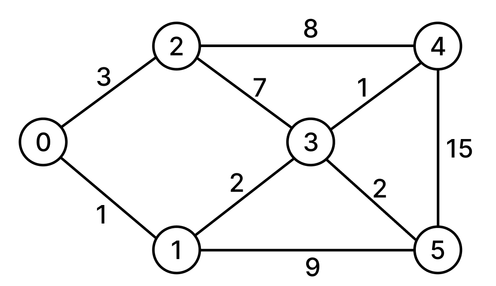

# Table of Contents
[[toc]]

## 자료 구조의 종류
자료 구조는 크게 `선형 구조`와 `비선형 구조`로 나뉜다.
- 선형 구조
    - `Array`
    - `Dynamic Array (ArrayList)`
    - `LinkedList`
    - `Stack`
    - `Queue`
    - `Deque`
- 비선형 구조
    - `Tree`
    - `Graph`

## Array

`배열(Array)`는 다음과 같은 특징이 있다.

- 배열이 생성될 때 크기가 고정되며, 크기를 변경할 수 없다.
- 데이터 읽기, 쓰기, 변경은 `Random Access`가 가능하므로 `O(1)`의 시간 복잡도를 갖는다.
- 물리적으로도 메모리 상에서 근접하게 위치하는 `지역성`을 갖는다.

`1차원 배열`은 다음과 같이 선언한다.
```java
int[] numbers = {1, 2, 3, 4, 5};
```

`2차원 배열`은 다음과 같이 선언한다.

```java 2차원 배열
int[][] numbers = {
    { 1, 2, 3 },
    { 4, 5, 6 },
    { 7, 8, 9 }
};
```

## Dynamic Array

`Dynamic Array`는 다음과 같은 특징이 있다.

- 배열의 크기를 변경할 수 있다.
- 일반적으로 `Array` 크기가 꽉 차면, 두 배 크기의 새로운 `Array`를 생성한 후 데이터를 복사한다.

Java에서는 `ArrayList`가 `Dynamic Array`의 역할을 한다.

``` java ArrayList
import java.util.ArrayList;

ArrayList<Integer> dArr = new ArrayList<Integer>();

// 데이터 추가
dArr.add(1);
dArr.add(2);
dArr.add(3);

// 데이터 변경
dArr.set(1, 5);

// 데이터 접근
dArr.get(1);

// 데이터 삭제
dArr.remove(2);
```

## LinkedList
`LinkedList`는 내부적으로 `Array` 대신 다음 노드의 주소값을 저장하는 `노드(Node)`를 사용한다.
``` java
import java.util.LinkedList;

public class LinkedList<T> {

    class Node<T> {
        private T data;
        public Node next;
    }

    // ...
}
```
Java에서는 다음과 같이 `LinkedList`를 사용할 수 있다.
``` java
List<Integer> linkedList = new LinkedList<Integer>();

// 데이터 추가
linkedList.add(1);
linkedList.add(2);
linkedList.add(3);
```

## Stack
`Stack`은 `FILO(First-in, Last-out)`의 자료구조다.
``` java Stack
import java.util.Stack;

Stack<Integer> stack = new Stack<Integer>();

stack.push(1);
stack.push(2);

stack.pop();    // 2
stack.pop();    // 1
```

## Queue
`Queue`는 `FIFO(First-in, Last-out)`의 자료구조다. `Queue`인터페이스와 `LinkedList`클래스로 구현할 수 있다.
``` java Queue
import java.util.Queue;
import java.util.LinkedList;

Queue<Integer> queue = new LinkedList<Integer>();

queue.add(1);
queue.add(2);

queue.peek();   // 1

queue.remove();    // 1
queue.remove();    // 2
```

### 기능 개발
::: details 기능 개발
프로그래머스 팀에서는 기능 개선 작업을 수행 중입니다. 각 기능은 진도가 100%일 때 서비스에 반영할 수 있습니다.

또, 각 기능의 개발속도는 모두 다르기 때문에 뒤에 있는 기능이 앞에 있는 기능보다 먼저 개발될 수 있고, 이때 뒤에 있는 기능은 앞에 있는 기능이 배포될 때 함께 배포됩니다.

먼저 배포되어야 하는 순서대로 작업의 진도가 적힌 정수 배열 progresses와 각 작업의 개발 속도가 적힌 정수 배열 speeds가 주어질 때 각 배포마다 몇 개의 기능이 배포되는지를 return 하도록 solution 함수를 완성하세요.

- 제한 사항
    - 작업의 개수(progresses, speeds배열의 길이)는 100개 이하입니다.
    - 작업 진도는 100 미만의 자연수입니다.
    - 작업 속도는 100 이하의 자연수입니다.
    - 배포는 하루에 한 번만 할 수 있으며, 하루의 끝에 이루어진다고 가정합니다. 예를 들어 진도율이 95%인 작업의 개발 속도가 하루에 4%라면 배포는 2일 뒤에 이루어집니다.

``` java

:::

### 주식 가격
::: details 주식 가격
- 문제설명

초 단위로 기록된 주식가격이 담긴 배열 prices가 매개변수로 주어질 때, 가격이 떨어지지 않은 기간은 몇 초인지를 return 하도록 solution 함수를 완성하세요.

- 제한사항

prices의 각 가격은 1 이상 10,000 이하인 자연수입니다.
prices의 길이는 2 이상 100,000 이하입니다.

- 입출력 예

|prices|prices|
|------|---|
|[1, 2, 3, 2, 3]|[4, 3, 1, 1, 0]|
	
- 입출력 예 설명
    - 1초 시점의 ₩1은 끝까지 가격이 떨어지지 않았습니다.
    - 2초 시점의 ₩2은 끝까지 가격이 떨어지지 않았습니다.
    - 3초 시점의 ₩3은 1초뒤에 가격이 떨어집니다. 따라서 1초간 가격이 떨어지지 않은 것으로 봅니다.
    - 4초 시점의 ₩2은 1초간 가격이 떨어지지 않았습니다.
    - 5초 시점의 ₩3은 0초간 가격이 떨어지지 않았습니다.

``` java
import java.util.*;

class Solution {
    public int[] solution(int[] prices) {
        ArrayList<Integer> answerList = new ArrayList<Integer>();
        ArrayList<Integer> queue = new ArrayList<Integer>();
        
        for (int i=0; i<prices.length; i++) {
            for (int j=i+1; j<prices.length; j++) {
                if (prices[i] <= prices[j]) {
                    queue.add(prices[j]);
                    // System.out.println(queue.toString());
                }
                else {
                    // System.out.println("prices[i] > prices[j]");
                    queue.add(prices[j]);
                    break;
                }
            }
            answerList.add(queue.size());
            queue.clear();
        }       
        
        // System.out.println(answerList.toString());
        
        int[] answer = new int[answerList.size()];
        for (int i=0; i<answerList.size(); i++) answer[i] = answerList.get(i);
        return answer;
    }
}
```
:::

### 다리를 지나는 트럭
::: details 다리를 지나는 트럭
- 문제 설명

트럭 여러 대가 강을 가로지르는 일차선 다리를 정해진 순으로 건너려 합니다. 모든 트럭이 다리를 건너려면 최소 몇 초가 걸리는지 알아내야 합니다. 다리에는 트럭이 최대 bridge_length대 올라갈 수 있으며, 다리는 weight 이하까지의 무게를 견딜 수 있습니다. 단, 다리에 완전히 오르지 않은 트럭의 무게는 무시합니다.

예를 들어, 트럭 2대가 올라갈 수 있고 무게를 10kg까지 견디는 다리가 있습니다. 무게가 [7, 4, 5, 6]kg인 트럭이 순서대로 최단 시간 안에 다리를 건너려면 다음과 같이 건너야 합니다.

|경과 시간|다리를 지난 트럭|다리를 건너는 트럭|대기 트럭|
|------|---|---|---|
|0|[]|[]|[7,4,5,6]|
|1~2|[]|[7]|[4,5,6]|
|3|[7]|[4]|[5,6]|
|4|[7]|[4,5]|[6]|
|5|[7,4]|[5]|[6]|
|6~7|[7,4,5]|[6]|[]|
|8|[7,4,5,6]|[]|[]|

따라서, 모든 트럭이 다리를 지나려면 최소 8초가 걸립니다.

solution 함수의 매개변수로 다리에 올라갈 수 있는 트럭 수 bridge_length, 다리가 견딜 수 있는 무게 weight, 트럭 별 무게 truck_weights가 주어집니다. 이때 모든 트럭이 다리를 건너려면 최소 몇 초가 걸리는지 return 하도록 solution 함수를 완성하세요.

- 제한 조건
    - bridge_length는 1 이상 10,000 이하입니다.
    - weight는 1 이상 10,000 이하입니다.
    - truck_weights의 길이는 1 이상 10,000 이하입니다.
    - 모든 트럭의 무게는 1 이상 weight 이하입니다.

- 입출력 예

|bridge_length|weight|truck_weights|return|
|------|---|---|---|
|2|10|[7,4,5,6]|8|
|100|100|[10]|101|
|100|100|[10,10,10,10,10,10,10,10,10,10]|110|

``` java
import java.util.*;

class Solution {
    public int solution(int bridgeLength, int bridgeLimit, int[] truckWeights) {
        
        int time = 0;
        int sum = 0;
        ArrayList<Integer> queue = new ArrayList<Integer>();
        
        for (int truckWeight: truckWeights) {
            while(true) {
                // Queue가 비어있다면
                if (queue.isEmpty()) {
                    queue.add(truckWeight);
                    sum = sum + truckWeight;
                    time ++;
                    break;
                // Queue가 비어있지 않다면    
                } else {
                    // 다리가 꽉 찼다면
                    if (queue.size() == bridgeLength) {
                        int value = queue.remove(0);
                        sum = sum - value;
                    // 다리가 꽉 차지 않았다면
                    } else {
                        // 무게 한도가 넘었다면
                        if (sum+truckWeight > bridgeLimit) {
                            queue.add(0);
                            time ++;
                        // 무게 한도가 넘지 않았다면    
                        } else {
                            queue.add(truckWeight);
                            sum = sum + truckWeight;
                            time ++;
                            break;
                        }
                    }
                }
            }
        }

        return time + bridgeLength;
    }
}
```
:::

## Deque
`Deque`는 `Stack`과 `Queue`를 합친 자료구조다. Java에서는 `Deque`인터페이스와 <b>`ArrayDeque`</b>클래스로 구현한다.
``` java
import java.util.Deque;
import java.util.ArrayDeque;

Deque<Integer> deque = new ArrayDeque<Integer>();

deque.addFirst(1);
deque.addLast(2);
deque.addLast(3);

deque.removeFirst();    // 1
deque.removeLast();     // 3
```


## Hash Table

### 특징
- `Key-Value`로 이루어진 자료구조다.
- `Key`와 `Hash Function`으로 데이터를 저장할 주소값을 계산한다. 
    - `HashFunction(key)` = `해시 함수의 반환값` = `해시 값` = `해시 주소` = `Hash Table의 인덱스`
- `Hash Table`은 보통 고정된 `배열`로 설계한다.
- 직접 접근을 하기 때문에 쓰기, 읽기, 검색에 `O(1)`의 시간 복잡도를 가진다.
- `충돌(Collision)`이 발생하면 검색하는데 `O(n)`의 시간 복잡도가 걸릴 수도 있으므로 충돌이 발생하지 않도록 잘 설계해야한다.

### 구현
``` java
public class MyHash {

    public class Slot {
        String value;
        Slot(String value) {
            this.value = value;
        }
    }

    public Slot[] hashTable;

    public MyHash(Integer size) {
        this.hashTable = new Slot[size];
    }

    public int hashFunction(String key) {
				// Division 기법
        return (int)(key.charAt(0)) % this.hashTable.length;
    }

    public boolean save(String key, String value) {
        Integer address = hashFunction(key);

        if (this.hashTable[address] != null) {
						// Overwrite
            this.hashTable[address].value = value;
        } else {
            this.hashTable[address] = new Slot(value);
        }
        return true;
    }

    public String get(String key) {
        Integer address = hashFunction(key);

        if (this.hashTable[address] != null) {
            return this.hashTable[address].value;
        } else {
            return null;
        }
    }

    public static void main(String[] args) {
        MyHash hash = new MyHash(20);
        hash.save("Paul", "01055555555");
        hash.save("Jonh", "01011111111");

        hash.get("Paul");  // 01055555555
    }
}
```

### 충돌
`Key`에 대한 `Hash Value`가 동일한 경우 `충돌(Collision)`이 발생한다. 
``` java
MyHash hash = new MyHash(20);

// 다른 Key이지만 Hash값 중복이 발생
hash.save("Paul", "01011111111");
hash.save("Paulo", "01022222222");
hash.save("Pogba", "01033333333");

hash.get("Paul");   // 01033333333
```
따라서 이를 해결하기 위한 별도의 `충돌 해결 알고리즘`이 필요하다.

- `Open Hashing`: 추가적인 공간을 사용한다.
    - `Chaining`: 충돌이 일어나면 연결 리스트로 데이터를 추가하여 뒤에 연결한다.
- `Closed Hashing`: 추가적인 공간을 사용하지 않는다.
    - `Linear Probing`: 충돌이 일어나면 빈 공간이 나오는 다음 공간에 데이터를 추가한다.

`Chaining` 예제는 다음과 같다.
``` java
public class MyHash {

    public class Slot {

        String value;
        String key;
        Slot next;

        Slot(String key, String value) {
            this.value = value;
            this.key = key;
            this.next = null;
        }
    }

    public Slot[] hashTable;

    public MyHash(Integer size) {
        this.hashTable = new Slot[size];
    }

    public int hashFunction(String key) {
        return (int)(key.charAt(0)) % this.hashTable.length;
    }

    public boolean save(String key, String value) {

        Integer address = this.hashFunction(key);

				// 충돌이 발생했다면
        if (this.hashTable[address] != null) {
						
            Slot findSlot = this.hashTable[address];
            Slot prevSlot = this.hashTable[address];

            // findSlot이 null이 아닐 때 까지, 즉 끝까지 반복
            while (findSlot != null) {
								 // Hash값이 동일하지만(충돌), key가 내가 찾는 key가 맞는 경우 
                 if (findSlot.key == key) {
                     findSlot.value = value;
                     return true;

								 // Hash 값이 동일하지만(충돌), key가 내가 찾는 key가 아닌 경우
                 } else {
                     prevSlot = findSlot;
										 // 다음 슬롯으로 이동
                     findSlot = findSlot.next;
                 }
            }
            prevSlot.next = new Slot(key, value);

				// 중복이 발생하지 않았다면
        } else {
            this.hashTable[address] = new Slot(key, value);
        }
        return true;
    }

    public String get(String key) {
        Integer address = this.hashFunction(key);

        if (this.hashTable[address] != null) {
            Slot findSlot = this.hashTable[address];
            while(findSlot!=null) {
                if (findSlot.key == key) {
                    return findSlot.value;
                } else {
                    findSlot = findSlot.next;
                }
            }
            return null;
        } else {
            return null;
        }
    }

    public static void main(String[] args) {
        MyHash hash = new MyHash(20);
        hash.save("Paul", "01011111111");
        hash.save("Paulo", "01022222222");
        hash.save("Pogba", "01033333333");

        System.out.println(hash.getData("Paul"));   // 01011111111
    }
}
```

`Linear Probing` 예제는 다음과 같다.
``` java
public class MyHash {

    public class Slot {
        String value;
        String key;

        Slot(String key, String value) {
            this.value = value;
            this.key = key;
        }
    }

    public Slot[] hashTable;

    public MyHash(Integer size) {
        this.hashTable = new Slot[size];
    }

    public int hashFunction(String key) {
        return (int)(key.charAt(0)) % this.hashTable.length;
    }

    public boolean save(String key, String value) {
        Integer address = this.hashFunction(key);

				// 충돌이 발생했다면
        if (this.hashTable[address] != null) {
            if (this.hashTable[address].key == key) {
                this.hashTable[address].value = value;
                return true;
            } else {
                Integer curAddress = address + 1;
                while (this.hashTable[curAddress] != null) {
                    if (this.hashTable[curAddress].key == key) {
                        this.hashTable[curAddress].value = value;
                        return true;
                    } else {
												// 다음 index로 이동
                        curAddress++;
                        if (curAddress >= this.hashTable.length) {
                            return false;
                        }
                    }
                }

                this.hashTable[curAddress] = new Slot(key, value);
            }
			
				// 충돌이 발생하지 않았다면
        } else {
            this.hashTable[address] = new Slot(key, value);
        }
        return true;
    }

    public String get(String key) {
        Integer address = this.hashFunction(key);

        if (this.hashTable[address] != null) {
            if (this.hashTable[address].key == key) {
                 return this.hashTable[address].value;
            } else {
                Integer currAddress = address + 1;
                while (this.hashTable[currAddress] != null) {
                    if (this.hashTable[currAddress] != null) {
                        return this.hashTable[currAddress].value;
                    } else {
                        currAddress++;
                        if (currAddress >= this.hashTable.length) {
                            return null;
                        }
                    }
                }

                return null;
            }
        } else {
            return null;
        }
    }

    public static void main(String[] args) {
        MyHash hash = new MyHash(20);
        hash.save("Paul", "01011111111");
        hash.save("Paulo", "01022222222");
        hash.save("Pogba", "01033333333");

        System.out.println(hash.getData("Paul"));   // 01011111111
    }
}
```

충돌을 개선하는 방법은 다음과 같다.
- 더 효율적인 `Hash Function`을 정의한다.
- `Hash Table`의 저장공간을 확대한다.


Java에서는 `Map`인터페이스를 사용한다.
``` java 
import java.util.Map;
import java.util.HashMap;

<Integer, String> map = new HashMap();

map.put(1, "Ronaldo");
map.put(2, "Kane");
map.put(3, "Paul");

map.get(2);
```

### 완주하지 못한 선수

::: details 완주하지 못한 선수
수많은 마라톤 선수들이 마라톤에 참여하였습니다. 단 한 명의 선수를 제외하고는 모든 선수가 마라톤을 완주하였습니다.

마라톤에 참여한 선수들의 이름이 담긴 배열 participant와 완주한 선수들의 이름이 담긴 배열 completion이 주어질 때, <u>완주하지 못한 선수의 이름</u>을 return 하도록 solution 함수를 작성해주세요.

- 제한사항
    - 마라톤 경기에 참여한 선수의 수는 1명 이상 100,000명 이하입니다.
    - completion의 길이는 participant의 길이보다 1 작습니다.
    - 참가자의 이름은 1개 이상 20개 이하의 알파벳 소문자로 이루어져 있습니다.
    - 참가자 중에는 동명이인이 있을 수 있습니다.
``` java
import java.util.*;

class Solution {
    public String solution(String[] participant, String[] completion) {
        HashMap<String, Integer> hashMap = new HashMap();
        for (String person: participant) {
            hashMap.put(person, hashMap.getOrDefault(person, 0) + 1);
        }
        for (String person: completion) {
            hashMap.put(person, hashMap.get(person) - 1);
        }
        
        for (String key: hashMap.keySet()) {
            if (hashMap.get(key) != 0) {
                return key;
            }
        }
        return "";
    }
}
``` 
``` java
import java.util.*;

class Solution {
    public String solution(String[] participant, String[] completion) {
        Arrays.sort(participant);
        Arrays.sort(completion);
        
        for (int i=0; i<completion.length; i++) {
            if (!completion[i].equals(participant[i])) {
                return participant[i];
            }
        }
        return participant[participant.length - 1];
    }
}
```
:::

### 전화번호 목록

::: details 전화번호 목록
전화번호부에 적힌 전화번호 중, 한 번호가 다른 번호의 접두어인 경우가 있는지 확인하려 합니다.
전화번호가 다음과 같을 경우, 구조대 전화번호는 영석이의 전화번호의 접두사입니다.

- 구조대 : 119
- 박준영 : 97 674 223
- 지영석 : 11 9552 4421

전화번호부에 적힌 전화번호를 담은 배열 phone_book 이 solution 함수의 매개변수로 주어질 때, 어떤 번호가 다른 번호의 접두어인 경우가 있으면 false를 그렇지 않으면 true를 return 하도록 solution 함수를 작성해주세요.
``` java
import java.util.*;

class Solution {
    public boolean solution(String[] phoneBook) {
        boolean answer = true;
        
        HashMap<String, Integer> map = new HashMap();
        
        for (int i=0; i<phoneBook.length; i++) {
            map.put(phoneBook[i], i);
        }
        
        for (int i=0; i<phoneBook.length; i++) {
            for (int j=0; j<phoneBook[i].length(); j++) {
                if (map.containsKey(phoneBook[i].substring(0, j))) {
                    return false;   
                }
            }
        }
        
        
        return answer;
    }
}
```
:::

### 위장 
::: details 위장
스파이들은 매일 다른 옷을 조합하여 입어 자신을 위장합니다.

예를 들어 스파이가 가진 옷이 아래와 같고 오늘 스파이가 동그란 안경, 긴 코트, 파란색 티셔츠를 입었다면 다음날은 청바지를 추가로 입거나 동그란 안경 대신 검정 선글라스를 착용하거나 해야 합니다.

|종류|이름|
|------|---|
|얼굴|동그란 안경, 검정 선글라스|
|상의|파란색 티셔츠|
|하의|청바지|
|겉옷|긴 코트|

- 제한사항
    - clothes의 각 행은 [의상의 이름, 의상의 종류]로 이루어져 있습니다.
    - 스파이가 가진 의상의 수는 1개 이상 30개 이하입니다.
    - 같은 이름을 가진 의상은 존재하지 않습니다.
    - clothes의 모든 원소는 문자열로 이루어져 있습니다.
    - 모든 문자열의 길이는 1 이상 20 이하인 자연수이고 알파벳 소문자 또는 '_' 로만 이루어져 있습니다.
    - 스파이는 하루에 최소 한 개의 의상은 입습니다.

``` java
import java.util.*;

class Solution {
    public int solution(String[][] clothes) {
        int answer = 1;
        
        HashMap<String, Integer> map = new HashMap();
        
        for (int i=0; i<clothes.length; i++) {
            if(!map.containsKey(clothes[i][1])) {
                map.put(clothes[i][1], 1);
            } else {
                map.put(clothes[i][1], map.get(clothes[i][1])+1);
            }
                
        }
        
        for(String key: map.keySet()) {
            answer = answer * (map.get(key)+1);
        }
        
        return answer-1;
    }
}
```
:::

## Tree
### Tree의 구성요소
- Node
- Edge
- Root Node
- Leaf Node
- Level 0 ~ Level N
- Depth N

### 이진 트리
- 자식이 0, 1, 2개

### 완전 이진 트리
`완전 이진 트리(Complete Binary Tree)`는 다음과 같은 특성을 갖는다.
- 레벨의 왼쪽에서부터 순차적으로 노드를 추가한다.
- 레벨 N이 다 채워져야만 레벨 N+1에 노드를 추가할 수 있다.

### 이진 검색 트리
`BST(Binary Serach Tree, 이진 검색 트리)`는 `Left < Root < Right`라는 특성을 갖는 이진 트리이며, 빠른 검색(`O(logn)`)에 사용된다.


#### 구현
``` java
public class BST {

    Node root;

    public class Node {

        int element;
        Node left;
        Node right;

        public Node(int data) {
            this.element = data;
            this.left = null;
            this.right = null;
        }
    }

    public BST() {
        this.root = null;
    }

		// 삽입
    public void insertNode(int element) {
        // CASE 1: Node가 하나도 없을 때
        if (this.root == null) {
            this.root = new Node(element);

				// CASE 2: Node가 하나 이상 들어있을 때
        } else {
            
            Node current = this.root;
            while (true) {
								// CASE 2-1: 데이터가 현재 노드보다 작으면 왼쪽 노드에 삽입해야한다.
                if (element < current.element) {
                    
										// CASE 2-1-1: 왼쪽 노드가 null이 아니면 왼쪽 노드를 current 노드로 설정한다.
                    if (current.left != null) {
                        current = current.left;

										// CASE 2-1-1: 왼쪽 노드가 null이면 왼쪽 노드에 새로운 노드를 삽입하고 반복문을 종료한다.
                    } else {                        
                        current.left = new Node(element);
                        break;
                    }

								// CASE 2-2: 데이터가 현재 노드보다 크면 오른쪽 노드에 삽입해야 한다.
                } else {
                    
										// CASE 2-2-1: 오른쪽 노드가 null이 아니면 오른쪽 노드를 temp 노드로 설정한다.
                    if (current.right != null) {
                        current = current.right;

										// CASE 2-2-2: 오른쪽 노드가 null이면 오른쪽 노드에 새로운 노드를 삽입하고 반복문을 종료한다.
                    } else {
                        current.right = new Node(element);
                        break;
                    }
                }
            }
        }
    }

		// 검색
    public Node search(int element) {

        // CASE 1: Node가 하나도 없을 때
        if (this.root == null) {
            return null;

        // CASE 2: Node가 하나 이상 있을 때
        } else {
            Node current = this.root;

            while (current != null) {
				
								// CASE 2-1: 현재 노드가 찾는 노드일 때
                if (current.element == element) {
                    return current;

								// CASE 2-2: 찾는 노드가 현재 노드보다 작을 때
                } else if (element < current.element) {
                    current = current.left;

								// CASE 2-3: 찾는 노드가 현재 노드보다 클 때
                } else {                    
                    current = current.right;
                }
            }
            return null;
        }
    }

    public static void main(String[] args) {

        BST tree = new BST();

        System.out.println("================ 삽입 ================");

        tree.insertNode(5);
        tree.insertNode(3);
        tree.insertNode(9);
        tree.insertNode(1);
        tree.insertNode(7);
        tree.insertNode(10);
        tree.insertNode(8);

        System.out.println(tree.root.element);   // 5
        System.out.println(tree.root.left.element);   // 3
        System.out.println(tree.root.right.element);   // 9
        System.out.println(tree.root.left.left.element);   // 1
        System.out.println(tree.root.right.left.element);   // 7
        System.out.println(tree.root.right.right.element);   // 10
        System.out.println(tree.root.right.left.right.element);   // 8

        System.out.println("================ 삭제 ================");

        Node target = null;

        target = tree.search(8);
        System.out.println(target.element);   // 8

        target = tree.search(3);
        System.out.println(target.element);   // 3

        target = tree.search(10);
        System.out.println(target.element);   // 10

        target = tree.search(2);
        System.out.println(target);   // null

    }
}
```

#### 삭제 시 고려사항
- 삭제할 노드의 자식이 없는 경우
- 삭제할 노드가 자식이 1개 있는 경우
    - 자식 한개가 왼쪽에 있는 경우
    - 자식 한개가 오른쪽에 있는 경우
- 삭제할 노드가 자식이 2개가 있는 경우
    - 오른쪽 트리의 가장 왼쪽 요소 또는 왼쪽 트리의 가장 오른쪽 요소로 대체

#### 이진트리 순회
``` java
public class BST {

    Node root;

    public class Node {

        int element;
        Node left;
        Node right;

        public Node(int data) {
            this.element = data;
            this.left = null;
            this.right = null;
        }
    }

    public BST() {
        this.root = null;
    }

    public void preorder(Node root) {
        if (root != null) {
            System.out.print(root.element + " ");
            if(root.left != null) preorder(root.left);
            if(root.right != null) preorder(root.right);
        }
    }

    public void inorder(Node root) {
        if (root != null) {
            if(root.left != null) inorder(root.left);
            System.out.print(root.element + " ");
            if(root.right != null) inorder(root.right);
        }
    }

    public void postorder(Node root) {
        if (root != null) {
            if(root.left != null) postorder(root.left);
            if(root.right != null) postorder(root.right);
            System.out.print(root.element + " ");
        }
    }


    public static void main(String[] args) {

        BST tree = new BST();
        tree.insertNode(5);
        tree.insertNode(3);
        tree.insertNode(9);
        tree.insertNode(1);
        tree.insertNode(7);
        tree.insertNode(10);
        tree.insertNode(8);

        tree.preorder(tree.root);   // 5 3 1 9 7 8 10

        tree.inorder(tree.root);    // 1 3 5 7 8 9 10

        tree.postorder(tree.root);  // 1 3 8 7 10 9 5
    }
}
```

### Priority Quene & Heap
#### Proirity Queue
- 들어온 순서에 상관없이 우선순위가 높은 데이터가 먼저 나오는 자료구조
- 우선순위 큐는 보통 `힙(Heap)`이라는 자료구조로 구현한다.
- Java에서는 `PriorityQueue`클래스로 구현할 수 있다.

#### Heap
- 최대값과 최소값을 빠르게 찾기 위한 `완전이진트리`
- 힙의 특징
    - 최대 힙, 최소 힙이 존재한다.
    - 최대 힙의 경우, 부모 노드는 자식 노드들보다 값이 크거나 같다.
    - 최소 힙의 경우, 부모 노드는 자식 노드들보다 값이 작거나 같다.
    - 즉, 루트 노드는 값이 가장 크거나 가장 작다.
- 데이터 삽입 방법
    - 완전이진트리 끝에 노드 추가
    - 추가된 노드의 값이 부모 노드 값보다 크면 위로 계속 스왑
- 데이터 삭제
    - 힙의 삭제는 `루트 노드`를 삭제하는 것이 일반적
    - 데이터가 삭제되면 가장 높은 레벨의 끝 노드를 루트 노드로 옮긴다.
    - 그 다음 두 자식노드와 값을 비교하여 큰 노드와 스왑
    - `Collections.swap()`을 사용한다.
- 힙의 구현
    - 보통 `배열`을 사용한다.
    - `인덱스 0번`은 비워둔다.
    - 부모 노드의 인덱스 번호 = 자식 노드의 인덱스 번호 / 2
    - 왼쪽 자식의 인덱스 번호 = 부모 노드의 인덱스 번호 * 2
    - 오른쪽 자식의 인덱스 번호 = (부모 노드의 인덱스 번호 * 2) + 1

#### 최소힙
``` java
PriorityQueue<Integer> heap = new PriorityQueue<>();

heap.add(3);
heap.add(9);
heap.add(5);
heap.add(6);
heap.add(20);
heap.add(16);
heap.add(7);

System.out.println(heap.remove());    // 3
System.out.println(heap.remove());    // 5
System.out.println(heap.remove());    // 6
```

#### 최대힙
``` java
PriorityQueue<Integer> heap = new PriorityQueue<>(Collections.reverseOrder());

heap.add(3);
heap.add(9);
heap.add(5);
heap.add(6);
heap.add(20);
heap.add(16);
heap.add(7);

System.out.println(heap.poll());    // 20
System.out.println(heap.poll());    // 16
System.out.println(heap.poll());    // 9
```

#### Comparator
``` java
class Student {
    String name;
    int age;

    public Student(String name, int age) {
        this.name = name;
        this.age = age;
    }
}
```
``` java
PriorityQueue<Student> heap = new PriorityQueue(new Comparator() {
    @Overide
    public int compare(Student s1, Student s2) {
        return s1.age - os.age;
    }
});
head.add(new Student("Paul", 30));
head.add(new Student("John", 10));
head.add(new Student("Son", 20));
```

#### Comparable
``` java
class Student implements Comparable<Student> {
    String name;
    int age;

    public Student(String name, int age) {
        this.name = name;
        this.age = age;
    }

    @Override
    public int compareTo(Student target) {
        return this.age - target.age;
    }
}
```
``` java
PriorityQueue<Student> heap = new PriorityQueue();
head.add(new Student("Paul", 30));
head.add(new Student("John", 10));
head.add(new Student("Son", 20));
```

#### 더 맵게
::: details 더 맵게
매운 것을 좋아하는 Leo는 모든 음식의 스코빌 지수를 K 이상으로 만들고 싶습니다. 모든 음식의 스코빌 지수를 K 이상으로 만들기 위해 Leo는 스코빌 지수가 가장 낮은 두 개의 음식을 아래와 같이 특별한 방법으로 섞어 새로운 음식을 만듭니다.
```
섞은 음식의 스코빌 지수 = 가장 맵지 않은 음식의 스코빌 지수 + (두 번째로 맵지 않은 음식의 스코빌 지수 * 2)
```
Leo는 모든 음식의 스코빌 지수가 K 이상이 될 때까지 반복하여 섞습니다.
Leo가 가진 음식의 스코빌 지수를 담은 배열 scoville과 원하는 스코빌 지수 K가 주어질 때, 모든 음식의 스코빌 지수를 K 이상으로 만들기 위해 섞어야 하는 최소 횟수를 return 하도록 solution 함수를 작성해주세요.

- 제한 사항
    - scoville의 길이는 2 이상 1,000,000 이하입니다.
    - K는 0 이상 1,000,000,000 이하입니다.
    - scoville의 원소는 각각 0 이상 1,000,000 이하입니다.
    - 모든 음식의 스코빌 지수를 K 이상으로 만들 수 없는 경우에는 -1을 return 합니다.

- 입출력 예

|scoville|K|return|
|------|---|---|
|[1, 2, 3, 9, 10, 12]|7|2|

``` java
import java.util.*;

class Solution {
    public int solution(int[] scoville, int K) {

        int count = 0;
        PriorityQueue<Integer> heap = new PriorityQueue();

        for (int i=0; i<scoville.length; i++) {
            heap.add(scoville[i]);    
        }

        while (heap.peek() < K) {
            if (heap.size() == 1) break;
            int sum = heap.remove() + (heap.remove()*2);
            heap.add(sum);
            count++;
        }

        if (heap.peek() < K) return -1;

        return count;
    }
}
```
:::

### Balanced Tree
- Binary Search Tree는 좌우 균형이 맞지 않으면 최악의 경우 `O(n)`의 시간 복잡도를 갖게 된다.
- Balanced Tree는 삽입, 삭제, 변경 시 필요하면 균형을 맞춰서 `O(logn)`의 시간 복잡도를 갖게 한다.
- Balanced Tree에는 AVL Tree, 2-3 Tree, 2-3-4 Tree, Red-Black Tree, B-Tree 등이 있다.


#### B-Tree
- 하나의 노드에 여러 자료가 배치되는 자료구조
- 한 노드에 N개의 자료가 저장되면 N차 B-tree라고 한다.
- 한 노드에 N개의 자료가 저장된다면 그 노드의 자식 수는 N+1개 여야한다.

## Graph

### 구성 요소
- Vertex
- Edge
- Adjacent Vertex(인접 노드)
- Degree(차수): 인접한 edge의 수
    
### 그래프의 종류
- 무방향 그래프
- 방향 그래프
- 가중치 그래프
    
### 그래프의 구현
그래프는 두 가지 방법으로 구현할 수 있다.
- 인접 행렬
- 인접 리스트

### 인접 행렬
그래프를 인접행렬로 표현하면 다음과 같다.


``` java
int[][] graph = {
        {0, 1, 1, 0, 1, 0},
        {1, 0, 0, 0, 0, 0},
        {1, 0, 0, 0, 1, 1},
        {0, 0, 0, 0, 1, 0},
        {1, 0, 1, 1, 0, 0},
        {0, 0, 1, 0, 0, 0}
};
```
`graph[0][1]`은 0번 Vertext와 1번 Vertext 사이에 Edge가 존재함을 의미한다.

### 인접 리스트
그래프를 인접 리스트로 구현하면 다음과 같다.


        
```java
HashMap<Integer, ArrayList<Integer>> graph = new HashMap();

graph.put(0, new ArrayList<Integer>(Arrays.asList(1, 2, 4)));
graph.put(1, new ArrayList<Integer>(Arrays.asList(0)));
graph.put(2, new ArrayList<Integer>(Arrays.asList(0, 4, 5)));
graph.put(3, new ArrayList<Integer>(Arrays.asList(4)));
graph.put(4, new ArrayList<Integer>(Arrays.asList(0, 2, 3)));
graph.put(5, new ArrayList<Integer>(Arrays.asList(2)));
```

### 그래프 탐색
시작점으로부터 모든 정점을 한번씩 방문하는 방법을 `그래프 탐색`이라고 한다.
- DFS
- BFS
        
### DFS(깊이 우선 탐색)
`DFS`는 `Stack` 또는 `재귀(Recursion)`을 통해 구현할 수 있다.

인접 행렬을 `Stack`으로 풀면 다음과 같다.
``` java
public class App {
    public static void main(String[] args) {
        int[][] graph = {
                {0, 1, 1, 0, 1, 0},
                {1, 0, 0, 0, 0, 0},
                {1, 0, 0, 0, 1, 1},
                {0, 0, 0, 0, 1, 0},
                {1, 0, 1, 1, 0, 0},
                {0, 0, 1, 0, 0, 0}
        };

        System.out.println(bfs(graph, 0));
    }

    public static ArrayList<Integer> bfs(int[][] graph, int start) {
        Stack<Integer> needVisit = new Stack<Integer>();
        ArrayList<Integer> visited = new ArrayList<Integer>();

        needVisit.push(start);

        while(needVisit.size() > 0) {
            // 방문이 필요한 노드 하나를 가져와서
            int node = needVisit.pop();

            // 방문하지 않았다면
            if (!visited.contains(node)) {
                // 방문하고
                visited.add(node);

                // 인접한 노드 중에서 방문하지 않는 노드를 needVisit에 넣는다
                for (int i=0; i<graph[node].length; i++) {
                    if (graph[node][i] == 1 && !visited.contains(i)) {
                        needVisit.push(i);
                    }
                }
            }
        }
        return visited;
    }
}
```

인접 행렬을 `재귀(Recursion)`로 풀면 다음과 같다.
``` java
public class App {

    public static void main(String[] args) {
        int[][] graph = {
                {0, 1, 1, 0, 1, 0},
                {1, 0, 0, 0, 0, 0},
                {1, 0, 0, 0, 1, 1},
                {0, 0, 0, 0, 1, 0},
                {1, 0, 1, 1, 0, 0},
                {0, 0, 1, 0, 0, 0}
        };

        boolean[] isVisited = new boolean[graph.length];

        List<Integer> visited = new ArrayList<>();

        dfs(graph, 0, isVisited, visited);

        System.out.println(visited);    // [0, 1, 2, 4, 3, 5]
    }

    public static void dfs(int[][] graph, int start, boolean[] isVisited, List<Integer> visited) {
        isVisited[start] = true;
        visited.add(start);

        // 인접한 노드 중에서
        for (int i=0; i<graph[start].length; i++) {
            // 정점 start에서 정점 i로의 경로가 존재하고, 정점 i를 방문하지 않았다면,
            if (graph[start][i] == 1 && isVisited[i] == false) {
                dfs(graph, i, isVisited, visitedList);
            }
        }
    }
}
```
        
인접 리스트를 `Stack`으로 풀어보자. 
```java
public class App {

    public static void main(String[] args) {

        HashMap<Integer, ArrayList<Integer>> graph = new HashMap();

        graph.put(0, new ArrayList<Integer>(Arrays.asList(1, 2, 4)));
        graph.put(1, new ArrayList<Integer>(Arrays.asList(0)));
        graph.put(2, new ArrayList<Integer>(Arrays.asList(0, 4, 5)));
        graph.put(3, new ArrayList<Integer>(Arrays.asList(4)));
        graph.put(4, new ArrayList<Integer>(Arrays.asList(0, 2, 3)));
        graph.put(5, new ArrayList<Integer>(Arrays.asList(2)));

        System.out.println(dfs(graph, 0));  // [0, 4, 3, 2, 5, 1]
    }

    public static ArrayList<Integer> dfs(HashMap<Integer, ArrayList<Integer>> graph, int start) {

        // 1개의 Queue, 1개의 Stack을 사용한다.
        ArrayList<Integer> visited = new ArrayList<Integer>();
        Stack<Integer> needVisit = new Stack<Integer>();

        needVisit.push(start);

        while (needVisit.size() > 0) {
            Integer node = needVisit.pop();

            // 방문을 안했다면
            if (!visited.contains(node)) {
                visited.add(node);
                ArrayList<Integer> adjacent = graph.get(node);
                for(int i=0; i<adjacent.size(); i++) {
                    needVisit.push(adjacent.get(i));
                }
            }
        }

        return visited;
    }
}
```
인접 리스트를 `재귀(Recursion)`으로 풀면 다음과 같다.
``` java
public class App {

    public static void main(String[] args) {

        HashMap<Integer, ArrayList<Integer>> graph = new HashMap();

        graph.put(0, new ArrayList<Integer>(Arrays.asList(1, 2, 4)));
        graph.put(1, new ArrayList<Integer>(Arrays.asList(0)));
        graph.put(2, new ArrayList<Integer>(Arrays.asList(0, 4, 5)));
        graph.put(3, new ArrayList<Integer>(Arrays.asList(4)));
        graph.put(4, new ArrayList<Integer>(Arrays.asList(0, 2, 3)));
        graph.put(5, new ArrayList<Integer>(Arrays.asList(2)));

        boolean[] isVisited = new boolean[graph.size()];
        ArrayList<Integer> visitedList = new ArrayList<>();

        dfs(graph, 0, isVisited, visitedList);

        System.out.println(visitedList);
    }

    public static void dfs(HashMap<Integer, ArrayList<Integer>> graph, int start, boolean[] isVisited, ArrayList<Integer> visitedList) {
        isVisited[start] = true;
        visitedList.add(start);
        ArrayList<Integer> adjacent = graph.get(start);
        for (int node: adjacent) {
            if (isVisited[node] == false) {
                dfs(graph, node, isVisited, visitedList);
            }
        }
    }
}
```

### BFS(너비 우선 탐색)
BFS는 `Queue`를 사용하면 된다.

인접 행렬을 `Queue`로 해결해보자.
``` java
public class App {
    public static void main(String[] args) {
        int[][] graph = {
                {0, 1, 1, 0, 1, 0},
                {1, 0, 0, 0, 0, 0},
                {1, 0, 0, 0, 1, 1},
                {0, 0, 0, 0, 1, 0},
                {1, 0, 1, 1, 0, 0},
                {0, 0, 1, 0, 0, 0}
        };

        System.out.println(bfs(graph, 0));  // [0, 1, 2, 4, 5, 3]
        System.out.println(bfs(graph, 1));  // [1, 0, 2, 4, 5, 3]
        System.out.println(bfs(graph, 2));  // [2, 0, 4, 5, 1, 3]
        System.out.println(bfs(graph, 3));  // [3, 4, 0, 2, 1, 5]
        System.out.println(bfs(graph, 4));  // [4, 0, 2, 3, 1, 5]
        System.out.println(bfs(graph, 5));  // [5, 2, 0, 4, 1, 3]
    }

    public static ArrayList<Integer> bfs(int[][] graph, int start) {
        ArrayList<Integer> needVisit = new ArrayList<>();
        ArrayList<Integer> visited = new ArrayList<>();

        needVisit.add(start);

        while(needVisit.size() > 0) {
            int node = needVisit.remove(0);

            // node를 방문하지 않았다면
            if (!visited.contains(node)) {
                // node를 방문하고
                visited.add(node);

                for (int i=0; i< graph[node].length; i++) {
                    // 인접한 노드 중에서 방문하지 않는 노드만 needVisit에 넣는다.
                    if (graph[node][i] == 1 && !visited.contains(i)) {
                        needVisit.add(i);
                    }
                }
            }
        }
        return visited;
    }
}
```

인접 리스트를 `Queue`로 해결해보자.
```java
public class App {

    public static void main(String[] args) {

        HashMap<Integer, ArrayList<Integer>> graph = new HashMap();

        graph.put(0, new ArrayList<Integer>(Arrays.asList(1, 2, 4)));
        graph.put(1, new ArrayList<Integer>(Arrays.asList(0)));
        graph.put(2, new ArrayList<Integer>(Arrays.asList(0, 4, 5)));
        graph.put(3, new ArrayList<Integer>(Arrays.asList(4)));
        graph.put(4, new ArrayList<Integer>(Arrays.asList(0, 2, 3)));
        graph.put(5, new ArrayList<Integer>(Arrays.asList(2)));

        System.out.println(bfs(graph, 0));      // [0, 1, 2, 4, 5, 3]
    }

    public static ArrayList<Integer> bfs(HashMap<Integer, ArrayList<Integer>> graph, Integer start) {

        // 2개의 Queue를 사용한다.
        ArrayList<Integer> visited = new ArrayList<Integer>();
        ArrayList<Integer> needVisit = new ArrayList<Integer>();

        needVisit.add(start);

        while(needVisit.size() > 0) {
            Integer node = needVisit.remove(0);

            // 방문을 안했다면
            if (!visited.contains(node)) {
                visited.add(node);
                needVisit.addAll(graph.get(node));
            }
        }

        return visited;
    }
}
```

#### 네트워크

::: details 네트워크
네트워크란 컴퓨터 상호 간에 정보를 교환할 수 있도록 연결된 형태를 의미합니다. 예를 들어, 컴퓨터 A와 컴퓨터 B가 직접적으로 연결되어있고, 컴퓨터 B와 컴퓨터 C가 직접적으로 연결되어 있을 때 컴퓨터 A와 컴퓨터 C도 간접적으로 연결되어 정보를 교환할 수 있습니다. 따라서 컴퓨터 A, B, C는 모두 같은 네트워크 상에 있다고 할 수 있습니다.

컴퓨터의 개수 n, 연결에 대한 정보가 담긴 2차원 배열 computers가 매개변수로 주어질 때, 네트워크의 개수를 return 하도록 solution 함수를 작성하시오.

- 입출력 예제

|n|computers|return|
|------|---|---|
|3|[[1, 1, 0], [1, 1, 0], [0, 0, 1]]|2|
|3|[[1, 1, 0], [1, 1, 1], [0, 1, 1]]|1|

``` java
class Solution {
    public int solution(int n, int[][] computers) {
        int networkCount = 0;
        boolean[] isVisited = new boolean[n];
        
        // 모든 노드에 대해서 dfs 수행
        for (int i=0; i<computers.length; i++) {
            if (isVisited[i] == false) {
                networkCount ++;
                dfs(computers, i, isVisited);
            }    
        }
        
        return networkCount;
    }
    
    public void dfs(int[][] graph, int start, boolean[] isVisited) {
        isVisited[start] = true;
        for (int i=0; i<graph[start].length; i++) {
            if (graph[start][i] == 1 && isVisited[i] == false) {
                dfs(graph, i, isVisited);
            }
        }
    }
}
```
:::

#### 단어 변환

::: details 단어 변환
두 개의 단어 begin, target과 단어의 집합 words가 있습니다. 아래와 같은 규칙을 이용하여 begin에서 target으로 변환하는 가장 짧은 변환 과정을 찾으려고 합니다.

1. 한 번에 한 개의 알파벳만 바꿀 수 있습니다.
2. words에 있는 단어로만 변환할 수 있습니다.

예를 들어 begin이 "hit", target가 "cog", words가 ["hot","dot","dog","lot","log","cog"]라면 "hit" -> "hot" -> "dot" -> "dog" -> "cog"와 같이 4단계를 거쳐 변환할 수 있습니다.

두 개의 단어 begin, target과 단어의 집합 words가 매개변수로 주어질 때, 최소 몇 단계의 과정을 거쳐 begin을 target으로 변환할 수 있는지 return 하도록 solution 함수를 작성해주세요.

``` java
import java.util.*;

class Solution {
    int answer = Integer.MAX_VALUE;
    boolean[] isVisited;
    
    public int solution(String begin, String target, String[] words) {
        isVisited = new boolean[words.length];    
        dfs(begin, target, words, 0);  
        if (answer == Integer.MAX_VALUE) return 0;
        return answer;
    }
    
    public void dfs(String begin, String target, String[] words, int depth) {
        if (depth > words.length)
            return;
        
        if (begin.equals(target)) {
            answer = Math.min(answer, depth);
            return;
        }
        
        for (int i=0; i<words.length; i++) {
            if (isChangeable(begin, words[i]) && !isVisited[i]) {
                isVisited[i] = true;
                dfs(words[i], target, words, depth+1);
                isVisited[i] = false;
            }
        }
    }
    
    
    // 문자가 하나만 다른지 확인
    public boolean isChangeable(String str1, String str2) {
        int diffCount = 0;
        for (int i=0; i<str1.length(); i++) {
            if (str1.charAt(i) != str2.charAt(i)) diffCount ++;
        }
        
        return diffCount == 1; 
    }
}
```
:::

### 최단 경로 알고리즘 (다익스트라)
- 하나의 노드에서 다른 모든 노드들까지의 최단 거리를 구하는 알고리즘
- 이전에 계산한 값을 재사용한다는 점에서 다이나믹 프로그래밍으로 분류하기도 한다.
- 현재 노드에서 가장 짧은 거리의 노드를 선택한다는 점에서 그리디 알고리즘으로 분류하기도 한다.




위와 같은 그래프가 있고 시작정점이 3일 때, 다익스트라 알고리즘은 다음과 같이 동작한다.

먼저 <u>최단거리 배열</u>과 <u>방문여부 배열</u>을 초기화한다.


그리고 시작정점에 대한 최단거리배열을 초기화한다.


시작정점을 방문한 후, 시작정점과 인접한 정점에 대해서 최단거리배열을 갱신한다.


방문하지 않은 인접 정점 중에서 최단거리인 정점을 찾아 방문한다. 그리고 그 정점과 인접한 정점들의 최단거리 배열을 갱신한다.


방문하지 않은 인접 정점 중에서 최단거리인 정점을 찾아 방문한다. 그리고 그 정점과 인접한 정점들의 최단거리 배열을 갱신한다.


방문하지 않은 인접 정점 중에서 최단거리인 정점을 찾아 방문한다. 그리고 그 정점과 인접한 정점들의 최단거리 배열을 갱신한다.


방문하지 않은 인접 정점 중에서 최단거리인 정점을 찾아 방문한다. 그리고 그 정점과 인접한 정점들의 최단거리 배열을 갱신한다.


방문하지 않은 인접 정점 중에서 최단거리인 정점을 찾아 방문한다. 그리고 그 정점과 인접한 정점들의 최단거리 배열을 갱신한다.


#### 풀이 1. 이차원 배열
`가중치 인접행렬`이라는 이차원 배열을 사용할 수 있다.
``` java
public class App {
    public static void main(String[] args) {

        Graph graph = new Graph(6);

        graph.input(0, 1, 1);
        graph.input(0, 2, 3);
        graph.input(1, 0, 1);
        graph.input(1, 3, 2);
        graph.input(1, 5, 9);
        graph.input(2, 0, 3);
        graph.input(2, 3, 7);
        graph.input(2, 4, 8);
        graph.input(3, 1, 2);
        graph.input(3, 2, 7);
        graph.input(3, 4, 1);
        graph.input(3, 5, 2);
        graph.input(4, 2, 8);
        graph.input(4, 3, 1);
        graph.input(4, 5, 15);
        graph.input(5, 1, 9);
        graph.input(5, 3, 2);
        graph.input(5, 4, 15);

        System.out.println(Arrays.toString(graph.dijkstra(0)));  // [0, 1, 3, 3, 4, 5]
        System.out.println(Arrays.toString(graph.dijkstra(1)));  // [1, 0, 4, 2, 3, 4]
        System.out.println(Arrays.toString(graph.dijkstra(2)));  // [3, 4, 0, 6, 7, 8]
        System.out.println(Arrays.toString(graph.dijkstra(3)));  // [3, 2, 6, 0, 1, 2]
        System.out.println(Arrays.toString(graph.dijkstra(4)));  // [4, 3, 7, 1, 0, 3]
        System.out.println(Arrays.toString(graph.dijkstra(5)));  // [5, 4, 8, 2, 3, 0]
    }
}

class Graph {
    private int n;  // Node의 수
    private int[][] graph;  // 그래프

    public Graph(int n) {
        this.n = n;
        this.graph = new int[n][n];
        for (int i = 0; i < n; i++)
            for (int j = 0; j < n; j++)
                graph[i][j] = Integer.MAX_VALUE;
    }

    public void input(int i, int j, int weight) {
        graph[i][j] = weight;
        graph[j][i] = weight;
    }

    public int[] dijkstra(int start) {

        // 거리 저장 배열 생성
        int[] distance = new int[n];

        // 거리 저장 배열 무한대로 초기화
        for (int i = 0; i < distance.length; i++) {
            distance[i] = Integer.MAX_VALUE;
        }

        // 방문 여부 확인 배열 생성
        boolean[] isVisited = new boolean[n];

        // 시작 노드 초기화
        distance[start] = 0;
        isVisited[start] = true;

        // 시작 노드와 연결된 노드들의 distance 초기화
        for (int i = 0; i < n; i++) {
            // 방문하지 않았고, 시작 노드와 연결되어있다면
            if (!isVisited[i] && graph[start][i] != Integer.MAX_VALUE) {
                distance[i] = graph[start][i];
            }
        }

        for (int i = 0; i < n - 1; i++) {
            int min = Integer.MAX_VALUE;
            int minIdx = -1;

            // 현재 노드에서 최소 거리의 노드 찾기
            for (int j = 0; j < n; j++) {
                // j 노드를 방문하지 않았고, j 노드가 가장 가깝다면
                if (!isVisited[j] && distance[j] < min) {
                    min = distance[j];
                    minIdx = j;
                }
            }

            // 현재 노드에서 최단거리 노드 방문
            isVisited[minIdx] = true;

            // 다른 노드를 통한 경로보다 거리가 더 가까운지 비교
            for (int k = 0; k < n; k++) {
                // k번 노드에 방문하지 않았고 && k번 노드로의 경로가 있고 &&
                if (!isVisited[k] && graph[minIdx][k] != Integer.MAX_VALUE && distance[minIdx] + graph[minIdx][k] < distance[k]) {
                    distance[k] = distance[minIdx] + graph[minIdx][k];
                }
            }
        }
        return distance;
    }

    public void printGraph() {
        System.out.println("=========================");
        for (int i = 0; i < graph.length; i++)
            System.out.println(Arrays.toString(graph[i]));
        System.out.println("=========================");
    }
}
```
시간 복잡도 `O(n^2)`

#### 풀이 2. 우선순위 큐

        
```java
public class App {
    public static void main(String[] args) {
        Map<Integer, ArrayList<Edge>> graph = new HashMap<>();;
        graph.put(0, new ArrayList<>(Arrays.asList(new Edge(2, 3), new Edge(1, 1))));
        graph.put(1, new ArrayList<>(Arrays.asList(new Edge(0, 1), new Edge(3, 2), new Edge(5, 9))));
        graph.put(2, new ArrayList<>(Arrays.asList(new Edge(0, 3), new Edge(3, 6), new Edge(4, 8))));
        graph.put(3, new ArrayList<>(Arrays.asList(new Edge(1, 2), new Edge(2, 6), new Edge(4, 1), new Edge(5, 2))));
        graph.put(4, new ArrayList<>(Arrays.asList(new Edge(2, 8), new Edge(3, 1), new Edge(5, 15))));
        graph.put(5, new ArrayList<>(Arrays.asList(new Edge(1, 9), new Edge(3, 2), new Edge(4, 15))));

        Solution solution = new Solution();

        System.out.println(solution.dijkstra(graph, 0));  // {0=0, 1=1, 2=3, 3=3, 4=4, 5=5}
        System.out.println(solution.dijkstra(graph, 1));  // {0=1, 1=0, 2=4, 3=2, 4=3, 5=4}
        System.out.println(solution.dijkstra(graph, 2));  // {0=3, 1=4, 2=0, 3=6, 4=7, 5=8}
        System.out.println(solution.dijkstra(graph, 3));  // {0=3, 1=2, 2=6, 3=0, 4=1, 5=2}
        System.out.println(solution.dijkstra(graph, 4));  // {0=4, 1=3, 2=7, 3=1, 4=0, 5=3}
        System.out.println(solution.dijkstra(graph, 5));  // {0=5, 1=4, 2=8, 3=2, 4=3, 5=0}
    }
}
``` 
``` java
class Solution {

    public Solution() {

    }

    public Map<Integer, Integer> dijkstra(Map<Integer, ArrayList<Edge>> graph, int start) {

        // 거리 저장 Map 생성 & 초기화
        Map<Integer, Integer> distances = new HashMap<>();
        for (Integer key : graph.keySet()) distances.put(key, Integer.MAX_VALUE);

        // start 노드 추가
        distances.put(start, 0);

        Edge edgeNode;
        Integer currentDistance;
        Integer currentNode;
        ArrayList<Edge> nodeList;
        Integer adjacent;
        Integer weight;
        Integer distance;

        PriorityQueue<Edge> priorityQueue = new PriorityQueue<>();
        priorityQueue.add(new Edge(start, 0));

        while (priorityQueue.size() > 0) {
            edgeNode = priorityQueue.remove();
            currentDistance = edgeNode.distance;
            currentNode = edgeNode.destination;

            if (distances.get(currentNode) < currentDistance) continue;

            nodeList = graph.get(currentNode);

            for (Edge node : nodeList) {
                adjacent = node.destination;
                weight = node.distance;
                distance = weight + currentDistance;

                if (distance < distances.get(adjacent)) {
                    distances.put(adjacent, distance);
                    priorityQueue.add(new Edge(adjacent, distance));
                }
            }
        }
        return distances;
    }
}
```
``` java
class Edge implements Comparable<Edge> {

    Integer destination;
    Integer distance;

    public Edge(Integer destination, Integer distance) {
        this.destination = destination;
        this.distance = distance;
    }

    @Override
    public int compareTo(Edge edge) {
        return this.distance - edge.distance;
    }
}
```
        

### 신장트리
`신장트리 (Spanning Tree)`는 그래프의 모든 노드를 사이클 없이 연결한 트리다.
    
#### 최소신장트리
- 가중치 그래프에서 모든 노드를 사이클 없이 최소 비용으로 연결하는 트리
- 최소신장트리를 찾는 방법에는 두 가지가 있다.
    - 크루스컬 알고리즘
    - 프림 알고리즘

#### 크루스컬 알고리즘
- 모든 간선을 오름차순으로 연결한다.
- 최소 비용의 간선부터 선택한다.
- 사이클이 생기는 간선은 선택하지 않는다.
- 모든 노드가 연결될 때 까지 반복 실행한다.
        
```java
public class Edge implements Comparable<Edge> {

    String nodeV;
    String nodeU;
    int weight;

    public Edge(String nodeV, String nodeU, int weight) {
        this.nodeV = nodeV;
        this.nodeU = nodeU;
        this.weight = weight;
    }

    @Override
    public String toString() {
        return "{" +
                "nodeV='" + nodeV + '\'' +
                ", nodeU='" + nodeU + '\'' +
                ", weight=" + weight +
                '}';
    }

    @Override
    public int compareTo(Edge edge) {
        return this.weight - edge.weight;
    }
}
```
        
```java
import java.util.ArrayList;
import java.util.Arrays;
import java.util.Collections;
import java.util.HashMap;

public class KruskalPath {

    HashMap<String, String> parent = new HashMap<String, String>();
    HashMap<String, Integer> rank = new HashMap<String, Integer>();

    public String find(String node) {
        // 인자로 받은 노드의 루트 노드를 반환
        if (parent.get(node) != node) {
            parent.put(node, find(parent.get(node)));
        }
        return parent.get(node);
    }

    public void union(String nodeV, String nodeU) {
        String root1 = find(nodeV);
        String root2 = find(nodeU);

        // 두 그래프를 union-by-rank 기법을 사용하여 연결
        if (rank.get(root1) > rank.get(root2)) {
            parent.put(root2, root1);
        } else {
            parent.put(root1, root2);
            if (rank.get(root1) == rank.get(root2)) {
                rank.put(root2, rank.get(root2) + 1);
            }
        }
    }

    // 초기화, 각 노드를 분리된 부분집합으로 만든다.
    public void makeSet(String node) {
        // 자신을 루트노드로 만듬.
        parent.put(node, node);
        rank.put(node, 0);
    }

    public ArrayList<Edge> kruskal(ArrayList<String> vertices, ArrayList<Edge> edges) {
        ArrayList<Edge> MST = new ArrayList<Edge>();
        Edge currentEdge;

        // 초기화
        for (int index=0; index<vertices.size(); index++) {
            makeSet(vertices.get(index));
        }

        // 간선 weight로 sorting
        Collections.sort(edges);

        // weight가 작은 edge부터 뽑아서 하나씩 알고리즘 돌려본다.
        for (int index=0; index<edges.size(); index++) {
            currentEdge = edges.get(index);

            // 싸이클이 없을 때만 합친다.
            if (find(currentEdge.nodeV) != find(currentEdge.nodeU)) {
                union(currentEdge.nodeV, currentEdge.nodeU);
                MST.add(currentEdge);
            }
        }

        return MST;
    }
}
```
        
```java
ArrayList<String> vertices = new ArrayList<String>(Arrays.asList("A", "B", "C", "D", "E", "F", "G"));

ArrayList<Edge> edges = new ArrayList<Edge>();
edges.add(new Edge("A", "B", 7));
edges.add(new Edge("A", "D", 5));
edges.add(new Edge("B", "A", 7));
edges.add(new Edge("B", "D", 9));
edges.add(new Edge("B", "C", 8));
edges.add(new Edge("B", "E", 7));
edges.add(new Edge("C", "B", 8));
edges.add(new Edge("C", "E", 5));
edges.add(new Edge("D", "A", 5));
edges.add(new Edge("D", "B", 9));
edges.add(new Edge("D", "E", 7));
edges.add(new Edge("D", "F", 6));
edges.add(new Edge("E", "C", 5));
edges.add(new Edge("E", "D", 7));
edges.add(new Edge("E", "B", 7));
edges.add(new Edge("E", "F", 8));
edges.add(new Edge("E", "G", 9));
edges.add(new Edge("F", "D", 6));
edges.add(new Edge("F", "E", 8));
edges.add(new Edge("F", "G", 11));
edges.add(new Edge("G", "F", 11));
edges.add(new Edge("G", "E", 9));

KruskalPath kruskal = new KruskalPath();
ArrayList<Edge> result = kruskal.kruskal(vertices, edges);
System.out.println(result);
```
        
    
#### 프림 알고리즘
- 시작 노드를 선택한다.
- 노드에 연결된 간선 중 가장 낮은 가중치를 선택한다.
- 선택된 노드에 연결된 간선도 포함하여 가장 낮은 가중치의 간선을 선택한다.
- 사이클이 생기는 간선은 선택하지 않는다.
        
```java
public class Edge implements Comparable<Edge> {

    public int weight;
    public String node1;
    public String node2;

    public Edge(int weight, String node1, String node2) {
        this.weight = weight;
        this.node1 = node1;
        this.node2 = node2;
    }

    @Override
    public String toString() {
        return "{" +
                "weight=" + weight +
                ", node1='" + node1 + '\'' +
                ", node2='" + node2 + '\'' +
                '}';
    }

    @Override
    public int compareTo(Edge edge) {
        return this.weight - edge.weight;
    }
}
```
        
```java
public class PrimPath {

    public ArrayList<Edge> prim(String startNode, ArrayList<Edge> edges) {

        Edge currentEdge, poppedEdge, adjacentEdgeNode;
        ArrayList<Edge> currentEdgeList, candidateEdgeList, adjacentEdgeNodes;

        PriorityQueue<Edge> priorityQueue;

        ArrayList<String> connectedNodes = new ArrayList<String>();
        ArrayList<Edge> MST = new ArrayList<Edge>();
        HashMap<String, ArrayList<Edge>> adjacentEdges = new HashMap<String, ArrayList<Edge>>();

        for (int index=0; index<edges.size(); index++) {
            currentEdge = edges.get(index);
            if (!adjacentEdges.containsKey(currentEdge.node1)) {
                adjacentEdges.put(currentEdge.node1, new ArrayList<Edge>());
            }
            if (!adjacentEdges.containsKey(currentEdge.node2)) {
                adjacentEdges.put(currentEdge.node2, new ArrayList<Edge>());
            }

            for (int idx=0; index<edges.size(); idx++) {
                currentEdge = edges.get(index);
                currentEdgeList = adjacentEdges.get(currentEdge.node1);
                currentEdgeList.add(new Edge(currentEdge.weight, currentEdge.node1, currentEdge.node2));
                currentEdgeList = adjacentEdges.get(currentEdge.node2);
                currentEdgeList.add(new Edge(currentEdge.weight, currentEdge.node2, currentEdge.node1));
            }

            connectedNodes.add(startNode);
            candidateEdgeList = adjacentEdges.getOrDefault(startNode, new ArrayList<>());

            priorityQueue = new PriorityQueue<Edge>();
            for (int idx=0; idx<candidateEdgeList.size(); idx++) {
                priorityQueue.add(candidateEdgeList.get(index));
            }

            while(priorityQueue.size() > 0) {
                poppedEdge = priorityQueue.poll();
                if (!connectedNodes.contains(poppedEdge.node2)) {
                    // 해당 edge를 mst에 추가
                    connectedNodes.add(poppedEdge.node2);
                    MST.add(new Edge(poppedEdge.weight, poppedEdge.node1, poppedEdge.node2));
                    adjacentEdgeNodes = adjacentEdges.getOrDefault(poppedEdge.node2, new ArrayList<Edge>());

                    for (int idx=0; idx<adjacentEdgeNodes.size(); idx++) {
                            adjacentEdgeNode = adjacentEdgeNodes.get(idx);
                            if (!connectedNodes.contains(adjacentEdgeNode.node2)) {
                                priorityQueue.add(adjacentEdgeNode);
                            }
                    }
                }
            }
        }
        return MST;
    }
}
```
        
```java
ArrayList<String> vertices = new ArrayList<String>(Arrays.asList("A", "B", "C", "D", "E", "F", "G"));

ArrayList<Edge> edges = new ArrayList<Edge>();
edges.add(new Edge(7, "A", "B"));
edges.add(new Edge(5, "A", "D"));
edges.add(new Edge(7, "B", "A"));
edges.add(new Edge(9, "B", "D"));
edges.add(new Edge(8, "B", "C"));
edges.add(new Edge(7, "B", "E"));
edges.add(new Edge(8, "C", "B"));
edges.add(new Edge(5, "C", "E"));
edges.add(new Edge(5, "D", "A"));
edges.add(new Edge(9, "D", "B"));
edges.add(new Edge(7, "D", "E"));
edges.add(new Edge(6, "D", "F"));
edges.add(new Edge(5, "E", "C"));
edges.add(new Edge(7, "E", "D"));
edges.add(new Edge(7, "E", "B"));
edges.add(new Edge(8, "E", "F"));
edges.add(new Edge(9 ,"E", "G"));
edges.add(new Edge(6, "F", "D"));
edges.add(new Edge(8, "F", "E"));
edges.add(new Edge(11, "F", "G"));
edges.add(new Edge(11, "G", "F"));
edges.add(new Edge(9, "G", "E"));

PrimPath prim = new PrimPath();
ArrayList<Edge> result = prim.prim("A", edges);
System.out.println(result);
```