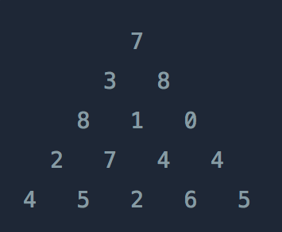

# Table of Contents
[[toc]]

## 알고리즘 출제 유형


## 알고리즘 분석
- 문제를 해결하는 방법이 여러가지 일 수 있다.
- 알고리즘 분석은 어떤 알고리즘이 <u><b>시간</b></u>, <u><b>공간</b></u>적으로 더 효율적으로 문제를 해결하는지 비교하는데 사용한다.
- 복잡도
    - `시간 복잡도`: 알고리즘 실행 속도
    - `공간 복잡도`: 알고리즘이 사용하는 메모리 크기
    - 일반적으로 시간 복잡도와 공간 복잡도는 반비례한다. 즉 시간 복잡도가 낮으면 공간 복잡도가 높다.

## 좋은 알고리즘이란?
- 적은 시간과 공간을 사용하는 알고리즘
- 다만 <u><b>시간</b></u>이 더 중요한 요소다.

## 실행 횟수
- 알고리즘의 실제 실행 시간은 하드웨어의 성능에 따라 달라질 수 있다. 
- 따라서 <b><u>실행 횟수</u></b>로 알고리즘의 성능을 비교한다.
- 알고리즘의 실행 시간은 입력 크기 $n$에 따른 <b><u>실행 횟수</u></b>를 함수 $f(n)$으로 표현할 수 있다.
    - $f(n) = n^4+20n^2+3n+40$
- 실행 횟수에 가장 많은 영향을 주는 요소는 <b><u>반복문</u></b>이다.

## 점근적 표기법
- 증가율
    - $f(n) = n^4+20n^2+3n+40$ 이라는 알고리즘에서 가장 큰 증가율을 갖는 계수는 $n^4$
- 점근적 표기법
    - 함수의 증가율을 다른 함수로 표기하는 것
    - 중요하지 않는 계수와 상수를 제거하고 가장 큰 증가율에만 집중한다.
        - $n^4+20n^2+3n+40≈n^4$
    - 알고리즘의 성능은 최선, 최악, 평균의 입력값에 따라 결과가 달라질 수 있다.
    - 접근적 표기법은 크게 세 가지가 있다.
        - 빅-오 표기법
            - 함수 $f(n)$의 가장 큰 증가율을 표시할 때 사용
        - 세타 표기법
            - 함수 $f(n)$의 평균 증가율을 표시할 때 사용
        - 오메가 표기법
            - 함수 $f(n)$의 가장 낮은 증가율을 표시할 때 사용

## 시간 복잡도

- 알고리즘의 시간 복잡도를 계산할 때는 점근적 표기법의 <b><u>빅-오 표기법</u></b>을 주로 사용한다.
- 가장 큰 증가율이란 가장 최악의 시간이 걸리는 입력값이 들어온 경우를 의미한다.
- 아무리 최악의 상황이라도, 이 정도의 성능은 보장한다는 의미이기 때문이다.
- 평균인 세타 표기법을 사용하면 가장 좋겠지만 평가와 계산이 매우 복잡하다.
    - $f(n) = n^4+20n^2+3n+40$ 일때
    - $f(n)$ = $O(n^4)$
    - $f(n)$의 시간 복잡도를 $O(n^4)$라고 한다.

|시간복잡도|명칭|예제|
|---|---|---|
|$O(1)$|상수형|연결리스트 맨 뒤에 값 추가, 스택의 Push, Pop|
|$O(logn)$|로그형|정렬된 배열에서 요소찾기, 이진트리|
|$O(n)$|선형|for문, 정렬되지 않은 배열에서 요소 찾기|
|$O(nlogn)$|선형로그형|n개의 항목을 분할정복 방식으로 병합정렬, 퀵정렬, 병합정렬, 힙정렬|
|$O(n^2)$|2차형|이중 for문, 삽입정렬, 버블정렬, 선택정렬|
|$O(n^3)$|3차형|행렬 계산하기|
|$O(2^n)$|지수형|하노이의 탑, 피보나치|
|$O(n!)$|팩토리얼형|순열|
    

## 정렬
### 버블 정렬
::: details 버블 정렬
``` java
import java.util.ArrayList;
import java.util.Collections;

public class BubbleSort {

    public ArrayList<Integer> sort(ArrayList<Integer> list) {
        for (int i=0; i<list.size()-1; i++) {
            for (int j=0; j<list.size()-1-i; j++) {
                if (list.get(j) > list.get(j+1)) {
                    Collections.swap(list, j, j+1);
                }
            }
        }

        return list;
    }
}
```
``` java
ArrayList notSorted = new ArrayList(Arrays.asList(3, 8, 1, 9, 2));

BubbleSort bubbleSort = new BubbleSort();
bubbleSort.sort(list);
```
:::

### 선택 정렬
::: details 선택 정렬
``` java
public class SelectionSort {

    public ArrayList<Integer> sort(ArrayList<Integer> list) {

        for (int i=0; i<list.size(); i++) {
            int minIndex = i;

            for (int j=i+1; j<list.size(); j++) {
                if (list.get(j) < list.get(minIndex)) {
                    minIndex = j;
                }
            }
            Collections.swap(list, i, minIndex);
        }

        return list;
    }
}
```
``` java
ArrayList<Integer> notSorted = new ArrayList<>(Arrays.asList(4, 9, 10, 6, 5, 8, 2, 7, 1, 3));

SelectionSort selectionSort = new SelectionSort();
selectionSort.sort(notSorted);
```
:::

### 삽입 정렬
::: details 삽입 정렬
``` java
ArrayList<Integer> notSorted = new ArrayList<>(Arrays.asList(4, 9, 10, 6, 5, 8, 2, 7, 1, 3));

SelectionSort selectionSort = new SelectionSort();
selectionSort.sort(notSorted);
```
``` java
ArrayList<Integer> notSorted = new ArrayList<>(Arrays.asList(4, 9, 10, 6, 5, 8, 2, 7, 1, 3));

InsertionSort insertionSort = new InsertionSort();
insertionSort.sort(notSorted);
```
:::

## 탐색
### 순차 탐색
데이터가 정렬되어있지 않아도 되며, `O(n)`의 시간복잡도를 가진다.
::: details 순차 탐색
``` java
ArrayList<Integer> list = new ArrayList<>(Arrays.asList(4, 9, 10, 6, 5, 8, 2, 7, 1, 3));

BinarySearch binarySearch = new BinarySearch();
System.out.println(binarySearch.search(list, 3));
System.out.println(binarySearch.search(list, 11));
```
:::

### 이진 탐색
데이터가 정렬되어있어야 하며, `O(logn)`의 시간복잡도를 가진다.
::: details 이진 탐색
``` java
import java.util.ArrayList;

public class BinarySearch {
    public boolean search(ArrayList<Integer> list, Integer target) {

        if (list.size() == 0) {
            return false;
        }

        if (list.size() == 1) {
            if (list.get(0) == target) {
                return true;
            } else {
                return false;
            }
        }

        int mediumIndex = list.size() / 2;
        if (target < list.get(mediumIndex)) {
            return search(new ArrayList<>(list.subList(0, mediumIndex)), target);
        } else {
            return search(new ArrayList<>(list.subList(mediumIndex, list.size())), target);
        }
    }
}
```
``` java
ArrayList<Integer> list = new ArrayList<>(Arrays.asList(1, 2, 3, 4, 5, 6, 7));

BinarySearch binarySearch = new BinarySearch();
System.out.println(binarySearch.search(list, 3));
System.out.println(binarySearch.search(list, 7));
System.out.println(binarySearch.search(list, 20));
```
:::


## 재귀(Recursion)
`재귀(Recursion)`는 자기 자신을 호출한다. 
``` java
function(입력) {
    if (입력 <= 일정값) {
            // 자기 자신을 호출
            return function(입력-1);
    } else {
            // 탈출 조건이 있어야 한다.
            return 탈출을 위한 특정값;
    }
}
```
재귀는 스택에 순차적으로 쌓인다.


### Factorial
::: details Factorial
``` java
public class Factorial {
    public Integer factorial(Integer n) {
        if (n>0) {
            return n * factorial(n-1);
        } else {
            return 1;
        }
    }
}
```
``` java
Factorial factorial = new Factorial();

System.out.println(factorial.factorial(1)); // 1
System.out.println(factorial.factorial(2)); // 1*2
System.out.println(factorial.factorial(3)); // 1*2*3
System.out.println(factorial.factorial(4)); // 1*2*3*4
```
:::

### 피보나치
::: details 피보나치
``` java
public int fibonacci(int n) {
    if (n == 0) {
        return 1;
    } else if (n = 1) {
        return 1;
    } else {
        return fibonacci(n-1) + fibonacci(n-2);
    }
}
```
:::

### 배열의 합
::: details 배열의 합
``` java
public static int sum(ArrayList<Integer> dataList) {
    if (dataList.size() == 0) {
        return 0;
    } else {
        return dataList.get(0) + sum(new ArrayList<>(dataList.subList(1, dataList.size())));
    }
}
```
:::

### DFS
::: DFS
``` java
public class App {

    public static void main(String[] args) {
        int[][] graph = {
                {0, 1, 1, 0, 1, 0},
                {1, 0, 0, 0, 0, 0},
                {1, 0, 0, 0, 1, 1},
                {0, 0, 0, 0, 1, 0},
                {1, 0, 1, 1, 0, 0},
                {0, 0, 1, 0, 0, 0}
        };

        boolean[] isVisited = new boolean[graph.length];

        List<Integer> visited = new ArrayList<>();

        dfs(graph, 0, isVisited, visited);

        System.out.println(visited);    // [0, 1, 2, 4, 3, 5]
    }

    public static void dfs(int[][] graph, int start, boolean[] isVisited, List<Integer> visited) {
        isVisited[start] = true;
        visited.add(start);

        // 인접한 노드 중에서
        for (int i=0; i<graph[start].length; i++) {
            // 정점 start에서 정점 i로의 경로가 존재하고, 정점 i를 방문하지 않았다면,
            if (graph[start][i] == 1 && isVisited[i] == false) {
                dfs(graph, i, isVisited, visitedList);
            }
        }
    }
}
```
:::

## 탐욕 알고리즘 (Greedy Algorithm)
- 지금 이 순간에서의 최적의 답을 구하는 전략
- 반드시 최적의 해는 아니다.

### 최소 동전 문제
::: details 최소 동전 문제
- 10원, 100원, 500원을 사용해서 최소한의 동전으로 710원을 거슬러주는 방법은?
- 큰 수부터 선택해보자.
    - 500 1개 / 100 2개 / 10 1개 => 총 4개
- 10원, 30원, 40원, 50원을 사용해서 최소한의 동전으로 70원을 거슬러주는 방법은?
- 마찬가지로 큰 수부터 선택해보자.
    - 50원 1개 / 10원 2개 => 총 3개 => 최적의 답이 아니다.
    - 40원 1개 / 30원 1개 => 총 2개

```java
public Integer coin(Integer price, ArrayList<Integer> coinList) {

    Integer totalCoinCount = 0;
    Integer eachCoinCount = 0;

    ArrayList<Integer> details = new ArrayList<Integer>();

    for (int index=0; index<coinList.size(); index++) {
        eachCoinCount = price / coinList.get(index);
        totalCoinCount += eachCoinCount;
        price = price - (coinList.get(index) * eachCoinCount);
        details.add(eachCoinCount);
        System.out.println(coinList.get(index) + "원 " + details.get(index)  + "개");
    }
    System.out.println("총 " + totalCoinCount + "개");

    return totalCoinCount;
}
```
```java
ArrayList<Integer> list = new ArrayList<Integer>(Arrays.asList(500, 100, 50, 10))
coin(710, list);
```
:::

### 체육복

::: details 체육복
점심시간에 도둑이 들어, 일부 학생이 체육복을 도난당했습니다. 다행히 여벌 체육복이 있는 학생이 이들에게 체육복을 빌려주려 합니다. 학생들의 번호는 체격 순으로 매겨져 있어, 바로 앞번호의 학생이나 바로 뒷번호의 학생에게만 체육복을 빌려줄 수 있습니다. 예를 들어, 4번 학생은 3번 학생이나 5번 학생에게만 체육복을 빌려줄 수 있습니다. 체육복이 없으면 수업을 들을 수 없기 때문에 체육복을 적절히 빌려 최대한 많은 학생이 체육수업을 들어야 합니다.

전체 학생의 수 n, 체육복을 도난당한 학생들의 번호가 담긴 배열 lost, 여벌의 체육복을 가져온 학생들의 번호가 담긴 배열 reserve가 매개변수로 주어질 때, 체육수업을 들을 수 있는 학생의 최댓값을 return 하도록 solution 함수를 작성해주세요.

- 제한사항

전체 학생의 수는 2명 이상 30명 이하입니다.
체육복을 도난당한 학생의 수는 1명 이상 n명 이하이고 중복되는 번호는 없습니다.
여벌의 체육복을 가져온 학생의 수는 1명 이상 n명 이하이고 중복되는 번호는 없습니다.

여벌 체육복이 있는 학생만 다른 학생에게 체육복을 빌려줄 수 있습니다.
여벌 체육복을 가져온 학생이 체육복을 도난당했을 수 있습니다. 이때 이 학생은 체육복을 하나만 도난당했다고 가정하며, 남은 체육복이 하나이기에 다른 학생에게는 체육복을 빌려줄 수 없습니다.
``` java
import java.util.*;

class Solution {
    public int solution(int n, int[] lost, int[] reserve) {
        
        int count = n;
        int[] people = new int[n+2];
        
        for (int l: lost) people[l]--;
        for (int r: reserve) people[r]++;
        
        for (int idx=1; idx<people.length-1; idx++) {
            if (people[idx] == -1) {
                if (people[idx-1] > 0) {
                    people[idx]++;
                    people[idx-1]--;
                } else if (people[idx+1] > 0) {
                    people[idx]++;
                    people[idx+1]--;
                } else {
                    count--;
                }
            }    
        }
     
        return count;
    }
}
```
:::


## 완전 탐색(Brute Force)
- 모든 경우의 수를 다 확인하는 전략

### 모의고사
::: details 모의고사
수포자는 수학을 포기한 사람의 준말입니다. 수포자 삼인방은 모의고사에 수학 문제를 전부 찍으려 합니다. 수포자는 1번 문제부터 마지막 문제까지 다음과 같이 찍습니다.

- 1번 수포자가 찍는 방식: 1, 2, 3, 4, 5, 1, 2, 3, 4, 5, ...
- 2번 수포자가 찍는 방식: 2, 1, 2, 3, 2, 4, 2, 5, 2, 1, 2, 3, 2, 4, 2, 5, ...
- 3번 수포자가 찍는 방식: 3, 3, 1, 1, 2, 2, 4, 4, 5, 5, 3, 3, 1, 1, 2, 2, 4, 4, 5, 5, ...

1번 문제부터 마지막 문제까지의 정답이 순서대로 들은 배열 answers가 주어졌을 때, 가장 많은 문제를 맞힌 사람이 누구인지 배열에 담아 return 하도록 solution 함수를 작성해주세요.
``` java
import java.util.*;

class Solution {
    public int[] solution(int[] answers) {
        
        int[] first = {1, 2, 3, 4, 5};
        int[] second = {2, 1, 2, 3, 2, 4, 2, 5};
        int[] third = {3, 3, 1, 1, 2, 2, 4, 4, 5, 5};
        
        int firstCount = 0;
        int secondCount = 0;
        int thirdCount = 0;
        
        for (int i=0; i<answers.length; i++) {
            if(answers[i] == first[i%first.length]) firstCount++;
            if(answers[i] == second[i%second.length]) secondCount++;
            if(answers[i] == third[i%third.length]) thirdCount++;
        } 

        int max = Math.max(firstCount, Math.max(secondCount, thirdCount));
        
        ArrayList<Integer> answerList = new ArrayList<Integer>();
        
        if (max == firstCount) answerList.add(1);
        if (max == secondCount) answerList.add(2);
        if (max == thirdCount) answerList.add(3);
        
        int[] answer = new int[answerList.size()];
        
        for (int i=0; i<answerList.size(); i++) {
            answer[i] = answerList.get(i);
        }
        
        return answer;
    }
}
```
:::

## Backtracking
- 완전 탐색 + 가지 치기(Pruning)
- 모든 경우의 수에서 유망하지 않는 경우의 수는 건너뛰는 것.
- BFS, DFS는 그래프 탐색에서 이미 방문한 노드는 다시 방문하지 않는다는 점에서 Backtracking 방법 중 하나다.

### 부분 수열의 합
::: details 부분 수열의 합
N개의 정수로 이루어진 수열이 있을 때, 크기가 양수인 부분수열 중에서 그 수열의 원소를 다 더한 값이 S가 되는 부분수열의 개수를 구하라. 
- 1 ≤ N ≤ 20
- |S| ≤ 1,000,000
- 정수의 절댓값은 100,000을 넘지 않는다.


``` java
class Solution {

    private int count;
    private int target;
    private int[] numbers;

    public int solution(int N, int S, int[] numbers) {
        this.count = N;
        this.target = S;
        this.numbers = numbers;
        
        for (int i=0; i<N; i++) {
            backtracking(numbers[i], i);
        }
    }

    public void backtracking(int total, int depth) {
        if (depth == N-1 && total == target) count ++;
        depth ++;
        if (depth < N) {
            backtracking(total + numbers[depth], depth);
            backtracking(total, depth);
        }
    }
}
```
:::

### N과 M
::: details N과 M
자연수 N과 M (1 ≤ M ≤ N ≤ 8)이 주어졌을 때 1부터 N까지의 자연수 중에서 중복없이 M개를 고른 수열을 출력하세요. 


``` java
class Solution {

    boolean[] isVisited;
    int[] numbers;

    public int solution(int N, int M) {
        backtracking(N, M, 0);
    }

    public void backtracking(int N, int M, int depth) {

        // 재귀 깊이가 M과 같아지면 탐색과정에서 담았던 배열을 출력
        if (depth == M) {
            for (int number: numbers) System.out.print(number + " ");
            System.out.println();
            return;
        }

        for (int i=0; i < N; i++) {
            // 해당 노드를 방문하지 않았다면
            if (!isVisited[i]) {
                isVisited[i] = true;  // 해당 노드 방문
                numbers[depth] = i+1;  // 해당 깊이를 index로 하여 i+1 저장
                backtracking(N, M, depth+1);  // 다음 자식 노드 방문을 위해 depth를 1 증가시켜 재귀 호출
                // 자식 노드 방문이 끝나고 돌아오면 해당 노드를 방문하지 않는 상태로 다시 변경
                isVisited[i] = false;
            }
        }
        return;
    }
}
```
``` java
boolean[] visit = new boolean[N];
int[] arr = new int[M];
 
public static void dfs(int N, int M, int depth) {
 
	// 재귀 깊이가 M과 같아지면 탐색과정에서 담았던 배열을 출력
	if (depth == M) {
		for (int val : arr) {
			System.out.print(val + " ");
		}
		System.out.println();
		return;
	}
 
 
	for (int i = 0; i < N; i++) {
 
		// 만약 해당 노드(값)을 방문하지 않았다면?
		if (visit[i] == false) {
			
			visit[i] = true;		// 해당 노드를 방문상태로 변경
			arr[depth] = i + 1;		// 해당 깊이를 index로 하여 i + 1 값 저장
			dfs(N, M, depth + 1);	// 다음 자식 노드 방문을 위해 depth 1 증가시키면서 재귀호출
            
			// 자식노드 방문이 끝나고 돌아오면 방문노드를 방문하지 않은 상태로 변경
			visit[i] = false;
		}
	}
	return;
}
```
:::

### 양과 늑대 
::: details 양과 늑대
- 문제 설명

2진 트리 모양 초원의 각 노드에 늑대와 양이 한 마리씩 놓여 있습니다. 이 초원의 루트 노드에서 출발하여 각 노드를 돌아다니며 양을 모으려 합니다. 각 노드를 방문할 때 마다 해당 노드에 있던 양과 늑대가 당신을 따라오게 됩니다. 이때, 늑대는 양을 잡아먹을 기회를 노리고 있으며, 당신이 모은 양의 수보다 늑대의 수가 같거나 더 많아지면 바로 모든 양을 잡아먹어 버립니다. 당신은 중간에 양이 늑대에게 잡아먹히지 않도록 하면서 최대한 많은 수의 양을 모아서 다시 루트 노드로 돌아오려 합니다.


예를 들어, 위 그림의 경우(루트 노드에는 항상 양이 있습니다) 0번 노드(루트 노드)에서 출발하면 양을 한마리 모을 수 있습니다. 다음으로 1번 노드로 이동하면 당신이 모은 양은 두 마리가 됩니다. 이때, 바로 4번 노드로 이동하면 늑대 한 마리가 당신을 따라오게 됩니다. 아직은 양 2마리, 늑대 1마리로 양이 잡아먹히지 않지만, 이후에 갈 수 있는 아직 방문하지 않은 모든 노드(2, 3, 6, 8번)에는 늑대가 있습니다. 이어서 늑대가 있는 노드로 이동한다면(예를 들어 바로 6번 노드로 이동한다면) 양 2마리, 늑대 2마리가 되어 양이 모두 잡아먹힙니다. 여기서는 0번, 1번 노드를 방문하여 양을 2마리 모은 후, 8번 노드로 이동한 후(양 2마리 늑대 1마리) 이어서 7번, 9번 노드를 방문하면 양 4마리 늑대 1마리가 됩니다. 이제 4번, 6번 노드로 이동하면 양 4마리, 늑대 3마리가 되며, 이제 5번 노드로 이동할 수 있게 됩니다. 따라서 양을 최대 5마리 모을 수 있습니다.

각 노드에 있는 양 또는 늑대에 대한 정보가 담긴 배열 `info`, 2진 트리의 각 노드들의 연결 관계를 담은 2차원 배열 `edges`가 매개변수로 주어질 때, 문제에 제시된 조건에 따라 각 노드를 방문하면서 모을 수 있는 양은 최대 몇 마리인지 return 하도록 solution 함수를 완성해주세요.

- 제한사항
    - 2 ≤ `info`의 길이 ≤ 17
        - `info`의 원소는 0 또는 1 입니다.
        - `info[i]`는 i번 노드에 있는 양 또는 늑대를 나타냅니다.
        - 0은 양, 1은 늑대를 의미합니다.
        - info[0]의 값은 항상 0입니다. 즉, 0번 노드(루트 노드)에는 항상 양이 있습니다.
    - `edges`의 세로(행) 길이 = `info`의 길이 - 1
        - `edges`의 가로(열) 길이 = 2
        - `edges`의 각 행은 [부모 노드 번호, 자식 노드 번호] 형태로, 서로 연결된 두 노드를 나타냅니다.
        - 동일한 간선에 대한 정보가 중복해서 주어지지 않습니다.
        - 항상 하나의 이진 트리 형태로 입력이 주어지며, 잘못된 데이터가 주어지는 경우는 없습니다.
        - 0번 노드는 항상 루트 노드입니다.

- 입출력 예

|info|edges|result|
|------|---|---|
|[0,0,1,1,1,0,1,0,1,0,1,1]|[[0,1],[1,2],[1,4],[0,8],[8,7],[9,10],[9,11],[4,3],[6,5],[4,6],[8,9]]|5|
|[0,1,0,1,1,0,1,0,0,1,0]|[[0,1],[0,2],[1,3],[1,4],[2,5],[2,6],[3,7],[4,8],[6,9],[9,10]]|5|

``` java
import java.util.*;

class Solution {
    public static int max_sheep;
    public static int[] infos;
    public static boolean[][][] visited;
    public static ArrayList<Integer>[] connect;
    
    public int solution(int[] info, int[][] edges) {
        int answer = 0;
        infos = info;

        connect = new ArrayList[info.length];
        for(int i=0;i<info.length;i++){
            connect[i] = new ArrayList<Integer>();
        }
        
        for(int i=0;i<edges.length;i++){
            int a = edges[i][0];
            int b = edges[i][1];
            connect[a].add(b);
            connect[b].add(a);
            
        }
        
        visited = new boolean[info.length][info.length+1][info.length+1];
        dfs(0, 0, 0);
        answer = max_sheep;
        return answer;
    }
    
    public static void dfs(int s, int w, int now){
        
        if(infos[now] == 0){
            s++;
        } else if(infos[now] == 1){
            w++;
        }
        
        
        if(w >= s) return;
        
        max_sheep = Math.max(max_sheep, s);
     

        for(int i=0;i<connect[now].size();i++){
            int next = connect[now].get(i);
            int temp = infos[now];
            if(!visited[next][s][w]){
                infos[now] = -1;
                visited[now][s][w] = true;
                dfs(s, w, next);
                infos[now] = temp;
                visited[now][s][w] = false;
            }
        }
        
    }
}
```
::: 

## 분할 정복 (Divide & Conquer)
큰 문제를 작은 문제로 나누어 해결하는 전략

### 병합정렬    
::: details 병합정렬    
```java
import java.util.ArrayList;

public class MergeSort {
    public ArrayList<Integer> sort(ArrayList<Integer> list) {

        if (list.size() <= 1) {
            return list;
        }

        int mediumIndex = list.size()/2;

        ArrayList<Integer> leftArray = new ArrayList<>(list.subList(0, mediumIndex));
        ArrayList<Integer> rightArray = new ArrayList<>(list.subList(mediumIndex, list.size()));

        ArrayList<Integer> sortedLeftArray = sort(leftArray);
        ArrayList<Integer> sortedRightArray = sort(rightArray);

        ArrayList<Integer> mergedArray = merge(sortedLeftArray, sortedRightArray);

        return mergedArray;
    }

    public ArrayList<Integer> merge(ArrayList<Integer> leftArray, ArrayList<Integer> rightArray) {

        int leftPointer = 0;
        int rightPointer = 0;

        ArrayList<Integer> mergedArray = new ArrayList<Integer>();

        while (leftPointer < leftArray.size() && rightPointer < rightArray.size()) {
            if (leftArray.get(leftPointer) < rightArray.get(rightPointer)) {
                mergedArray.add(leftArray.get(leftPointer));
                leftPointer += 1;
            } else {
                mergedArray.add(rightArray.get(rightPointer));
                rightPointer += 1;
            }
        }

        while (leftArray.size() > leftPointer) {
            mergedArray.add(leftArray.get(leftPointer));
            leftPointer+=1;
        }

        while (rightArray.size() > rightPointer) {
            mergedArray.add(rightArray.get(rightPointer));
            rightPointer+=1;
        }

        return mergedArray;
    }
}
```

```java
ArrayList<Integer> notSorted = new ArrayList<>(Arrays.asList(4, 9, 10, 6, 5, 8, 2, 7, 1, 3));

MergeSort mergeSort = new MergeSort();

System.out.println(mergeSort.sort(notSorted));
```
:::
    
### 퀵 정렬
- 맨 앞 pivot을 기준으로 작은 값은 앞에, 큰 값은 뒤에 배치한다.        
- 퀵 정렬의 시간복잡도는 $O(nlogn)$
- $logn$개로 분할, 각 단계에서 $n$번 비교      

::: details 퀵 정렬
```java
public class QuickSort {
    public ArrayList<Integer> sort(ArrayList<Integer> list) {

        if (list.size() <= 1) {
            return list;
        }

        Integer pivot = list.get(0);

        ArrayList<Integer> leftArray = new ArrayList<Integer>();
        ArrayList<Integer> rightArray = new ArrayList<Integer>();

        for (int i=1; i<list.size(); i++) {
            if (list.get(i) < pivot) {
                leftArray.add(list.get(i));
            } else {
                rightArray.add(list.get(i));
            }
        }

        ArrayList<Integer> mergedArray = new ArrayList<>();

        mergedArray.addAll(sort(leftArray));
        mergedArray.add(pivot);
        mergedArray.addAll(sort(rightArray));

        return mergedArray;
    }
}
```
```java
ArrayList<Integer> notSorted = new ArrayList<>(Arrays.asList(4, 9, 10, 6, 5, 8, 2, 7, 1, 3));

QuickSort quickSort = new QuickSort();
System.out.println(quickSort.sort(notSorted));
```
::: 
시간복잡도는 $O(nlogn)$며, 최악의 경우 $O(n^2)$다.


## 동적 계획법(Dynamic Programming)
- 큰 문제를 작은 문제로 나누어 해결하는 전략
- `Divider & Conquer`와의 차이점은 중복된 부분 문제를 반복 계산하지 않는 것이다.
- `Memorization`: 부분 문제의 결과값을 저장한 후 재사용하는 전략. 작은 문제의 결과값을 저장하기 위해 `캐시` 또는 `DP 테이블`이라는 배열을 사용한다.
- 동적 계획법에는 크게 `Botton up` 방식과 `Top down` 방식이 있다.

### Bottom up 방식
`Bottom up` 방식은 작은 문제부터 풀고 크게 만들어가는 방식으로 보통 `반복(Iteration)`을 사용한다.

``` java
public int fibonacci(int n) {

    int[] cache = new int[n+1];

    // 작은 문제를 푼다
    cache[0] = 0;   
    cache[1] = 1;

    // 작은 문제를 바탕으로 반복하여 큰 문제를 풀어나간다.
    for (int i=2; i<n+1; i++) {
        cache[i] = cache[i-1] + cache[i-2];
    }

    return cache[n];
}

fibonacci(1);   // 1
fibonacci(2);   // 1
fibonacci(3);   // 2
fibonacci(4);   // 3
fibonacci(5);   // 5
fibonacci(6);   // 8
```

#### 정수 삼각형

::: details 정수 삼각형



위와 같은 삼각형의 꼭대기에서 바닥까지 이어지는 경로 중, 거쳐간 숫자의 합이 가장 큰 경우를 찾아보려고 합니다. 아래 칸으로 이동할 때는 대각선 방향으로 한 칸 오른쪽 또는 왼쪽으로만 이동 가능합니다. 예를 들어 3에서는 그 아래칸의 8 또는 1로만 이동이 가능합니다.

삼각형의 정보가 담긴 배열 triangle이 매개변수로 주어질 때, 거쳐간 숫자의 최댓값을 return 하도록 solution 함수를 완성하세요.

제한사항
- 삼각형의 높이는 1 이상 500 이하입니다.
- 삼각형을 이루고 있는 숫자는 0 이상 9,999 이하의 정수입니다.

입출력 예

|triangle|result|
|------|---|
|[[7], [3, 8], [8, 1, 0], [2, 7, 4, 4], [4, 5, 2, 6, 5]]|30|

``` java
import java.util.*;
import java.lang.*;

class Solution {
    public int solution(int[][] triangle) {
        
        int answer = 0;
        
        // 캐시, 요소에 이 때까지의 합을 저장한다.
        int[][] cache = new int[triangle.length][triangle.length];

        // 작은 문제를 푼다. (꼭지점 값 설정)
        cache[0][0] = triangle[0][0];
        
        // 반복문
        for (int i=1; i<triangle.length; i++) {
            // 각 행의 첫 번째 요소 초기화
            cache[i][0] = triangle[i][0] + cache[i-1][0];
            
            for (int j=1; j<i+1; j++)  {
                cache[i][j] = triangle[i][j] + Math.max(cache[i-1][j], cache[i-1][j-1]);
            }
        }
        
        // 최대값 계산
        for (int i=0; i<triangle.length; i++)
            answer = Math.max(cache[triangle.length-1][i], max);
        
        return answer;
    }
}
```
:::


### Top down 방식
`Top down` 방식은 큰 문제를 해결하기 위해 한 단계 작은 문제들을 계속 호출하는 방식이다. 보통 `재귀(Recursion)`을 사용하며, 점화식과 유사하다.
``` java
final int MAX = 1000;
int[] cache = new int[MAX];

public int fibonacci(int n, int[] cache) {
    if (n==1 || n==2) return 1;

    // 이미 계산한 적 있으면 이전 값 사용
    if (cache[n] != 0) return cache[n];

    // 재귀를 사용하여 한 단계 작은 문제 호출, 점화식과 유사
    cache[n] = fibonacci(n-1, cache) + fibonacci(n-2, cache);
    return cache[n];
}

fibonacci(1, cache);    // 1
fibonacci(2, cache);    // 1
fibonacci(3, cache);    // 2
fibonacci(4, cache);    // 3
fibonacci(5, cache);    // 5
fibonacci(6, cache);    // 8
```        

#### 타겟 넘버
::: details 타겟 넘버
n개의 음이 아닌 정수들이 있습니다. 이 정수들을 순서를 바꾸지 않고 적절히 더하거나 빼서 타겟 넘버를 만들려고 합니다. 예를 들어 [1, 1, 1, 1, 1]로 숫자 3을 만들려면 다음 다섯 방법을 쓸 수 있습니다.

```
-1+1+1+1+1 = 3
+1-1+1+1+1 = 3
+1+1-1+1+1 = 3
+1+1+1-1+1 = 3
+1+1+1+1-1 = 3
```
사용할 수 있는 숫자가 담긴 배열 numbers, 타겟 넘버 target이 매개변수로 주어질 때 숫자를 적절히 더하고 빼서 타겟 넘버를 만드는 방법의 수를 return 하도록 solution 함수를 작성해주세요.

``` java
import java.util.*;

class Solution {
    public int solution(int[] numbers, int target) {
        
        int answer = dp(numbers, 0, 0, target);
        return answer;
    }
    
    public int dp(int[] numbers, int depth, int sum, int target) {
        if (numbers.length == depth) {
            if (sum == target) {
                // 이미 계산된 작은 값을 재사용
                return 1;
            } else {
                // 이미 계산된 작은 값을 재사용
                return 0;
            }
        } else {
            // 작은 문제를 호출
            return dp(numbers, depth+1, sum+numbers[depth], target) + dp(numbers, depth+1, sum-numbers[depth], target);
        }
    }
}
```
:::