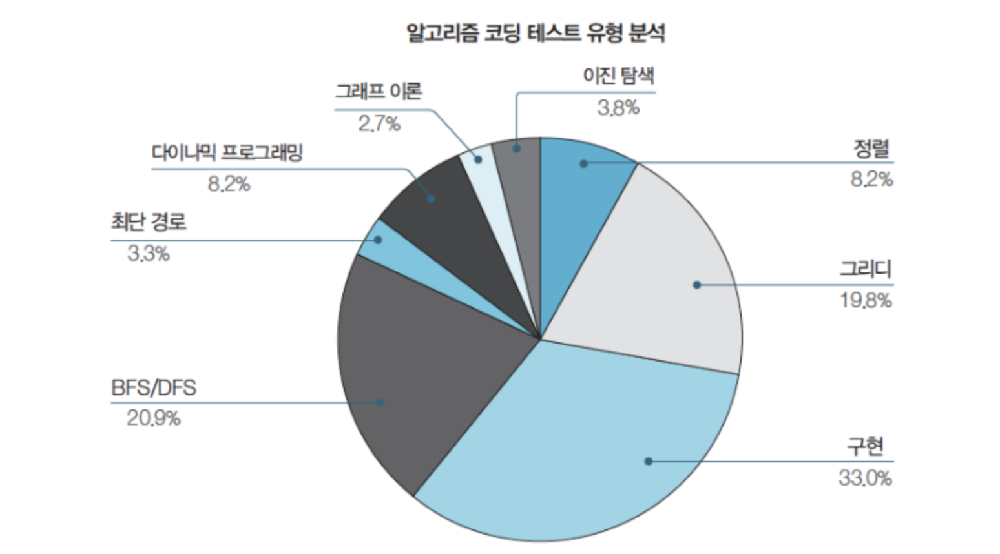
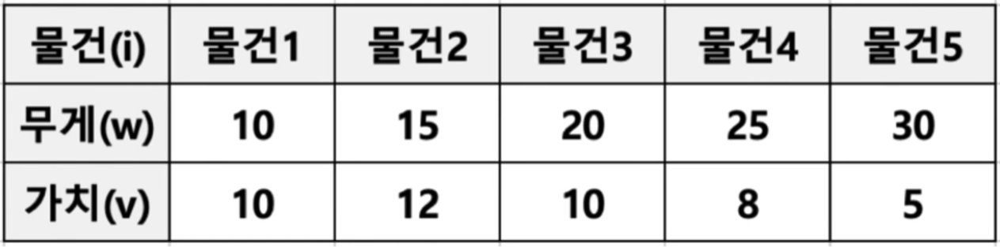
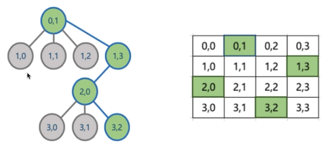
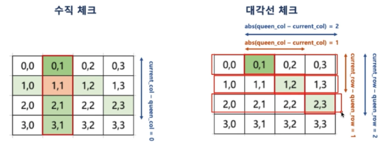

# Table of Contents
[[toc]]

## 알고리즘 출제 유형


## 알고리즘 분석
- 문제를 해결하는 방법이 여러가지 일 수 있다.
- 알고리즘 분석은 어떤 알고리즘이 <u><b>시간</b></u>, <u><b>공간</b></u>적으로 더 효율적으로 문제를 해결하는지 비교하는데 사용한다.
- 복잡도
    - `시간 복잡도`: 알고리즘 실행 속도
    - `공간 복잡도`: 알고리즘이 사용하는 메모리 크기
    - 일반적으로 시간 복잡도와 공간 복잡도는 반비례한다. 즉 시간 복잡도가 낮으면 공간 복잡도가 높다.

## 좋은 알고리즘이란?
- 적은 시간과 공간을 사용하는 알고리즘
- 다만 <u><b>시간</b></u>이 더 중요한 요소다.

## 실행 횟수
- 실제 실행시간은 하드웨어의 성능에 따라 달라질 수 있다.
- 따라서 <b><u>실행 횟수</u></b>로 알고리즘의 성능을 비교한다.
- 실행 횟수에 가장 많은 영향을 주는 요소는 <b><u>반복문</u></b>이다.

## 점근적 표기법
- 점근적 표기법에서는 알고리즘의 수행 시간을 입력 크기 $n$에 따른 <b><u>실행 횟수</u></b>를 함수 $f(n)$으로 표현한다.
    - $f(n) = n^4+20n^2+3n+40$
- 증가율
    - $f(n) = n^4+20n^2+3n+40$ 이라는 알고리즘에서 가장 큰 증가율을 갖는 계수는 $n^4$
- 점근적 표기법
    - 함수의 증가율을 다른 함수로 표기하는 것
    - 중요하지 않는 계수와 상수를 제거하고 가장 큰 증가율에만 집중한다.
        - $n^4+20n^2+3n+40≈n^4$
    - 알고리즘의 성능은 최선, 최악, 평균의 입력값에 따라 결과가 달라질 수 있다.
    - 접근적 표기법은 크게 세 가지가 있다.
        - 빅-오 표기법
            - 함수 $f(n)$의 가장 큰 증가율을 표시할 때 사용
        - 세타 표기법
            - 함수 $f(n)$의 평균 증가율을 표시할 때 사용
        - 오메가 표기법
            - 함수 $f(n)$의 가장 낮은 증가율을 표시할 때 사용

## 시간 복잡도

- 알고리즘의 시간 복잡도를 계산할 때는 점근적 표기법의 <b><u>빅-오 표기법</u></b>을 주로 사용한다.
- 가장 큰 증가율이란 가장 최악의 시간이 걸리는 입력값이 들어온 경우를 의미한다.
- 아무리 최악의 상황이라도, 이 정도의 성능은 보장한다는 의미이기 때문이다.
- 평균인 세타 표기법을 사용하면 가장 좋겠지만 평가와 계산이 매우 복잡하다.
    - $f(n) = n^4+20n^2+3n+40$ 일때
    - $f(n)$ = $O(n^4)$
    - $f(n)$의 시간 복잡도를 $O(n^4)$라고 한다.

|시간복잡도|명칭|예제|
|---|---|---|
|$O(1)$|상수형|연결리스트 맨 뒤에 값 추가, 스택의 Push, Pop|
|$O(logn)$|로그형|정렬된 배열에서 요소찾기, 이진트리|
|$O(n)$|선형|for문, 정렬되지 않은 배열에서 요소 찾기|
|$O(nlogn)$|선형로그형|n개의 항목을 분할정복 방식으로 병합정렬, 퀵정렬, 병합정렬, 힙정렬|
|$O(n^2)$|2차형|이중 for문, 삽입정렬, 버블정렬, 선택정렬|
|$O(n^3)$|3차형|행렬 계산하기|
|$O(2^n)$|지수형|하노이의 탑, 피보나치|
|$O(n!)$|팩토리얼형||
    

- $O(1)$

상수 회 실행

```java
if (n>10) {
		System.out.println(n);
}
```

- $O(logn)$

```java

```

- $O(n)$

반복문 1번

$f(n) = n = O(n)$

```java
for (int index=0; index<n; index++) {
		System.out.println(n);
}
```

반복문 1번

$f(n) = 3n = O(n)$

```java
for (int i=0; i<3; i++) {
		for (int j=0; j<n; j++) {
				System.out.println(j);
		}
}
```

- $O(nlogn)$

- $O(n^2)$

```java
for (int i=0; i<n; i++) {
		for (int j=0; j<n; j++) {
				System.out.println(j);
		}
}
```

- $O(n^3)$

```java

```

- $O(2^n)$

```java

```

- $O(n!)$

```java

```

## 정렬
### 버블 정렬
``` java
import java.util.ArrayList;
import java.util.Collections;

public class BubbleSort {

    public ArrayList<Integer> sort(ArrayList<Integer> list) {
        for (int i=0; i<list.size()-1; i++) {
            for (int j=0; j<list.size()-1-i; j++) {
                if (list.get(j) > list.get(j+1)) {
                    Collections.swap(list, j, j+1);
                }
            }
        }

        return list;
    }
}
```
``` java
ArrayList notSorted = new ArrayList(Arrays.asList(3, 8, 1, 9, 2));

BubbleSort bubbleSort = new BubbleSort();
bubbleSort.sort(list);
```

### 선택 정렬
``` java
public class SelectionSort {

    public ArrayList<Integer> sort(ArrayList<Integer> list) {

        for (int i=0; i<list.size(); i++) {
            int minIndex = i;

            for (int j=i+1; j<list.size(); j++) {
                if (list.get(j) < list.get(minIndex)) {
                    minIndex = j;
                }
            }
            Collections.swap(list, i, minIndex);
        }

        return list;
    }
}
```
``` java
ArrayList<Integer> notSorted = new ArrayList<>(Arrays.asList(4, 9, 10, 6, 5, 8, 2, 7, 1, 3));

SelectionSort selectionSort = new SelectionSort();
selectionSort.sort(notSorted);
```

### 삽입 정렬
``` java
ArrayList<Integer> notSorted = new ArrayList<>(Arrays.asList(4, 9, 10, 6, 5, 8, 2, 7, 1, 3));

SelectionSort selectionSort = new SelectionSort();
selectionSort.sort(notSorted);
```
``` java
ArrayList<Integer> notSorted = new ArrayList<>(Arrays.asList(4, 9, 10, 6, 5, 8, 2, 7, 1, 3));

InsertionSort insertionSort = new InsertionSort();
insertionSort.sort(notSorted);
```

## 탐색
### 순차 탐색
``` java
ArrayList<Integer> notSorted = new ArrayList<>(Arrays.asList(4, 9, 10, 6, 5, 8, 2, 7, 1, 3));

InsertionSort insertionSort = new InsertionSort();
insertionSort.sort(notSorted);
```
``` java
ArrayList<Integer> list = new ArrayList<>(Arrays.asList(4, 9, 10, 6, 5, 8, 2, 7, 1, 3));

BinarySearch binarySearch = new BinarySearch();
System.out.println(binarySearch.search(list, 3));
System.out.println(binarySearch.search(list, 11));
```
### 이진 탐색
데이터가 정렬되어있어야 한다.
``` java
import java.util.ArrayList;

public class BinarySearch {
    public boolean search(ArrayList<Integer> list, Integer target) {

        if (list.size() == 0) {
            return false;
        }

        if (list.size() == 1) {
            if (list.get(0) == target) {
                return true;
            } else {
                return false;
            }
        }

        int mediumIndex = list.size() / 2;
        if (target < list.get(mediumIndex)) {
            return search(new ArrayList<>(list.subList(0, mediumIndex)), target);
        } else {
            return search(new ArrayList<>(list.subList(mediumIndex, list.size())), target);
        }
    }
}
```
``` java
ArrayList<Integer> list = new ArrayList<>(Arrays.asList(1, 2, 3, 4, 5, 6, 7));

BinarySearch binarySearch = new BinarySearch();
System.out.println(binarySearch.search(list, 3));
System.out.println(binarySearch.search(list, 7));
System.out.println(binarySearch.search(list, 20));
```


## 재귀(Recursion)
자기 자신을 호출
``` java
function(입력) {
		if (입력 <= 일정값) {
				return function(입력-1);
		} else {
				// 탈출 조건이 있어야 한다.
				return 탈출을 위한 특정값;
		}
}
```
Factorial
``` java
public class Factorial {
    public Integer factorial(Integer n) {
        if (n>0) {
            return n * factorial(n-1);
        } else {
            return 1;
        }
    }
}
```
``` java
Factorial factorial = new Factorial();

System.out.println(factorial.factorial(1)); // 1
System.out.println(factorial.factorial(2)); // 1*2
System.out.println(factorial.factorial(3)); // 1*2*3
System.out.println(factorial.factorial(4)); // 1*2*3*4
```
재귀 함수는 스택에 순차적으로 싸인다.
f(1)

f(2)

f(3)

...

f(n-1)

f(n)

배열의 합을 구하라
``` java
public int sum(ArrayList<Integer> dataList) {
    if (dataList.size() <= 0) {
        return 0;
    }
    return dataList.get(0) + sum(new ArrayList<Integer>(dataList.subList(1, dataList.size())));
}
```
``` java
sum(new ArrayList<Integer>(Arrays.asList(1, 2, 3, 4, 5)));
```

- 정수 4를 1, 2, 3으로 나타낼 수 있는 조합은 다음과 같다.
    - 1, 1, 1, 1
    - 1, 1, 2
    - 1, 2, 1
    - 2, 1, 1
    - 1, 3
    - 3, 1
    - 2, 2
    
    이 때 $n$을 1, 2, 3의 조합으로 나타낼 수 있는 방법의 수를 구하시오.
    
    - n=1 일 때 1개
    - n=2 일 때 2개
    - n=3 일 때 4개
    - n=4 일 때 7개

``` java
public int solution(int n) {
    if (n==1) {
        return 1;
    } else if (n==2) {
        return 2;
    } else if (n==3) {
        return 4;
    } 
    return solution(n-1) + solution(n-2) + solution(n-3);
}
```


## 탐욕 알고리즘 (Greedy Algorithm)
- 지금 이 순간에서의 최적의 답을 구하는 전략
- 반드시 최적의 해는 아님
- 동전 예제
    - 10, 100, 500 **⇒** 710
        - 500  1개
        - 100 2개
        - 10 1개
        - 총 4개
    - 10, 30, 40, 50 **⇒** 70
        - 50 1개
        - 10 2개
        - 총 3개
        - 최적의 답이 아니다. (30 1개, 40  1개, 총 2개)

```java
public Integer coin(Integer price, ArrayList<Integer> coinList) {

    Integer totalCoinCount = 0;
    Integer eachCoinCount = 0;

    ArrayList<Integer> details = new ArrayList<Integer>();

    for (int index=0; index<coinList.size(); index++) {
        eachCoinCount = price / coinList.get(index);
        totalCoinCount += eachCoinCount;
        price = price - (coinList.get(index) * eachCoinCount);
        details.add(eachCoinCount);
        System.out.println(coinList.get(index) + "원 " + details.get(index)  + "개");
    }
    System.out.println("총 " + totalCoinCount + "개");

    return totalCoinCount;
}
```
```java
ArrayList<Integer> list = new ArrayList<Integer>(Arrays.asList(500, 100, 50, 10))
coin(710, list);
```

- 물건을 조깰 수 있으면 부분 배낭 문제(Fractional Knapsack Problem)
- 물건을 쪼갤 수 없으면 배낭 문제(Knapsack Problem)

- 부분 배낭 문제 (Fractional Knapsack Problem)
    - 무게 제한이 k인 배낭
    - 최대 가치를 가지도록 배낭을 채워보자
    - 물건 i는 무게 w, 가치 v
    - 무게는 적고, 가치가 높은 물건을 먼저 넣는다. (무게 당 가치)



``` java
public void knapsack(Integer[][] items, double capacity) {

    double totalValue = 0.0;
    double fraction = 0.0;      // 해당 물건의 몇 퍼센트만 들어갔는가?

    Arrays.sort(items, new Comparator<Integer[]>() {
        @Override
        public int compare(Integer[] item1, Integer[] item2) {
            // 무게 당 가치 순으로 정렬
            return (item2[1]/item2[0]) - (item1[1]/item1[0]);
        }
    });

    for (int index=0; index<items.length; index++) {
        if ((capacity - (double)items[index][0]) > 0) {
            capacity = capacity - (double)items[index][0];
            totalValue = totalValue + (double)items[index][1];
            System.out.println("무게:" + items[index][0] + ", 가치:" + items[index][1]);
        } else {
            fraction = capacity / (double)items[index][0];
            totalValue += (double) (double)items[index][1] * fraction;
            System.out.println("무게:" + items[index][0] + ", 가치:" + items[index][1] + ", 비율:" + fraction);
            break;
        }
    }

    System.out.println("총 담을 수 있는 가치: " + totalValue);
}
```
``` java
// 물건
Integer[][] items = {
        {10, 10},
        {15, 12},
        {20, 10},
        {25, 8},
        {30, 5}
};

knapsack(items, 30.0);

// 무게:10, 가치:10
// 무게:15, 가치:12
// 무게:20, 가치:10, 비율:0.25
// 총 담을 수 있는 가치: 24.5
```


## 분할 정복 (Divide & Conquer)
- 큰 문제를 부분 문제로 나누어 계산하는 전략
    - 병합정렬
        
        ```java
        import java.util.ArrayList;
        
        public class MergeSort {
            public ArrayList<Integer> sort(ArrayList<Integer> list) {
        
                if (list.size() <= 1) {
                    return list;
                }
        
                int mediumIndex = list.size()/2;
        
                ArrayList<Integer> leftArray = new ArrayList<>(list.subList(0, mediumIndex));
                ArrayList<Integer> rightArray = new ArrayList<>(list.subList(mediumIndex, list.size()));
        
                ArrayList<Integer> sortedLeftArray = sort(leftArray);
                ArrayList<Integer> sortedRightArray = sort(rightArray);
        
                ArrayList<Integer> mergedArray = merge(sortedLeftArray, sortedRightArray);
        
                return mergedArray;
            }
        
            public ArrayList<Integer> merge(ArrayList<Integer> leftArray, ArrayList<Integer> rightArray) {
        
                int leftPointer = 0;
                int rightPointer = 0;
        
                ArrayList<Integer> mergedArray = new ArrayList<Integer>();
        
                while (leftPointer < leftArray.size() && rightPointer < rightArray.size()) {
                    if (leftArray.get(leftPointer) < rightArray.get(rightPointer)) {
                        mergedArray.add(leftArray.get(leftPointer));
                        leftPointer += 1;
                    } else {
                        mergedArray.add(rightArray.get(rightPointer));
                        rightPointer += 1;
                    }
                }
        
                while (leftArray.size() > leftPointer) {
                    mergedArray.add(leftArray.get(leftPointer));
                    leftPointer+=1;
                }
        
                while (rightArray.size() > rightPointer) {
                    mergedArray.add(rightArray.get(rightPointer));
                    rightPointer+=1;
                }
        
                return mergedArray;
            }
        }
        ```
        
        ```java
        ArrayList<Integer> notSorted = new ArrayList<>(Arrays.asList(4, 9, 10, 6, 5, 8, 2, 7, 1, 3));
        
        MergeSort mergeSort = new MergeSort();
        
        System.out.println(mergeSort.sort(notSorted));
        ```
        
        - 시간복잡도 $O(nlogn)$
            - $logn$개로 분할, 각 단계에서 $n$번 비교
    
    - 퀵 정렬 (Quick Sort)
        - 맨 앞 pivot을 기준으로 작은 값은 앞에, 큰 값은 뒤에 배치한다.
        
        ```java
        public class QuickSort {
            public ArrayList<Integer> sort(ArrayList<Integer> list) {
        
                if (list.size() <= 1) {
                    return list;
                }
        
                Integer pivot = list.get(0);
        
                ArrayList<Integer> leftArray = new ArrayList<Integer>();
                ArrayList<Integer> rightArray = new ArrayList<Integer>();
        
                for (int i=1; i<list.size(); i++) {
                    if (list.get(i) < pivot) {
                        leftArray.add(list.get(i));
                    } else {
                        rightArray.add(list.get(i));
                    }
                }
        
                ArrayList<Integer> mergedArray = new ArrayList<>();
        
                mergedArray.addAll(sort(leftArray));
                mergedArray.add(pivot);
                mergedArray.addAll(sort(rightArray));
        
                return mergedArray;
            }
        }
        ```
        
        ```java
        ArrayList<Integer> notSorted = new ArrayList<>(Arrays.asList(4, 9, 10, 6, 5, 8, 2, 7, 1, 3));
        
        QuickSort quickSort = new QuickSort();
        System.out.println(quickSort.sort(notSorted));
        ```
        
        - 시간복잡도 $O(nlogn)$, 최악의 경우 $O(n^2)$


## 동적 계획법(Dynamic Programming)
- Divide & Conquer + Memorization(Reuse)
- Memorization: 부분 문제의 결과값을 저장하여 재활용하는 전략

- 피보나치 예제
    1. Recursive
        
        ```sql
        public int fibonacci(int n) {
            if (n == 0) {
                return 0;
            } else if (n == 1) {
                return 1;
            } else {
                return fibonacci(n-1) + fibonacci(n-2);
            }
        }
        
        fibonacci(1);   // 1
        fibonacci(2);   // 1
        fibonacci(3);   // 2
        fibonacci(4);   // 3
        fibonacci(5);   // 5
        fibonacci(6);   // 8
        ```
        
    2. DP
        
        ```sql
        public int fibonacci(int n) {
        
            int[] cache = new int[n+1];
            cache[0] = 0;   // 이미 계산된 작은 값을 다시 계산하지 않고 재사용
            cache[1] = 1;   // 이미 계산된 작은 값을 다시 계산하지 않고 재사용
        
            for (int i=2; i<n+1; i++) {
                cache[i] = cache[i-1] + cache[i-2];
            }
        
            return cache[n];
        }
        
        fibonacci(1);   // 1
        fibonacci(2);   // 1
        fibonacci(3);   // 2
        fibonacci(4);   // 3
        fibonacci(5);   // 5
        fibonacci(6);   // 8
        ```


## 완전 탐색(Brute Force)
- 무식하게 모든 경우의 수를 탐색하는 전략
- 컴퓨터의 빠른 연산 속도를 이용
- 비밀번호 4자리 찾기
- N과 M 문제 (중복 허용)
- N과 M 문제 (중복 미허용)

## 백 트래킹(Backtracking)
- Brute Force + 가지 치기
- [N과 M 문제](https://www.acmicpc.net/problem/15649)
- [부분수열의 합](https://www.acmicpc.net/problem/1182)
- [로또](https://www.acmicpc.net/problem/6603)
- N Queens 문제
    - 첫번째 행의 첫번째 요소 선택검증 (Promising)
    - 두번째 행의 세번째 요소 선택검증 (Promising)
    - 세번째 행에는 가능한 요소 없다
    - 따라서 네번째 행은 검사하지않고 가지치기 (Pruning)
    - 두번째 행의 네번째 요소 선택
    
    - 상태 공간 트리 (State Space Tree)
    
    
    
    - 코드
        

    
        
```java
public class NQueens {

    public void dsf(Integer N, Integer currentRow, ArrayList<Integer> currentCandidates) {
        // currentCandidate: 윗 행들에서 선택한 요소들
        if (currentRow == N) {
            System.out.println(currentCandidates);
        }

        for (int index=0; index<N; index++) {
            if (isAvailable(currentCandidates, index)) {
                currentCandidates.add(index);
                dsf(N, currentRow+1, currentCandidates);

                // Pruning
                currentCandidates.remove(currentCandidates.size() - 1);
            }
        }
    }

    // Promising
    public boolean isAvailable(ArrayList<Integer> candidate, Integer currentColumn) {
        Integer currentRow = candidate.size();
        for (int index=0; index<currentRow; index++) {
            if(
                (candidate.get(index)== currentColumn)
                ||
                ((Math.abs(candidate.get(index) - currentColumn)) == (currentRow - index))
            ) {
                return false;
            }
        }
        return true;
    }
}
```

```java
NQueens nQueens = new NQueens();
nQueens.dsf(4, 0, new ArrayList<Integer>());
// [1, 3, 0, 2]    1행은 1, 2행은 3, 3행은 0, 4행은 2
// [2, 0, 3, 1]    1행은 2, 2행은 0, 3행은 3, 4행은 1
```
