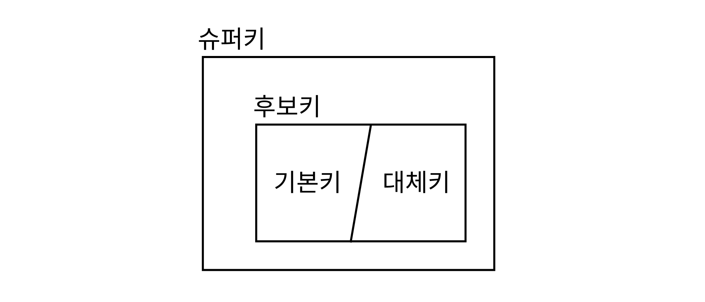

# Table of Contents
[[toc]]

# Database
`Database`개념에 대해 정리한다.

## DDL
`DDL(Data Definition Lauguage)`의 약자로 데이터베이스의 구조(Schema)를 정의하는 기능
- CREATE
- ALTER
- DROP
- TRUNCATE

## DML
`DML(Data Manipulation Lauguage)` 데이터를 조작하는 기능
- SELECT
- INSERT
- UPDATE
- DELETE

## DCL
`DCL(Database Control Launuage)`의 약자
- 무결성과 동시성 제어
    - COMMIT
    - ROLLBACK
- 보안과 권한
    - GRANT
    - REVOKE

## ERD
- `ERD(Entity-Relation Diagram)`은 데이터베이스의 개념적 설계에 사용한다.
- 필자는 [`draw.io`](https://app.diagrams.net/)를 사용하여 `ER Diagram`을 그린다.

## 키
- 테이블의 행을 유일하게 식별하는 고유한 식별자이자 일종의 제약조건
- `유일성`을 가져야한다.
- 키를 위반하는 행은 테이블에 추가할 수 없다.

### 유일성과 최소성 
- `유일성`: 하나의 키로 하나의 행를 식별. 모든 키는 유일성을 가져야한다.
- `최소성`: 최소한의 컬럼을 사용. 모든 키가 최소성을 가지는 것은 아니다.

### 단일키와 복합키
- `단일키`: 한 개의 컬럼으로 구성된 키
- `복합키`: 두 개 이상의 컬럼으로 구성된 키

### 키의 종류


- `슈퍼키`
    - 유일성
    - ~~최소성~~
        - 학번 - 단일키
        - 주민번호 - 단일키
        - 학번, 주민번호 - 복합키
        - 주민등록번호, 학년 - 복합키

- `후보키`
    - 유일성
    - 최소성

- `기본키`와 `대체키`
    - 후보키가 여러 개인 경우 하나를 `기본키`, 나머지를 `대체키`로 지정한다.
        - 학번 - 기본키
        - 주민번호 - 대체키

### 기본키, 외래키
``` sql{3}
CREATE TABLE member (
    id BIGINT NOT NULL AUTO_INCREMENT,
    PRIMARY KEY(id)
);
```
``` sql{3}
CREATE TABLE post (
    // ...
    writer_id BIGINT,
    FOREIGN KEY (`writer_id`) REFERENCES `member` (`id`)
);
```

## 이상현상
데이터베이스의 설계를 잘못하면 데이터의 `일관성`, `무결성`이 깨지는데 이를 <b>`이상현상(Anomaly)`</b>이라고 한다.
- 삽입 이상
- 갱신 이상
- 삭제 이상

## 정규화
- `이상현상`을 해결하고 데이터 중복을 최소화하기 위해 테이블을 <b>`무손실 분해`</b>하는 것
- 조인의 증가로 데이터 처리시간이 늘어난다는 단점이 있기 때문에 일관성과 무결성을 고려해서 적절하게 분해해야한다.

## 인덱스
- `인덱스`는 검색 성능을 향상시키기 위해 사용한다.
- 테이블을 생성할 때 `기본키`나 `유일키`를 지정하면 해당 컬럼으로 `인덱스`가 자동으로 생성된다.
- 필요에 따라 추가적인 인덱스를 생성할 수 있으며, 다중 컬럼으로도 `인덱스`를 생성할 수 있다.

## 트랜잭션
- 데이터베이스의 상태를 변화시키는 하나의 논리적인 작업
- `INSERT`, `DELETE`, `UPDATE` 같은 `DML` 연산 여러 개으로 구성되어있다.
- `Commit`을 하는 시점에 데이터베이스에 반영되며, 오류가 발생하거나 `Rollback`을 하면 데이터베이스에 반영되지 않는다.

## ACID
- `Atomaticity(원자성)`: `All or Nothing`, 트랜잭션을 구성하는 연산들은 모두 반영되거나 전부 반영되지 않아야 한다.
- `Consistency(일관성)`: 트랜잭션이 반영되고 나서도 데이터베이스의 무결성이 유지되어야 한다.
- `Isolation(격리성)`: 트랜잭션 중간에 다른 트랜잭션의 연산이 끼어들지 못한다. 
- `Durability(내구성)`: 성공적으로 수행된 트랜잭션은 데이터베이스에 영구적으로 반영되어야 한다.

## JDBC
- Java Database Connectivity
- 데이터베이스 접근을 위한 Java API
- 모든 영속성 계층 라이브러리는 내부적으로 JDBC를 사용한다.
- `Connection` 객체로 데이터베이스와의 연결을 관리한다.
- `Statement` 객체로 쿼리를 실행하고 `ResultSet`으로 결과를 받아볼 수 있다.
``` java
import java.sql.Connection;
import java.sql.DriverManager;
import java.sql.Statement;
import java.sql.ResultSet;
import java.sql.SQLException;

public class App {
    public static void main(String[] args) {
        Connection connection = null;
        Statement statement = null;
        ResultSet resultSet = null;

        try{
            Class.forName("com.mysql.jdbc.Driver");

            String url = "jdbc:mysql://localhost:3306/mydb";
            connection = DriverManager.getConnection(url, "admin", "admin");

            statement = connection.createStatement();

            String sql = "SELECT * FROM member";

            resultSet = statement.executeQuery(sql);

            while(resultSet.next()){

                String name = resultSet.getString(1);
                String password = resultSet.getString(2);

                System.out.println(name + " " + password);
            }
        }
        catch(Exception e){
            e.printStackTrace()
        }
        finally{
            connection.close();
            statement.close();
            resultSet.close()
        }
    }
}
```

## Connection Pool
- 런타임에 `Connection` 객체를 매번 생성하는 것은 비효율적이다.
- 애플리케이션 구동 시 `ConnectionPool`에 정해진 숫자의 `Connection` 객체를 미리 생성한다.
- 필요한 경우 미리 생성된 `Connection` 객체을 할당하고 다 사용된 `Connection` 객체은 반납한다.
- `Connection`수를 제한할 수 있다.

## SQL Mapper
- 자바 객체와 SQL를 매핑해주는 표준
- 대표적인 구현체에는 myBatis가 있다 
- 데이터베이스에 종속적인 SQL을 직접 작성해야한다.
``` xml
<!-- UserMapper.xml -->
<?xml version="1.0" encoding="UTF-8"?>
<!DOCTYPE mapper PUBLIC "-//mybatis.org//DTD Mapper 3.0//EN" "http://mybatis.org/dtd/mybatis-3-mapper.dtd">
	
<mapper namespace="con.yologger.app.UserMapper">
	<select id="findAll" resultType="com.yologger.app.User">
		select * from user
	</select>
</mapper>
```
``` java
import com.example.demo.dto.User; 
import org.apache.ibatis.annotations.Mapper; 
import org.apache.ibatis.annotations.Param; 
import org.apache.ibatis.annotations.Select; 
import java.util.List; 

@Mapper 
public interface UserMapper { 
    @Select("SELECT * FROM user") 
    List<User> findAll(); 
}
```

## JPA
- 관계형 데이터베이스의 테이블과 객체지향 프로그래밍의 객체를 매핑해주는 기술이다.
- 데이터베이스에 독립적이며, JPA가 DB에 종속적인 쿼리를 대신 작성해준다
- 복잡한 쿼리는 JPQL, QueryDSL로 직접 작성할 수 있다.

## RDBMS vs. NoSQL
### RDBMS
- `Row`와 `Column`으로 구성된 테이블 기반의 이차원 관계형 데이터베이스
- 스키마가 존재하기 때문에 정형화된 형태로 데이터가 저장된다.
- 외래키로 테이블 간 관계를 표현한다.
- 관계가 있는 테이블들은 `Join`으로 조회할 수 있다.
- 대표적인 제품군에는 Oracle DB, MySQL, Maria DB가 있다.

### NoSQL
- Not Only SQL 
- 관계형 데이터베이스는 정형화된 형태로 데이터를 저장하지만 No SQL은 상대적으로 비정형화된 형태로 데이터를 자유롭게 저장할 수 있다.
- 은행의 계좌 시스템처럼 ACID(Atomic, Consistency, Integrity, Duarabity)를 반드시 보장해야하는 분야에는 RDBMS를 적용한다.
- 반면 구조가 복잡하진 않지만 대용량 데이터를 빠르게 처리해야하는 분야, 예를 들면 카카오톡 메시지 저장, 빅데이터 분석 등에 사용할 수 있다.
- No SQL은 대부분 다음과 같은 특징이 있다.
    - 외래키를 통한 관계를 설정하지 않는다.
    - JOIN을 지원하지 않는다.
    - 정형화된 스키마가 없고 자유로운 형태의 데이터를 저장할 수 있다.
    - 대용량 데이터 처리에 적합하다.
    - 수평적 확장을 위한 클러스터링, 분산 저장 기능을 제공한다.
    - 대표적인 제품군에는 `Key-Value` 기반의 `Redis`, `Document` 기반의 `Mongo DB`, `ElasticSearch`가 있다.
- RDBMS와 NoSQL은 대체 관계가 아니라 상호보완관계다. 필요한 시점과 상황에 따라 적절히 사용하는게 좋다.

## Redis
- `Key-Value` 기반의 NoSQL 데이터베이스
- 디스크 기반이 아니라 인메모리 방식을 사용하기 때문에 입출력 연산이 적어 속도가 매우 빠르다.
- 인메모리 방식이기 때문에 애플리케이션이 다운되거나 재시작되면 데이터가 사라진다. 이 때문에 다음과 같은 방법으로 데이터를 백업한다. 
    - `RDB`: 현재 메모리 상태에 대한 스냅샷을 디스크에 저장한다.
    - `AOF(Append Only File)`: 추가, 수정, 삭제 명령이 실행될 때 마다 파일에 기록한다.
    - `Replication`: 다른 레디스 노드에 데이터를 복사하여 저장한다. 여러 레디스 노드 중 하나를 Master로 선정하여 사용하고, 데이터를 다른 노드에 저장한다. Master 노드에 장애가 발생하면 다른 Slave 노드를 Master로 승격하며, 특정 Slave 노드를 Master 노드로 변경할 수도 있다.
- 세션 스토어, 데이터베이스 캐시, 공유 저장소 등에 사용된다.
- Publish/Subscribe 모델을 지원하기 때문에 메시지 큐로도 사용할 수 있다.
- String, List, Set, Hash 자료형을 지원한다.
- `Spring Data Redis`는 `RedisTemplate`과 더욱 추상화된 `RedisRepository`를 지원한다.

## Mongo DB
- `JSON Document` 기반의 NoSQL 데이터베이스
- 스키마가 없어서 저장되는 데이터의 구조가 자유롭다.
- 테이블은 `Collection`, 행은 `Document`, 열은 `Field`에 대응한다.
- `Field`에는 자바스크립트의 데이터 타입을 저장할 수 있으며, 추가적으로 `Document`를 유일하게 구분하기 위해 `ObjectId` 타입과 `_id` 필드를 사용한다.
- `_id`필드는 데이터를 삽입할 때 별도의 값을 제공하지 않으면 자동으로 생성된다.
- 외래키 개념이 없어서 `Embedded` 또는 `Reference` 방식으로 관계를 표현한다.
- 조인 개념이 없어서 어플리케이션 레벨에서 처리해야한다.
- 스키마가 자주 바뀌는 환경에서 `Mongo DB`를 사용하면 적합하다.
- Mongo DB는 비교적 쉽게 클러스터를 구축할 수 있고 샤딩, 레플리케이션을 적용하여 고가용성을 확보할 수 있다.

## ElasticSearch
- Apache Lucene 기반 분산 검색 엔진
- 관계형 데이터베이스는 행의 위치인 `인덱스(Index)`를 사용하여 행을 조회한다. 반면 ElasticSearch은 도큐먼트의 문자, 단어 등을 매핑한 `역색인(Inverted Index)`을 사용하여 데이터를 조회한다. 일반 인덱스는 책 앞 페이지의 목차와 같은 의미이고, 역색인은 책 뒷 편의 단어 별 빠른 페이지와 같다.
- 인덱스를 통한 검색은 인덱스를 순차검색 하기 때문에 `O(n)`의 시간 복잡도를 갖는다. 반면 역색인은 마치 해시함수와 같아서 `O(1)`의 시간 복잡도를 갖는다. 이 때문에 ElasticSearch은 방대한 데이터를 빠르게 검색하는데 적합하다.
- ElasticSearch는 스키마가 없기 때문에 NoSQL처럼 `비정형 데이터`를 저장할 수 있다. 물론 `Mapping`을 사용하면 스키마를 설정할 수도 있다.
- Elastic Search는 기본적으로 REST API에 HTTP 요청을 보내는 형태로 데이터를 조작한다.
- ElasticSearch은 빠른 검색을 위해 단독으로 사용되기도 하지만 `ELK(ElasticSearch / LogStash / Kibana)스택 + Beats`으로 사용되기도 한다.
- ELK 스택을 사용하면 여러 데이터소스에서 발생한 데이터를 수집, 가공, 분석한 후 시각화할 수 있다. 
- ELK 스택은 MSA 환경에서 여러 개별 서비스의 로그를 중앙 집중형 로깅하고 모니터링하는데 사용할 수 있다.
- 빅데이터 분야에도 활용할 수 있다.
- `Beats`: 
    - 여러 데이터 소스에 설치되어 데이터를 수집한 후 Logstash로 전송한다.
- `Logstash`: 
    - 데이터 소스의 데이터를 실시간으로 수집하여 Elastic Search로 전달하는 파이프 라인 엔진이다.
    - 여러 데이터 소스로부터 발생하는 데이터를 적절하게 변환한다.
- `Elastic Search`
    - Logstash를 통해 수신된 데이터를 저장소에 저장하는 역할을 담당한다.
    - 역인덱싱을 통한 빠른 검색을 제공한다.
    - 어그리게이션 등을 통한 데이터 가공 및 분석 기능을 제공한다.
- `Kibana`
    - ElasticSearch에 저장된 데이터를 시각화한다.

## Sharding
`샤딩(Sharding)`은 여러 데이터베이스 인스턴스에 데이터를 분산 저장하는 기술이다. 이를 통해 트래픽을 분산할 수 있다. 또한 레플리케이션을 통해 백업 및 복구가 가능해진다. 그 외에도 여러 데이터베이스 인스턴스에 라우팅을 제공하기 위해 라우팅 서버가 필요하다.