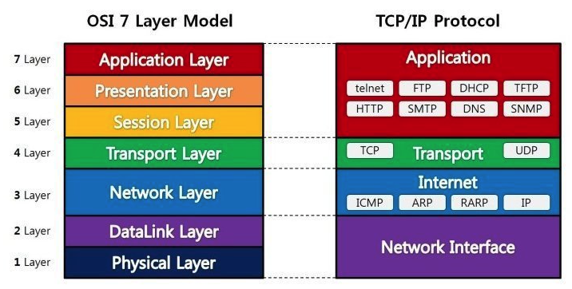

# Table of Contents
[[toc]]

## 웹 통신의 흐름
1. 사용자가 브라우저로 URL을 입력한다.
2. 브라우저는 DNS를 통해 서버의 IP 주소를 찾는다.
3. HTTP는 TCP 위에서 동작하므로 `3-way handshaking`을 통해 TCP connection을 수립한다.
3. TCP 연결을 통해 HTTP 요청이 전송된다.
4. 서버는 요청을 처리하고 HTTP 응답을 반환한다.
5. 브라우저는 HTTP 응답을 처리하여 브라우저에 보여준다.

## OSI 7 Layer
네트워크 장비, 소프트웨어 간 호환성을 확보하기 위해 제정된 표준

- `물리 계층`: 비트를 전기적 신호로 변환하고, 전기적 신호를 어떻게 인식할 것인지를 정의한 계층. 리피터, 허브가 이 계층에 포함된다.
- `데이터 링크 계층`: 인접한 두 노드 간 신뢰성 있는 데이터 전송을 담당하는 계층. 데이터 속도제어, 순서제어, 오류제어를 하는 계층. 브릿지와 스위치가 이 계층에 포함되며 기기마다 고유하게 할당되는 `MAC 주소`로 기기를 구분한다.
- `네트워크 계층`: 송신 측에서 수신 측까지 패킷을 전달하기 위한 계층. `IP 주소`를 통해 `라우팅`하는 것이 주 목적인 계층이며, 라우터가 이 계층에 포함된다.
- `전송 계층`: 송신 측과 수신 측의 신뢰성 있는 데이터 전송을 담당하는 계층. TCP와 UDP가 이 계층에 포함된다.
- `세션 계층`: 애플리케이션 레벨의 세션을 관리하는 계층
- `프리젠테이션 계층`: 데이터 표현 차이를 해결해주는 계층. 서로 다른 형식을 변환하거나 암호화/복호화, 압축을 담당하는 계층. SSL이 이 계층에 포함된다.
- `응용 계층`: 호스트에서 동작하는 애플리케이션이 포함되는 계층. 

## TCP/IP 4 Layer
- `네트워크 인터페이스 계층`: 전기적 신호, 비트의 전송 규약을 정의한 계층, MAC 주소가 이 곳에 포함된다.
- `인터넷 계층`: IP 주소를 통한 라우팅 규약을 정의한 계층. IP 주소가 이 곳에 포함된다.
- `전송 계층`: IP 주소를 통한 데이터 전송의 신뢰성을 담당하는 계층. TCP/UDP가 이 곳에 포함된다.
- `응용 계층`: 호스트에서 동작하는 애플리케이션이 이 곳에 포함된다.

## TCP vs UDP
### TCP
- 연결지향형 프로토콜
- 먼저 `3-way Handshaking`을 통해 연결을 만들고 데이터를 전송한다.
- 수신측에서 패킷의 오류를 검사하고 오류가 있으면 재전송을 요청하기 때문에 신뢰성이 보장된다.
- 신뢰성을 필요로하는 어플리케이션에서 사용한다.

### TCP 3-way Handshaking
- 신뢰성있는 데이터 전송을 위해 데이터를 전송하기 전 세션을 먼저 수립하는 것
- 네 번째 `Handshaking`으로 연결을 종료한다.

### UDP
- 비연결지향형 프로토콜
- 신뢰성을 보장하지 않지만 간단하고 빠르기 때문에 스트리밍같은 서비스에 사용된다.

## 네트워크 장비
- `리피터`
    - 단순히 전기적 신호를 증폭시켜준다.
    - 1:1
- `허브`
    - 단순히 전기적 신호를 증폭시켜준다.
    - M:N
- `브릿지`
    - MAC 주소를 기반으로 동작한다.
    - 소프트웨어적으로 처리
- `스위치`
    - MAC 주소를 기반으로 동작한다.
    - 하드웨어적으로 처리하기 때문에 더 빠르다.
- `라우터`
    - IP 주소를 기반으로 라우팅해주다.
    - 핵심은 포워딩
- `게이트웨이`
    - 다른 방식의 프로토콜을 가진 두 네트워크를 연결

## DNS
- `Domain Name Service`의 약자
- `IP 주소`를 `www.google.com`처럼 기억하기 쉬운 `URL 주소`로 변환해주는 것

## HTTP 
- Hypertext Transfer Protocol
- 클라이언트와 서버 간 웹페이지 같은 자원을 주고받을 때 사용하는 통신 프로토콜
- TCP 계층 위에서 동작하며 `stateless`, `connectionless`하다는 것이 가장 큰 특징

## HTTP Method
|이름|설명|
|------|---|
|`GET`|서버에서 데이터를 가져올 때 사용하는 메서드. `Query Parameter`와 `Path Variable`로 조회할 데이터를 지정할 수 있다.|
|`POST`|서버에 리소스를 생성할 때 사용하는 메서드. `REST API`에서는 `json`이나 `xml` 형태의 데이터를 `Http Request Body`에 담아 보낸다.|
|`DELETE`|서버의 리소스를 삭제할 때 사용하는 메서드|
|`PUT`|서버 리소스의 전체를 업데이트할 때 사용하는 메서드|
|`PATCH`|서버 리소스의 일부를 업데이트할 때 사용하는 메서드|

## HTTP Status Code
- `2xx`: 요청 처리 성공
    - `200(OK)`: 요청이 성공적으로 처리됨
    - `201(Created)`: 요청이 성공적으로 처리되고 리소스가 생성됨. `POST` 요청에 대한 응답으로 사용된다.
    - `202(Accepted)`: 비동기 처리에 대한 응답. 
    - `204(No content)`: 요청이 성공적으로 처리되었으나 응답이 없음. `DELETE`, `PUT`, `PATCH` 요청에 대한 응답으로 사용된다.
- `3xx`: 리다이렉트
- `4xx`: 클라이언트 에러
    - `400(Bad request)`: 클라이언트 요청이 올바르지 않을 때 사용된다. 
    - `401(Unauthorized)`: 인증이 되지 않은 상태에서 자원을 요청할 때 사용한다.
    - `403(Forbiddend)`: 인증은 되었으나 권한이 없을 때 사용한다. 예를 들어 일반 사용자가 관리자의 리소스를 요청했을 때 응답으로 사용할 수 있다.
    - `404(Not Found)`: 클라이언특가 요청한 자원이 서버에 없을 때 응답으로 사용한다.
- `5xx`: 서버 에러, 일반적으로 클라이언트에게 `5xx` 오류를 보내지 않는다.

## HTTPS
`HTTP`는 따로 암호화 과정을 거치지 않기 때문에 중간에서 패킷을 가로챌 수 있고, 수정할 수 있다. 따라서 전송되는 데이터를 `SSL`로 암호화하여 전송하는 것을 `HTTPS`라고 한다.

## REST API
`HTTP URI`를 통해 자원을 표시하고 `HTTP Method`를 통해 자원에 대한 처리를 표현한다. 보통 `JSON` 형태로 데이터를 주고 받는다.

## 세션과 쿠키
- HTTP 통신에서 서버가 클라이언트를 식별하고 연결상태를 유지하기 위해 사용하는 데이터
- 서버는 클라이언트의 인증이 완료되면 세션을 생성하여 메모리에서 관리한다.
- 서버는 세션에 상응하는 쿠키를 생성하여 클라이언트에 전송한다.
- 클라이언트는 쿠키를 브라우저에 저장하고 데이터를 요청할 때마다 쿠키를 함께 보낸다.
- 서버는 쿠키를 세션과 비교한 후 일치하면 응답을 해준다.
- 세션을 인메모리 방식으로 관리하면 서버가 재시작될 때 사라지기 때문에 `Redis` 같은 데이터베이스에서 관리한다.
- 세션을 유지하는 것은 서버에 부담을 줄 수 있기 때문에 요즘에는 `토큰 기반 인증`도 많이 사용한다.

## JWT
- 특정 정보와 `Secret Key`를 사용하여 검증 가능하고 만료 기한이 있는 특수한 문자열을 생성할 수 있다.
- 보통 `토큰 인증방식`에서 `Access Token`과 `Refresh Token`을 생성하는데 사용한다.
- `쿠키 세션 인증방식`처럼 세션을 서버에 저장할 필요가 없기 때문에 서버의 부담이 줄어든다.

## OAuth 2.0
- 제 3자에게 인증을 위임하는 인증 방식
- 구글, 카카오 같은 간편 로그인도 `OAuth 2.0` 기반의 인증
- 순서
    - 어플리케이션을 구글, 카카오 같은 제 3자에게 등록하고 `리다이렉션 URL`과 `API Key`를 발급받는다.
    - 개발자는 제 3자에게 발급받은 `API Key`를 어플리케이션에 등록한다.
    - 사용자가 어플리케이션으로 로그인하면 `리다이렉션 URL`로 이동하도록 구현한다.
    - 사용자가 제 3자의 로그인 페이지에서 인증에 성공하면 애플리케이션은 인증 여부와 사용자 정보를 받게 된다.

## SOP
- 동일 출처 정책(Same Origin Policy)
- 브라우저가 하나의 도메인에서 다른 도메인으로 통신하지 못하도록 차단하는 정책
- 즉, `SOP`정책을 위반한 응답을 브라우저가 막는 것
- 예를 들어 `http://domainA.com`에서 `http://domainB.com`으로 접근하지 못하도록 하는 것이다.
- 실제로는 브라우저가 `호스트`, `프로토콜`, `포트번호`까지 일치하는지 확인한다.

## CORS
- `SOP`문제를 해결하기 위한 방법이 `CORS(교차 출처 리소스 공유)`
- 클라이언트와 서버가 정해진 헤더를 통해 교차 출처 리소스를 허용할지 결정하는 스펙
- `CORS`는 백엔드에서 처리해야한다.
- 클라이언트는 그저 HTTP Request의 `Origin`헤더에 도메인을 추가하여 요청한다.
- 서버는 도메인이 적절한지 확인한 후 응답의 `Access-Control-Allow-Origin` 헤더에 그 도메인을 추가하여 반환한다.
- 클라이언트의 웹 브라우저는 응답의 `Access-Control-Allow-Origin`가 클라이언트의 도메인인지 확인한 후 일치하면 응답을 통과시킨다.
- `Spring`, `Express` 같은 웹 프레임워크는 `CORS`을 쉽게 적용하기 위한 다양한 방법을 제공한다. `스프링 MVC`에서는 `@CrossOrigin`어노테이션이나 `@Configuration`을 통해 허용할 도메인을 설정할 수 있다.

## 프록시 서버
### 포워트 프록시 서버
- Client 쪽에 위치하는 프록시 서버
- Client의 IP 주소를 감춰준다.
- Server의 데이터를 캐싱한다.
- Client가 정해진 사이트에만 접속할 수 있도록 제한할 수 있다.

### 리버스 프록시 서버
- 로드밸런싱 (Nginx)
- 무중단 배포
- 서비스를 실제로 제공하는 WAS의 IP를 감출 수 있다.

## SQL Injection
- 로그인 폼 같은 입력 위젯에 `DELETE`, `DROP`, `UPDATE` 같은 SQL을 삽입하여 서버에 전송하는 것
- 1차적으로 `Spring Validation`으로 입력값을 검증하고,
- 2차적으로 `Native SQL` 대신 `Spring Data JPA`나 `Query DSL`을 사용한다.

## IP 
### 공인 IP
- 전 세계적으로 유일한 IP

### 사설 IP
- LAN, Ethernet 안에서만 유효한 IP
- 공인 IP 주소의 부족으로 등장했다.
- `Router`에서 `사설 IP`와 `Port`를 `공인 IP`로 매핑한다.

## IP와 MAC Address
- `MAC 주소`는 NIC(네트워크 인터페이스 카드)에 고유하게 할당되는 번호. 
- `IP 주소`가 네트워크 상 호스트를 구분하기 위한 주소라면 `MAC 주소`는 하드웨어를 식별하기 위한 주소다.
- `ARP(Address Resolution Protocol)`과 `RARP(Reverse ARP)`를 사용하여 IP와 MAC address 사이의 변환을 한다.

## DHCP
- `Dynamic Host Configuration Protocol`
- `LAN(Ethernet) 환경에서` 동적으로 사설 IP를 할당해주는 프로토콜

## 포트
한 호스트에서 어플리케이션을 구분하기 위한 포트번호