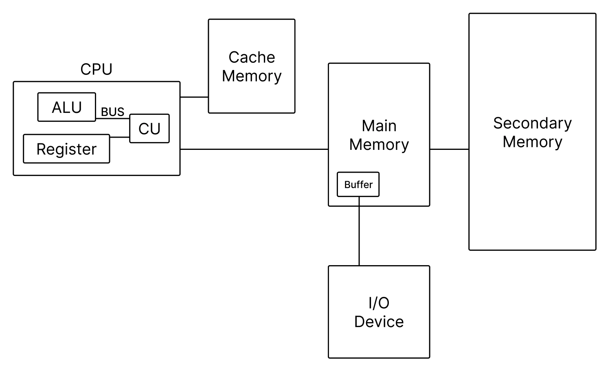

# Table of Contents
[[toc]]

## 문자 인코딩
- 알파벳, 한글같은 문자나 특수문자를 컴퓨터가 인식할 수 있도록 변환하는 것

### ASCII
- <u>영문 알파벳</u>을 표현하는 문자 인코딩 방식
- 7비트로 한 문자를 표현하고, 1개는 패리티 비트로 사용한다.
- $2^7 = 128$개의 문자를 표헌할 수 있다.

### 유니코드
- <u>전 세계의 언어</u>를 표현할 수 있는 문자 인코딩 방식
- `UTF-8`: 
    - 가변길이 문자열 인코딩
    - 1~4 바이트

## 컴퓨터 구조

## CPU
- `Processor`라고도 한다.
- 컴퓨터를 제어하는 핵심 장치. 인간의 뇌와 같다.

### CPU의 구성요소
#### ALU
- `Arithmetic Logic Unit`
- 산술 연산, 논리 연산을 처리하는 디지털 회로

#### Register
- CPU 내부의 기억장치
- Register의 크기는 CPU가 한 클럭에 처리할 수 있는 비트 수다.
    - `PC`: `Program Counter`. 다음 실행할 명령어의 메모리 주소를 저장한다.
    - `IR`: `Instruction Register`. 현재 실행 중인 명령어를 저장한다.

#### CU
- `Control Unit`
- 메모리의 명령어를 패치, 해독하고 적절한 제어 신호를 각 장치에 보낸다.

#### Bus
- ALU, Register, CU를 연결하고 데이터가 전송되는 통로

### CPU 아키텍처
#### CISC
- `Complex Instruction Set Computer`
- 명령어의 길이가 가변적이다.
- 하나의 명령어로 최대한 많은 작업을 한다.
- 모든 명령어를 하드웨어적으로 구현한다.
- Intel, AMD의 x86 제품군
- 주로 PC, Server에 사용된다.

#### RISC
- `Reduced Instruction Set Computer`
- 명령어의 길이가 고정되어있다.
- 하나의 명령어로 하나의 작업을 수행한다.
- `CISC`에서 자주 사용하는 명령어만 하드웨어적으로 구현하고, 복잡한 명령어는 소프트웨어적으로 구현한 형태다.
- 자주 사용하는 명령어를 캐싱할 수 있다.
- ARM 제품군
- 주로 모바일 AP에 사용된다.

## AP
- `Application Processor`
- `SoC(System on a Chip)`이라고도 한다.
- 하나의 칩에 CPU, RAM, GPU 등이 한 개의 칩에 들어가는 것을 의마한다.
- 주로 ARM에서 아키텍쳐를 설계하며, 이를 커스터마이징한 삼성 엑시노스, 퀄컴 스냅드래곤, 애플 실리콘 등의 제품군이 있다.

## GPU
- `Graphic Processing Unit`
- 그래픽 처리장치
- `CPU`가 복잡한 연산을 빠르게 처리한다면, `GPU`는 단순하고 양이 많은 연산을 빠르게 병렬처리한다.
- 그래픽, 게임, 인공지능, 증강현실, 빅데이터 분석 등 대용량 데이터 처리 분야에 활용된다.
- 엔비디아

## RAM
- Randon Access Memory
- `Random Access` 방식이기 때문에 접근 속도가 일정하다.
- 재부팅하면 정보가 사라지는 휘발성 메모리
- 주 메모리에 사용된다.

### DRAM
- 충전이 필요한 `Capacitor`를 사용하므로 재충전이 계속 필요하다.
- `SRAM`에 비해 속도는 느리지만 구조가 단순하 집적도를 높이기 쉽고 용량이 크다.
- 따라서 주메모리에 많이 사용된다.

### SRAM
- 충전이 필요없는 `Flip Flop`을 사용한다.
- `DRAM`보다 접근속도가 100배 이상 빠르지만 구조가 복잡하해 집적도를 높이기 어려워서 용량이 작다.
- `DRAM`보다 가격이 비싸다.
- 따라서 `Cache Memory`에 주로 사용된다.

## ROM
- Read Only Memory
- 읽기 전용 메모리이기 때문에 데이터를 변경할 수 없거나 특수한 방법으로만 변경할 수 있다.
- 쓰기 속도는 RAM에 비해 훨씬 빠르다.
- 비휘발성 메모리이기 때문에 전력이 차단되도 데이터가 유지된다.
- 부팅 시 가장 먼저 실행되어 하드웨어를 초기화하는 `BIOS`가 주로 저장된다.

### EEPROM
- Electrically Erasable Programmable Read Only Memory
- 전기적으로 여러번 삭제 후 재기록할 수 있다.
- 읽기 속도는 매우 빠르지만 쓰는 속도는 느리다. `ROM`은 덮어쓰기가 불가능하고 전체를 삭제한 후 재기록해야하기 때문이다.

## Flash Memory
- `EEPROM`에서 발전한 메모리
- 전기적인 방식으로 재기록이 가능하다.
- 비휘발성 메모리이기 때문에 전원이 차단되도 데이터가 유지된다.
- EEPROM은 메모리 전체를 삭제하고 재기록하지만 `Flash Memory`는 바이트 단위로 삭제 후 재기록할 수 있다.
- 작고 빠르기 때문에 다양한 온갖 전자제품에 사용되며 USB 메모리, SSD에도 사용된다.

## 보조 기억장치
### HDD
- Hard Disk Drive
- 회전 디스크에 데이터를 저장한다.
- `암(Arm)`이 디스크를 회전하여 데이터를 읽고 쓴다.
- `암(Arm)`의 물리적 회전 속도 때문에 속도가 느리다.
- 또한 전력소모가 크다.

### SSD
- Solid State Drive
- 여러 `Flash Memory`를 마치 `RAID 0` 방식으로 구성하여 `Flash Memory`의 느린 쓰기 속도를 극복한다.
- `HDD`보다 훨씬 빠른 속도를 자랑한다.
- 스마트폰 뿐만 아니라 노트북 분야에도 많이 사용되고 있다.

## 캐시 메모리
- CPU와 주기억장치 사이에 위치하여 속도 향상을 가져온다.
- `SRAM`을 사용하기 때문에 `DRAM`을 사용하는 주메모리보다 속도가 빠르다.
- 캐시 메모리는 `시간 지역성`, `공간 지역성` 개념에서 출발한다.
- 주 메모리에서 읽어온 데이터를 캐시메모리에 저장하고, 다음 접근 때 캐시메모리에서 데이터를 읽어온다.
- 찾는 데이터가 캐시 메모리에 있는 비율을 `Hit Ratio`라고 한다.
- 찾는 데이터가 캐시 메모리에 없어 주메모리를 탐색하는 시간을 `Miss Penalty`라고 한다.

## 가상 메모리
- 주기억장치는 가격도 비싸고 크기의 한계가 있다. 이러한 한계를 극복하고 주기억장치보다 더 큰 프로그램을 실행하기 위해 <u>보조 기억장치의 영역 일부를 주기억장치처럼 사용하는 것</u>
- 프로그램을 `페이지(Page)`라는 단위로 분할하고, 현재 실행중인 페이지만 주기억장치에 로드하여 실행한다.

## RAID
- 저장장치 여러개를 묶어 논리적으로 고성능, 안정성이 있는 저장장치 한 개 같은 효과를 얻기 위한 기법
- 주 사용 목적은 `고성능(Striping)`과 `안전성(Mirroring)`에 있다.

### RAID 0
- 고성능(Striping)
- 일반적으로 입출력 속도는 CPU의 처리속도보다 훨씬 느리다.
- `RAID 0`은 여러 저장장치에 데이터를 분산하여 저장한다.
- 한 저장장치에 데이터가 저장되는 동안 CPU는 쉬지않고 다른 저장장치에 데이터를 저장한다.
- 이론적으로 저장장치가 N개라면 속도는 N배가 된다.
- 저장장치가 하나라도 고장나면 데이터 전체가 파손되기 때문에 안정성이 떨어진다.

### RAID 1
- 안정성(Mirroring)
- 동일한 데이터를 여러 디스크에 중복 저장한다.
- 디스크 중 하나라도 살아남은 데이터는 보존된다.

### RAID 2, 3, 4, 5
- 디스크에 데이터를 저장할 때 오류를 검출할 수 있는 `Parity bit`를 함께 저장한다. 