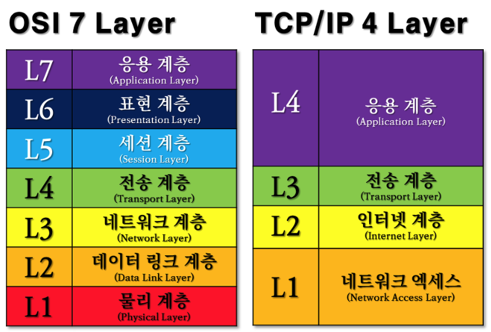
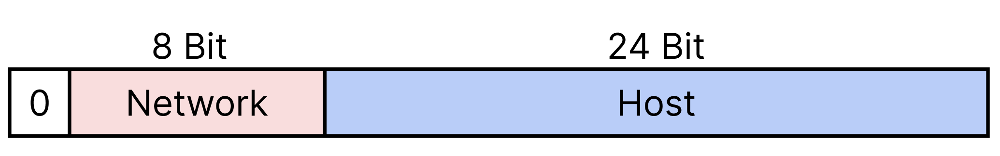
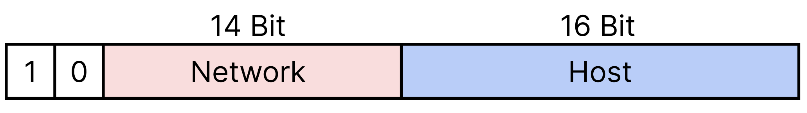
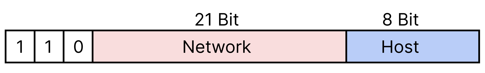
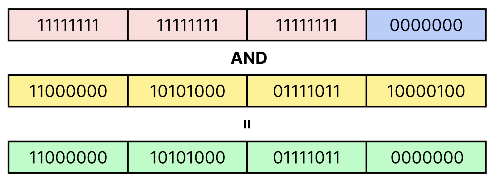
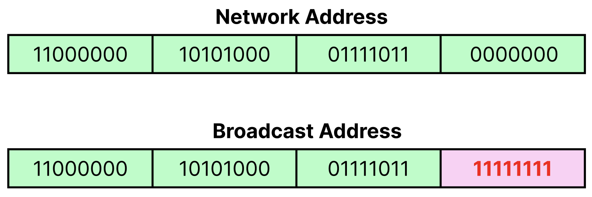

# Table of Contents
[[toc]]

## 웹 통신의 흐름
1. 사용자가 브라우저로 URL을 입력한다.
2. 브라우저는 DNS를 통해 서버의 IP 주소를 찾는다.
3. HTTP는 TCP 위에서 동작하므로 `3-way handshaking`을 통해 TCP connection을 수립한다.
3. TCP 연결을 통해 HTTP 요청이 전송된다.
4. 서버는 요청을 처리하고 HTTP 응답을 반환한다.
5. 브라우저는 HTTP 응답을 처리하여 브라우저에 보여준다.

## OSI 7 Layer 모델
네트워크 장비, 소프트웨어 간 호환성을 확보하기 위해 제정된 표준

- <b>`물리 계층`</b>
    - 전기적 신호와 비트 간 변환, 전기적 신호를 어떻게 인식할 것인지를 정의한 계층. 
    - 리피터, 허브가 이 계층에 포함된다.
- <b>`데이터 링크 계층`</b>
    - 인접한 두 노드 간 신뢰성 있는 데이터 전송을 담당하는 계층. 
    - 속도 제어, 순서 제어, 오류 제어를 담당하며 Ethernet, WiFi, Bluetooth가 이 계층에 포함
    - `MAC 주소`로 기기를 고유하게 구분한다.
    - 브릿지와 스위치가 이 계층에 포함된다.
- <b>`네트워크 계층`</b>
    - 출발지 호스트에서 목적지 호스트까지 IP 주소를 통한 라우팅을 담당하는 계층
    - 라우터가 이 계층에 포함된다.
- <b>`전송 계층`</b>
    - 출발지 호스트에서 목적지 호스트까지 신뢰성 있는 데이터 전송을 담당하는 계층. 
    - TCP와 UDP가 이 계층에 포함된다.
- <b>`세션 계층`</b>
    - 프로세스 레벨의 세션을 관리하는 계층
- <b>`프리젠테이션 계층`</b>
    - 압축, 암호화/복호화, 인코딩/디코딩을 담당하는 계층
    - Base 64 인코딩, MIME 인코딩, SSL/TSL이 이 계층에 포함된다.
- <b>`응용 계층`</b>: 
    - 호스트에서 동작하는 프로세스가 포함되는 계층

## TCP/IP 4 Layer 모델
- <b>`네트워크 인터페이스 계층`</b>
    - OSI 7 Layer의 물리 계층과 데이터 링크 계층을 합친 계층
    - 전기적 신호와 비트 간 변환, 비트의 전송 규약, 인접한 두 노드 간 신뢰성 있는 데이터 전송을 정의한 계층
    - MAC 주소가 이 곳에 포함된다.
- <b>`인터넷 계층`</b>
    - IP 주소를 사용하여 출발지 호스트에서 목적지 호스트로의 라우팅을 담당하는 계층
    - 라우터가 이 계층에 포함된다.
- <b>`전송 계층`</b>
    - 출발지 호스트에서 목적지 호스트까지 신뢰성 있는 데이터 전송을 담당하는 계층. 
    - TCP와 UDP가 이 계층에 포함된다.
- <b>`응용 계층`</b>
    - 호스트에서 동작하는 프로세스가 이 곳에 포함된다.

## TCP vs UDP
### TCP
- Connection-oriented 프로토콜
- 먼저 `3-way Handshaking`을 통해 연결을 수립한 후 데이터를 전송한다.
- 수신측에서 패킷의 오류를 검사하고 오류가 있으면 재전송을 요청하기 때문에 신뢰성이 보장된다.

### TCP 3-way Handshaking
- 신뢰성있는 데이터 전송을 위해 데이터를 전송하기 전 세션을 먼저 수립하는 것
- `SYN`, `SYN+ACK`, `ACK` 순으로 패킷이 전송되면 연결이 되었다고 간주한다.
- 네 번째 `Handshaking`으로 연결을 종료한다.

### UDP
- Connection-less 프로토콜
- 신뢰성을 보장하지 않지만 간단하고 빠르기 때문에 스트리밍 같은 서비스에 사용된다.

## 네트워크 장비
- `리피터`
    - 단순히 전기적 신호를 증폭시켜준다.
    - 1:1
- `허브`
    - 단순히 전기적 신호를 증폭시켜준다.
    - M:N
- `브릿지`
    - MAC 주소를 기반으로 동작한다.
    - 소프트웨어적으로 처리
- `스위치`
    - MAC 주소를 기반으로 동작한다.
    - 하드웨어적으로 처리하기 때문에 더 빠르다.
- `라우터`
    - IP 주소를 기반으로 라우팅해주다.
    - 핵심은 포워딩
- `게이트웨이`
    - 다른 방식의 프로토콜을 가진 두 네트워크를 연결

## DNS
- `Domain Name Service`의 약자
- `IP 주소`를 `www.google.com`처럼 기억하기 쉬운 `URL 주소`로 변환해주는 것

## HTTP 
- Hypertext Transfer Protocol
- 클라이언트와 서버 간 웹 페이지 같은 자원을 주고받을 때 사용하는 통신 프로토콜
- TCP 계층 위에서 동작하며 `connectionless`, `stateless`하다는 것이 가장 큰 특징
- `connection`, `state`를 부여하기 위해 쿠키, 세션을 사용할 수 있다.
- JSON 형태의 데이터를 주고 받는 REST API에도 사용된다.

### HTTP Method
|이름|설명|
|------|---|
|`GET`|- 서버에서 데이터를 가져올 때 사용하는 메서드.   - `Query Parameter`와 `Path Variable`로 조회할 데이터를 지정할 수 있다.|
|`POST`|- 서버에 리소스를 생성할 때 사용하는 메서드.   - `REST API`에서는 `json`, `xml` 형태의 데이터를 `Http Request Body`에 담아 보낸다.|
|`DELETE`|서버의 리소스를 삭제할 때 사용하는 메서드|
|`PUT`|서버 리소스의 전체를 업데이트할 때 사용하는 메서드|
|`PATCH`|서버 리소스의 일부를 업데이트할 때 사용하는 메서드|

### HTTP Status Code
- `2xx`: 요청 처리 성공
    - `200(OK)`: 요청이 성공적으로 처리됨
    - `201(Created)`: 요청이 성공적으로 처리되고 리소스가 생성됨. `POST` 요청에 대한 응답으로 사용된다.
    - `202(Accepted)`: 서버가 요청을 수신했으나 아직 처리중이라는 의미, 비동기 처리에 대한 응답. 
    - `204(No content)`: 요청이 성공적으로 처리되었으나 응답이 없음. `PUT`, `PATCH`, `DELETE` 요청에 대한 응답으로 사용된다.
- `3xx`: 리다이렉트
- `4xx`: 클라이언트 에러
    - `400(Bad request)`: 클라이언트 요청이 올바르지 않을 때 사용된다. 
    - `401(Unauthorized)`: 인증이 되지 않은 상태에서 자원을 요청할 때 사용한다.
    - `403(Forbiddend)`: 인증은 되었으나 권한이 없을 때 사용한다.
    - `404(Not Found)`: 클라이언특가 요청한 자원이 서버에 없을 때 응답으로 사용한다.
- `5xx`: 서버 에러, 일반적으로 클라이언트에게 이 에러를 보내지 않는다.
    - `500(Internal Server Error)`: 서버 내부 에러

### HTTPS
`HTTP`는 따로 암호화 과정을 거치지 않기 때문에 중간에서 패킷을 가로채면 내용을 들여다볼 수 있고 위변조할 수도 있다. 따라서 전송되는 데이터를 `SSL`로 암호화하여 전송하는 것을 `HTTPS`라고 한다.

### REST API
`HTTP URI`를 통해 자원을 표시하고 `HTTP Method`를 통해 자원에 대한 처리를 표현한다. 보통 `JSON` 형태로 데이터를 주고 받는다.

### MIME Type
- 인터넷에서 전달되는 데이터의 타입을 알려주는 식별자 `Media Type은`이라고도 한다. 
- 자주 사용되는 MIME Type은 다음과 같다.
    - `application/json`: JSON 형식의 데이터
    - `application/x-www-form-urlencoded`: HTML의 `<form>` 태그
    - `multipart/form-data`: 이미지와 문자열처럼 두 종류 이상의 데이터 함께 전송할 때 사용. 주로 파일 업로드에 사용.

## IP
- Internet Protocol
- 두 호스트 간 정보를 송신하고 수신하는데 필요한 규약
- OSI 7 layer의 세 번째 계층인 Network Layer에 해당한다.
- `IP 주소`로 호스트를 구분한다.

## IP 주소
- Internet Protocol 환경에서 각 호스트를 유일하게 구분하는 주소
- `IP v4`와 `IP v6` 두 종류가 있다.

### IP v4
- 32bit로 이루어진 주소
- 8bit 단위로 끊어서 표현한다. 
    - `00000000.00000000.00000000.00000000` ~ `11111111.11111111.11111111.11111111`
- 보통 10진수로 표현한다. 
    - `0.0.0.0` ~ `255.255.255.255`
- 약 43억 개($256^4$)의 고유한 주소를 부여할 수 있다.
- 네트워크 영역과 호스트 영역으로 구분된다.

### IP v6
- 128 bit로 이루어진 주소
- IP v4 주소의 부족으로 등장

## 네트워크 클래스
- 약 43억 개의 IP v4 주소를 A, B, C, D, E 클래스로 나눈 IP 주소 할당 방식

|클래스|대역폭|설명|
|------|---|---|
|클래스 A|0.0.0.0 ~ 127.255.255.255|대규모 네트워크에서 사용되는 대역폭|
|클래스 B|128.0.0.0 ~ 191.255.255.255|중규모 네트워크에서 사용되는 대역폭|
|클래스 C|192.0.0.0 ~ 223.255.255.255|소규모 네트워크에서 사용되는 대역폭|
|클래스 D|224.0.0.0 ~ 239.255.255.255|멀티캐스트용 대역폭|
|클래스 E|192.168.0.0 ~ 192.168.255.255|연구개발용 대역폭|

### 클래스 A
- 대규모 네트워크에서 사용되는 대역폭
- 첫 번째 비트가 `0`으로 시작한다.
- 두 번째 비트에서 시작하여 8개의 비트는 네트워크 영역으로 사용한다.
- 나머지 24비트는 호스트 영역으로 사용한다.
- 즉 클래스 A는 $2^8$(256)개의 네트워크를 가질 수 있고, 각 네트워크 당 $2^{24}$(16,777,216)개의 호스트를 가질 수 있다.

### 클래스 B
- 중규모 네트워크에서 사용되는 대역폭
- 앞 두 개의 비트가 `10`으로 시작한다.
- 세 번째 비트에서 시작하여 14개의 비트는 네트워크 영역으로 사용한다.
- 나머지 16개는 호스트 영역으로 사용한다.
- 즉 클래스 B는 $2^14$(16,384)개의 네트워크를 가질 수 있고, 각 네트워크 당 $2^{16}$(65,536)개의 호스트를 가질 수 있다.

### 클래스 C
- 소규모 네트워크에서 사용되는 대역폭
- 앞 세 개의 비트 `110`으로 시작한다.
- 네 번째 비트에서 시작하여 21개의 비트는 네트워크 영역으로 사용한다.
- 나머지 8개는 호스트 영역으로 사용한다.
- 즉 클래스 C는 $2^21$(2,097,152)개의 네트워크를 가질 수 있고, 각 네트워크 당 $2^{8}$(256)개의 호스트를 가질 수 있다.

### 클래스 D
- 멀티캐스트용 대역폭
- 앞 네 개의 비트가 `1110`으로 시작한다.

### 클래스 E
- 연구개발용 대역폭
- 앞 네 개의 비트가 `1111`로 시작한다.

### 특수 범위
몇몇 주소들은 특별한 목적을 위해 예약되어있다. 예를 들어 논리적으로 `클래스 C`의 경우 하나의 네트워크 당 256개의 호스트를 가질 수 있다. 그러나 실제로는 다음 두 주소를 제외한 254개의 호스트를 가질 수 있다.

- 네트워크 주소
- 브로드캐스트 주소

대표적인 특수 범위의 주소는 다음과 같다.

|대역폭|설명|
|---|----|
|127.0.0.1|루프백 주소(localhost)|
|0.0.0.0|네트워크 주소|
|255.255.255.255|브로드캐스트 주소|
|10.0.0.0 ~ 10.255.255.255|클래스 A의 사설망|
|172.16.0.0 ~ 172.31.255.255|클래스 B의 사설망|
|192.168.0.0 ~ 192.168.255.255|클래스 C의 사설망|

### 서브넷 마스크
`서브넷 마스크`는 IP v4의 32bit 숫자 중 <u>네트워크 영역을 1, 호스트 영역을 0으로 나타내는 것</u>이다.

|클래스|서브넷 마스크|
|---|----|
|클래스 A|255.0.0.0(10진수)|
|클래스 B|255.255.0.0(10진수)|
|클래스 C|255.255.255.0(10진수)|

주소 `192.168.123.7`를 예제로 살펴보자. 이 주소를 이진수로 표현하면 다음과 같다.

이 IP는 클래스 C에 속하며, 클래스 C는 클래스를 구분하는 용도의 `110`을 포함하여 총 24 Bit를 클래스 영역으로 사용한다. 클래스 C의 서브넷 마스크를 표현하면 다음과 같다.

이 서브넷 마스크를 10진수로 표현하면 `255.255.255.0`이 된다.

### 네트워크 주소
IP 주소와 서브넷 주소를 AND 연산으로 합치면 다음과 같다.

이 주소를 10진수로 변환하면 `192.168.123.0`이며, 이 주소를 해당 네트워크의 주소라고 한다.

### 브로드캐스트 주소
`브로드캐스트`는 같은 네트워크에 연결된 모든 호스트에게 데이터를 전송하는 것이다. `브로드캐스트 주소`는 해당 네트워크의 마지막 IP 주소를 사용하며, <u>네트워크 주소에서 호스트 영역을 1로 채우면 된다.</u>

이 주소를 10진수로 표현하면 `192.168.123.255`다. 

### 왜 서브넷 마스크을 사용하는가?
서브넷 마스크를 왜 사용하는지 이해하려면 네트워크 장비인 `라우터(Router)`에 대해 알아야한다. 라우터는 서로 다른 두 네트워크를 연결한다. 

- 서로 다른 두 LAN을 연결
- LAN과 외부 네트워크를 연결

한 네트워크의 호스트들은 네트워크 상태 등을 파악하기 위해 주기적으로 다른 호스트들에게 브로드캐스트 메시지를 보낸다. 이 때문에 네트워크에 호스트가 많아질수록 트래픽이 많아지고 대역폭을 낭비할 염려가 있다.

라우터에 특정 LAN에 대한 서브넷 마스크를 등록하면, 라우터는 특정 LAN에서 발생하는 브로드캐스트 메시지를 다른 네트워크로 전파되지 않도록 차단한다. 이 때문에 트래픽을 외부 네트워크로 유출하여 대역폭을 낭비할 가능성을 낮출 수 있다.

### 서브넷과 서브넷팅
`클래스 C`는 하나의 네트워크 당 254개의 호스트를 가질 수 있다. 만약 `클래스 C`의 네트워크에 30개의 호스트만이 존재한다면 나머지 224개는 낭비된다.

`서브넷팅(Subneting)`은 이러한 낭비를 방지하기 위해 <u>하나의 네트워크를 여러 개의 작은 `서브넷(Subnet)`으로 나누는 기술</u>을 의미한다. IP 주소에서 호스트 영역의 앞 부분도 네트워크 영역으로 사용하는 것이다.

서브넷 마스크를 1 bit 늘리면 네트워크 수는 2배 늘어나고, 네트워크 당 호스트의 수는 반으로 줄어든다.

## CIDR
<b>`CIDR(Classess Inter-Domain Routing)`</b>은 <u>클래스 없이 IP 주소를 할당하는 방식</u>으로 1993년부터 기존 네트워크 `클래스 네트워크` + `서브네팅` 방식을 대체했다. IP 대역을 클래스를 구분하지 않고 자유롭게 서브넷 마스크를 설정하여 서브넷팅 한다고 생각하면 된다. 

`<IP 주소>/<서브넷 마스크 비트수>` 형태의 <u>CIDR 표기법</u>으로 주소를 표현하며, 기존 <u>네트워크 클래스 방식보다 유연하게 IP 주소를 할당할 수 있다.</u>

예제를 살펴보자. `192.168.1.3/24`의 경우 서브넷 마스크가 24 bit임을 의미한다. 따라서 이 IP가 포함된 네트워크의 주소는 `192.168.1.0`이고 510($2^8-2$)개의 호스트를 가질 수 있으며, 브로드캐스트 주소는 `192.168.1.255`가 된다.

## 공인 IP vs. 사설 IP
`공인 IP`는 Public Internet 망에서 유일한 IP주소다. 반면 `사설 IP`는 특정 네트워크, 예를 들면 LAN, Ethernet에서만 유일한 IP다. 보통 Public Internet과 LAN을 연결하는 라우터에서 `공인 IP:포트번호`과 사설 IP를 매핑한 테이블을 유지하며 `NAT(Network Address Translation)`, `RNAT` 프로토콜을 이용하여 두 주소를 변환해준다.

## IP와 MAC Address
- `MAC 주소`는 NIC(네트워크 인터페이스 카드)에 고유하게 할당되는 번호. 
- `IP 주소`가 네트워크 상 호스트를 구분하기 위한 주소라면 `MAC 주소`는 하드웨어를 식별하기 위한 주소다.
- `ARP(Address Resolution Protocol)`과 `RARP(Reverse ARP)`를 사용하여 IP와 MAC address 사이의 변환을 한다.

## DNS
- Domain Name Service
- Domain Name을 IP 주소로 변환해주는 서비스
- 보통 LAN 안에 DNS Server가 배치된다.

## DHCP
- `Dynamic Host Configuration Protocol`
- `LAN(Ethernet) 환경에서` 동적으로 사설 IP를 할당해주는 프로토콜

## 포트
한 호스트에서 프로세스를 구분하기 위한 포트번호

## 프록시 서버
### 포워드 프록시 서버
- Client 쪽에 위치하는 프록시 서버
- Client의 IP 주소를 감춰준다.
- Server의 데이터를 캐싱한다.
- Client가 정해진 사이트에만 접속할 수 있도록 제한할 수 있다.

### 리버스 프록시 서버
- 로드밸런싱 (Nginx)
- 무중단 배포
- 서비스를 실제로 제공하는 WAS의 IP를 감출 수 있다.