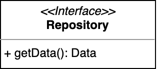
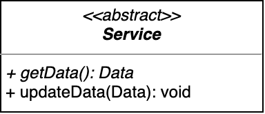
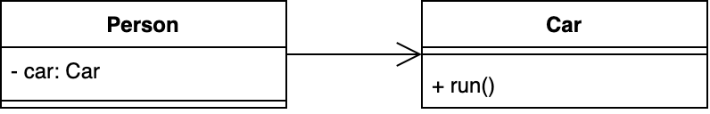
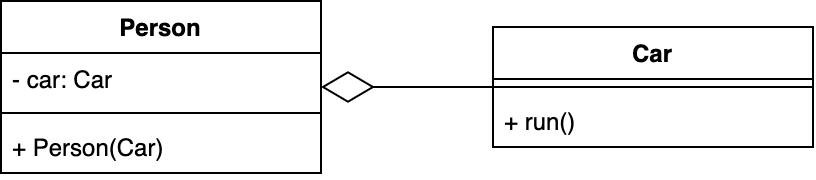
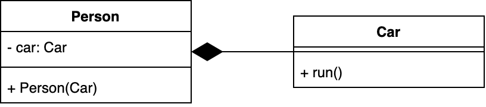
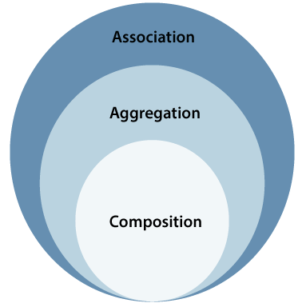

# Table of Contents
[[toc]]

## 소프트웨어 공학
- 최소 `비용`, `시간`으로 최대 `품질`의 소프트웨어를 개발, 운영, 유지보수하기 위한 방법론

## 좋은 소프트웨어란?
1. 사용자 요구가 정확히 반영된 소프트웨어
2. 에러가 적은 소프트웨어
3. 유지보수가 쉬운 소프트웨어
4. 변경에 대응하기 쉬운 소프트웨어

## 소프트웨어 위기
- 소프트웨어 규모가 커지고 복잡해 질수록 유지보수 비용이 기하급수적으로 증가하는 현상
- 소프트웨어 수명 전체를 고려하면 유지보수 비용이 개발 비용을 초과한다.

## 왜 유지보수가 필요할까?
1. 시스템에 남아있는 오류를 제거하기 위해
2. 요구사항의 변경
3. 비즈니스의 변경

## 소프트웨어의 생명주기
프로젝트 계획 > 요구분석 > 아키텍처 설계 > 상세 설계 > 구현 > 테스트 > 유지보수

## 소프트웨어 개발 방법론
- 폭포수 방법론
- 애자일 방법론

## 폭포수 방법론

- 계획, 요구분석, 아키텍처 설계, 상세 설계, 구현, 테스트 등 각 단계를 순서대로 진행하는 방법론
- 한 단계의 결과가 확인된 후에 다음 단계로 넘어간다.
- 구현, 테스트 등 뒷 단계가 지연될 가능성이 있다.
- 변경에 유연하게 반응하기 힘들다.

## 애자일 방법론
- 처음부터 끝까지 계획하고 개발하는 폭포수 방법론과는 달리 피드백을 받아서 유연하게 개발하는 방법
- 개발해야 할 기능이 100가지라면 중요한 1~2가지 기능을 짧은 단위로 먼저 개발하고, 사용자로부터 피드백을 받아 보안하는 주기를 반복하는 것이 포인트
- `Jira`처럼 `Scrum`, `Kanvan Borad` 같은 애자일을 지원하는 프로젝트 관리도구와 전문적인 `QA 인력`이 필요
- 애자일 방법론에도 다양한 방법이 있다. 

### Scrum
- 1년 정도의 단기 계획인 로드맵으로 `Product Backlog` 작성
- 2~3주 단위의 `Spring Planing Meeting`으로 `Sprint Backlog` 작성
- 2~3주 단위의 `Sprint`와 매일 진행하는 `Daily Scrum Meeting` 수행

### Kanvan Board
해야할 작업, 진행 중인 작업, 완료된 작업 등 작업을 시각화하는데 사용한다.


### 간트 차트
일정 관리에 사용된다.


### Pair Programming
- 두 사람이 짝이 되어 한사람은 코딩, 다른 사람은 <b>코드 리뷰</b>를 하는 방법론
- 두 사람이 함께 성장할 수 있고, 코드의 일관성이 유지

### Test Driven Development
- 테스트 케이스를 먼저 작성하고 이를 통과하는 코드를 개발하는 방법론

### Feature Driven Development
- 기능 단위로 개발하는 방법론

### XP(Extreme Programming)
- 문서화를 줄이고 조금씩 자주 개발하고 릴리즈하는 방법론

### Lean
- 한국말로 군살이 없다는 의미
- 낭비를 줄이는데 포커스를 둔 방법론

## 프로젝트 계획
- 개발 범위를 한정한다.
- 일정을 계획한다.
- 비용을 추정한다.
- 구성원에 작업을 할당한다.
- 위험 요소를 관리한다.

## SOLID 원칙
객체지향 프로그래밍 및 설계에서 유지 보수가 쉽고 변경에 유연하게 대응할 수 있도록 적용하는 원칙

### SRP
- 단일 책임 원칙(Single Responsibility Priciple)
- 한 클래스는 하나의 책임만 가져야한다. 
- 즉 하나의 클래스는 해당 클래스와 연관된 기능들만 가져야하며, 응집도를 높이고 결합도를 낮추는 것과 관련된다.
- 예를 들어 계산기 클래스는 덧셈, 뺄셈, 곱셈, 나눗셈 기능만을 포함해야한다.

### OCP
- 개방 폐쇠 원칙(Open Closed Priciple)
- 변경에는 닫혀있으나 확장에는 열려있다.
- 즉 요구사항이 변경되었을 때 기존 코드를 수정하지 않고도 확장의 형태로 재사용할 수 있어야한다.
- 요구사항이 변경될 수도 있는 부분을 인터페이스로 정의하고, 변경된 요구사항은 새로은 구현체로 구현한다.
- 다형성이 핵심이다.
- 변경될 부분과 절대 변경되지 않을 부분을 구분하는게 핵심이다.

### LSP
- 리스코프 치환 원칙(Liskov Substitution Principle)
- 부모 클래스 타입의 변수에 자식 클래스의 인스턴스를 넣어도 잘 작동해야한다.
- 자식 클래스는 부모 클래스의 기능을 오버라이딩하기보단 새롭게 메소드를 정의하는 형태로 구현해야한다.

### ISP
- 인터페이스 분리 원칙(Interface Segregation Principle)
- 클래스는 자신이 사용하지 않는 인터페이스를 implements 하지 말아야한다.
- 또한 하나의 인터페이스에 선언을 몰아넣는 것보다 연관된 작은 단위로 인터페이스에 분리하여 필요한 인터페이스만 구현하는 것이 낫다.

### DIP
- 의존관계 역전 원칙(Dependency Inversion Principle)
- 의존성 주입의 기반이 되는 원칙
- 변수의 타입은 인터페이스로 정의하고 의존성 주입을 통해 구현체를 할당하는 것
- OOP의 다형성이 기반이 된다.

## 클린 아키텍처
- 핵심은 계층을 분리하고, 계층의 기능을 명확하게 정의하는 것
- Layered Architecture라는 용어를 쓰기도 한다.
- 예를 들어 웹 프론트나 모바일 앱은 UI와 관련된 계층, 비즈니스 로직과 관련된 계층, 캐싱과 관련된 리포지토리 계층, 데이터베이스에 접근하거나 네트워크 통신하는 계층으로 계층을 나눌 수 있다.
- 서버 어플리케이션의 경우 요청을 받거나 뷰를 보여주는 컨트롤러 계층, 비즈니스 로직을 수행하는 계층, 트랜잭션을 관리하는 계층, 데이터베이스에 접근하는 계층 등으로 나눌 수 있다.
- 각 계층은 인접한 계층에만 접근할 수 있으며, 계층 간에 데이터가 이동할 때 적절한 `Mapper`가 필요하기도 하다.
- 또한 인터페이스와 다형성, 추상화를 적용하여 의존하는 계층과의 결합도를 낮출 수 있다.
- 마지막으로 의존성 주입 프레임워크와 함께 사용될 때 계층 분리와 효용성이 극대화된다.
- 파일과 코드가 많아진다는 단점이 있다.
- 그러나 작업중인 계층, 그리고 인접한 계층만 고려하여 개발하기 때문에 분업화 측면에 큰 장점이 있다.
- 유지보수, 기능 추가가 쉬워진다.
- 인접한 계층만 고려하면 되기 때문에 단위테스트가 쉬워지며, `Mockup` 라이브러리와 함께 사용하면 큰 시너지를 만들어낸다.

## 스케일 업 vs. 스케일 아웃
- `스케일 업`: 더 좋은 컴퓨터를 배치하는 것.
- `스케일 아웃`: 비슷한 성능의 컴퓨터를 수직적으로 배치하는 것. Kubernetes 같은 오케스트레이션 도구가 필요하다.


## Design Pattern
- 객체지향 프로그래밍 설계를 할 때 자주 발생하는 문제를 피하기 위해 사용되는 패턴
- `GoF`는 자주 사용되는 23개의 패턴을 정리한 논문으로 크게 생성 패턴, 구조 패턴, 행위 패턴으로 구분된다.

### 생성 패턴
객체를 생성할 때 사용하는 패턴
- 싱글톤(Singleton)
- 빌더(Builder)
- 팩토리 메소드(Factory Method)
- 추상 팩토리(Abstract Factory)
- 프로토타입(Prototype)

#### 싱글톤(Singleton)
- 클래스의 인스턴스가 오직 하나만 존재하도록 하는 패턴
``` java
public class ThemeManager {
    // Instance
    private static ThemeManager instance = new ThemeManager();

    // private construct
    private ThemeManager() {}

    public static ThemeManager getInstance() {
        return instance;
    }
}
```
``` java
ThemeManager themeMgr = ThemeManager.getInstance();
```

#### 빌더(Builder)
- 인스턴스를 생성자로 직접 생성하지 않고, 빌더라는 내부 클래스로 간접 생성하는 것
- 생성자의 인자가 많으면 각 인자가 어떠한 의미를 가지는지 알기 어려운데 `Builder`클래스와 `setXXX()` 형태의 메소드로 이를 해결할 수 있다.
- Java에서는 Lombok 라이브러리의 `@Builder` 어노테이션으로 쉽게 구현할 수 있다.

``` java
class Something {

    private Something(int number, String name, double size) {
        //Something 클래스 초기화
    }

    public static class Builder {

        int number=0;
        String name=null;
        double size=0d;

        public Builder() {
            //Builder 초기화
        }

        public Builder number(int number) {
            this.number = number;
            return this;
        }

        public Builder name(String name) {
            this.name = name;
            return this;
        }

        public Builder size(double size) {
            this.size = size;
            return this;
        }

        public Something build() {
            return new Something(number, name, size);
        }
    }
}
```
``` java
Something something = new Something.Builder()
    .number(number)
    .name(name)
    .size(size)
    .build();
```

#### 팩토리 메소드(Factory Method)
- 생성자 대신 객체를 만드는 `메소드`를 제공하여 객체 생성 과정을 외부로부터 숨기는 패턴
``` java
public interface Notification {
    void send();
}
```
``` java
public class SMSNotification implements Notification {
 
    @Override
    public void send() {
        // TODO Auto-generated method stub
        System.out.println("Sending an SMS notification");
    }
}
```
``` java
public class EmailNotification implements Notification {
 
    @Override
    public void send() {
        // TODO Auto-generated method stub
        System.out.println("Sending an email notification");
    }
}
```
``` java
public class KakaoNotification implements Notification {
 
    @Override
    public void send() {
        // TODO Auto-generated method stub
        System.out.println("Sending an Kakao notification");
    }
}
```
``` java
public enum NotificationType {
    Sms, Email, Kakao
}
```
``` java
public class NotificationFactory {
    public Notification create(NotificationType type) {
        switch (type) {
            case Sms:
                return new SMSNotification();
            case Email:
                return new EmailNotification();
            case Kakao:
                return new KakaoNotification();
            default:
                throw new IllegalArgumentException("Unknown Notification Type");
        }
    }
}
```
``` java
public class Main {
    public static void main(String[] args) {
        NotificationFactory factory = new NotificationFactory();
        Notification notification = factory.create(NotificationType.SMS);
    }
}
```


#### 추상 팩토리(Abstract Factory)

#### 프로토타입(Prototype)

### 구조 패턴
객체의 구조를 디자인할 때 사용하는 패턴
- 어댑터(Adapter)
- 퍼사드(Facade)
- 프록시(Proxy)
- 컴포지트(Composite)
- 브릿지(Bridge)
- 데코레이터(Decorator)
- 플라이웨이트(Flyweight)

#### 어댑터(Adapter)

#### 퍼사드(Facade)
- Facade는 `건물의 외관 정면`이라는 의미
- 복잡한 내부과정을 대신 처리해주는 Wrapper 클래스를 제공하는 패턴
``` java
class Cpu {
	public void freeze() { ... }
	public void jump(long position) { ... }
	public void execute() { ... }
}
```
``` java
class Memory {
	public void load(long position, byte[] data) {
		...
	}
}
```
``` java
class HardDisk {
	public byte[] read(long lba, int size) {
		...
	}
}
```
``` java
class Computer {

    // ...

	public void startComputer() {
        Cpu cpu = new Cpu();
        Memory memory = new Memory();
        HardDisk hardDisk = new HardDisk();
		cpu.freeze();
		memory.load(BOOT_ADDRESS, hardDisk.read(BOOT_SECTOR, SECTOR_SIZE));
		cpu.jump(BOOT_ADDRESS);
		cpu.execute();
	}
}
```
``` java
Computer facade = new Computer()
facade.startComputer();
```

#### 프록시(Proxy)

#### 컴포지트(Composite)

#### 브릿지(Bridge)

#### 데코레이터(Decorator)

#### 플라이웨이트(Flyweight)


### 행위 패턴
객체 간 커뮤니케이션을 할 때 사용하는 패턴
- 반복자(Iterator)
- 옵저버(Observer)
- 책임 연쇄(Chain of Responsibility)
- 전략(Strategy)
- 템플릿 메소드(Template method)
- 중재자(Mediator)
- 메멘토(Memento)
- 커맨드(Command)
- 상태(State)
- 방문자(Visitor)
- 인터프리터(Interpreter)


#### 반복자(Iterator)
- 연속적인 데이터를 동일한 방법으로 쉽게 접근할 수 있도록 도와주는 패턴
- Java에서는 List 같은 Collection들이 `Iterable` 인터페이스를 구현한다. 이 인터페이스에는 `Iterator`가 존재하는데, `Iterator`의 `next()`, `hasNext()` 메소드를 사용하면 동일한 요소들에 반복적으로 접근할 수 있다.
``` java
// Iterable.java
public interface Iterable<T> {
    Iterator<T> iterator();

    // 중략...
}
```
``` java
// Iterator.java
public interface Iterator {
    boolean hasNext();
    Object next();
    void remove();
}
```
``` java
// List.java
public iterface List extends Iterable {
    // ...
}
``` java
List<String> list = new ArrayList(Arrays.asList("a", "b", "c", "d"));
Iterator iterator = list.iterator();

while (iterator.hasNext()) {
    String c = iterator.next();
}
```

#### 옵저버(Observer)
- 어떤 클래스에 변화가 일어났을 때, 이를 관찰하고 있는 다른 클래스에가 통보해주는 것.
- 안드로이드의 LiveData, Rxjava의 Observable, Reactor의 Flux같이 `Reactive Programming`에서 많이 사용되는 패턴
``` java
Observable observable = Observable.create(emitter -> {
    emitter.onNext("a")
    emitter.onNext("b")
    emitter.onNext("c")
});

observable.subscribe(new Observer() {

    @Override
    public void onSubscribe(@NonNull Disposable d) {
        // ..
    }

    @Override
    public void onNext(@NonNull Object o) {
        // ..
    }

    @Override
    public void onError(@NonNull Throwable e) {
        // ..
    }

    @Override
    public void onComplete() {
        // ..
    }
});
```

#### 책임 연쇄(Chain of Responsibility)

#### 전략(Strategy)

#### 템플릿 메소드(Template method)

#### 중재자(Mediator)

#### 메멘토(Memento)

#### 커맨드(Command)

#### 상태(State)

#### 방문자(Visitor)

#### 인터프리터(Interpreter)

## UML Diagram
`UML(Unified Modeling Language)`은 데이터, 객체, 애플리케이션, 서브시스템 등 <u>시스템을 구성하는 요소의 구조, 기능을 다이어그램으로 표현하는 모델링 언어</u>다. UML은 크게 두 관점으로 분류할 수 있다.
- 구조 모델링
- 행위 모델링

### 구조 모델링
시간의 개념이 포함되지 않은 `구조 모델링`은 `정적 모델링`이라고도 하며 주로 클래스, 시스템의 구조를 다이어그램으로 표현한다.
- Class diagram
- Package diagram
- Deployment diagram

### 행위 모델링
시간의 개념이 포함된 `행위 모델링`은 `동적 모델링`이라고도 하며 클래스, 시스템의 구성 요소들이 어떻게 상호작용하는지를 다이어그램으로 표현한다.
- Interaction diagram
    - Sequence diagram
    - Communication diagram
- Use Case diagram
- State diagram
- Activity diagram


### Class diagram
`클래스 다이어그램(Class diagram)`은 가장 많이 사용되는 UML diagram으로, 클래스 간 관계를 표현한다.

#### 클래스
클래스 다이어그램에서는 클래스를 다음과 같이 표현한다.

``` java
class Parent {

    private String name;
    private int age;

    public void printInfo() {
        System.out.println(name + " is " + age);
    }
}
```


#### 접근 제어자
접근 제어자는 멤버변수 또는 메소드 앞에 다음 기호를 붙인다.

|기호|내용|
|------|---|
|`+`|public|
|`-`|private|
|`#`|protected|

#### 생성자
생성자는 다음과 같이 표현한다.
``` java
class Parent {
    private House house;

    public Parent() {
        this.house = null;
    }

    public Parent(House house) {
        this.house = house;
    }
}
```


#### static
`static` 메소드나 멤버변수는 밑줄을 추가한다.

``` java
class Counter {
    static int count = 0;

    static int get() {
        return count; 
    }

    public void increase() {
        count ++;
    }

    public void decrease() {
        count --;
    }
}
```


#### 인터페이스
인터페이스는 다음과 같이 표현한다.

``` java
interface Repository {
    public Data getData();
}
```

보통 인터페이스 이름 위에 스테레오 타입 `<<interface>>`를 추가해준다.




#### 추상 클래스
추상 클래스 또한 이름 위에 스테레오 타입 `<<abstract>>`를 추가해준다. 또한 추상 클래스와 추상 메소드는 이탤릭체로 표현한다.
``` java
abstract class Service {
    public abstract Data getData();
    public void updateData() {
        // ...
    }
}
```




#### 클래스 사이의 관계 
객체들은 서로 상호작용하며 `관계(Relation)`를 갖는다. 
- Generalization
- Realization
- Dependency
- Association
    - Composition
    - Aggregation

#### Generalization
`일반화(Generalization) 관계`는 자식 클래스가 부모 클래스의 멤버변수와 메소드를 물려받는 상속을 의미한다.
``` java
class Parent {

    private String name;
    private int age;

    public void printInfo() {
        System.out.println(name + " is " + age);
    }
}
```
``` java
class Child extends Parent {

    private String school;

    @Override
    public void printInfo() {
        System.out.println(name + " is " + age + " and studies at " + school);
    }

    public void printSchool() {
        System.out.println(school)l
    }
}
```

이를 클래스 다이어그램으로 표현하면 다음과 같다.


#### Realization
`실체화(Generalization) 관계`는 인터페이스를 구현하는 것을 의미한다.
``` java
interface Repository {
    public Data getData()
}
```
``` java
interface RepositoryImpl implements Repository {
    public Data getData() {
        // ...
    }
}
```

이를 클래스 다이어그램으로 표현하면 다음과 같다.


#### Dependency
`의존(Dependency) 관계`는 어떤 클래스가 다른 클래스를 참조하는 것을 의미한다. 보통 클래스 내부에 다른 클래스의 참조를 갖지는 않고, 파라미터로 다른 클래스의 참조를 전달받는 것을 의존 관계로 정의한다.

메소드로 다른 클래스의 인스턴스를 전달받는 것이 대표적인 의존 관계다.
``` java
class Person {
    public void moveBy(Car car) {
        car.run();
    }
}
```


생성자로 다른 클래스를 전달 받는 것도 의존 관계다.
``` java
class Person {

    public Person(Car car) {
        // ...
    }
}
```


#### Association
`연관(Association) 관계`는 의존 관계와 다르게 클래스 내부에 다른 클래스의 참조를 가지고 있다.
``` java {2}
class Person {
    private Car car;

    // ...
}
```


참조의 방향성을 나타내기 위해 화살표를 추가하기도 한다.



`Collection`의 형태로 여러 참조를 가진 경우 개수를 추가할 수 있다.
``` java {2}
class Person {
    private List<Car> cars = new ArrayList<Car>;

    // ...
}
```


#### Aggregation
`집합(Aggregation, Aggregate Association) 관계`는 좀 더 특수한 연관관계다. 클래스가 메모리에서 소멸해도 참조되는 다른 클래스는 소멸되지 않는 관계를 집합 관계라고 한다.

``` java {2}
class Person {
    private Car car;

    public Person(Car car) {
        this.car = car;
    }
}
```
위 코드는 `Person`클래스 내부에 `Car` 객체에 대한 참조를 가지고 있다. 그러나 참조되는 객체를 생성자의 파라미터로 전달받기 때문에 `Person` 객체가 사라져도 `Car` 객체는 사라지지 않는다.

이를 다이어그램으로 표현하면 다음과 같다.



집합 관계도 참조 방향성과 개수를 추가할 수 있다.


집합 관계에서 두 객체는 <u>약한 연관관계를 가지고 있다</u>고 한다.

#### Composition
`합성(Composition, Composite Association) 관계` 역시 좀 더 특수한 연관관계다. 클래스가 메모리에서 소멸하면 참조되는 클래스의 객체도 소멸되는 관계를 합성 관계라고 한다.
``` java {2}
class Person {
    private Car car = new Car();
}
```
위 예제는 `Person`객체가 소멸하면 `Car`객체도 소멸된다. 이를 다이어그램으로 표현하면 다음과 같다.

합성 관계도 참조 방향성과 개수를 추가할 수 있다.



합성 관계에서 두 객체는 <u>강한 연관관계를 가지고 있다</u>고 한다.


#### 클래스 다이어그램 정리
Association, Aggregation, Composition은 다음과 같은 포함 관계를 갖는다.



보통 처음에는 객체 간 관계가 명확하지 않기 때문에 Assoication으로 연결한다. 그러다 점점 상세화되면서 Aggregation 또는 Composition으로 변경한다.