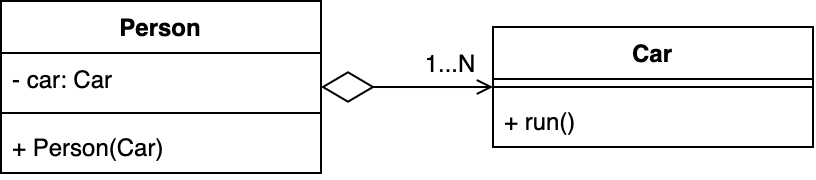

# Table of Contents
[[toc]]

# UML Diagram
`UML(Unified Modeling Language)`은 <u>시스템을 구성하는 요소의 <b>구조</b>, <b>기능</b>을 다이어그램으로 표현하는 모델링 언어</u>다. UML은 크게 두 관점으로 분류할 수 있다.
- 구조 모델링
- 행위 모델링

## 구조 모델링
시간 개념이 포함되지 않은 `구조 모델링`은 `정적 모델링`이라고도 하며 주로 클래스, 시스템의 구조를 다이어그램으로 표현한다.
- Class diagram
- Package diagram
- Deployment diagram

## 행위 모델링
시간 개념이 포함된 `행위 모델링`은 `동적 모델링`이라고도 하며 클래스, 시스템의 구성 요소들이 어떻게 상호작용하는지를 다이어그램으로 표현한다.
- Interaction diagram
    - Sequence diagram
    - Communication diagram
- Use Case diagram
- State diagram
- Activity diagram


## Class diagram
`클래스 다이어그램(Class diagram)`은 가장 많이 사용되는 UML diagram으로, 클래스 간 관계를 표현한다.

### 클래스
클래스 다이어그램에서는 클래스를 다음과 같이 표현한다.

``` java
class Parent {

    private String name;
    private int age;

    public void printInfo() {
        System.out.println(name + " is " + age);
    }

    public void updateName(String name) {
        this.name = name;
    }
}
```


### 접근 제어자
접근 제어자는 멤버변수 또는 메소드 앞에 다음 기호를 붙인다.

|기호|내용|
|------|---|
|`+`|public|
|`-`|private|
|`#`|protected|

### 생성자
생성자는 다음과 같이 표현한다.
``` java
class Parent {
    private House house;

    public Parent() {
        this.house = null;
    }

    public Parent(House house) {
        this.house = house;
    }
}
```


### static
`static` 메소드나 멤버변수는 밑줄을 추가한다.

``` java
class Counter {
    static int count = 0;

    static int get() {
        return count; 
    }

    public void increase() {
        count ++;
    }

    public void decrease() {
        count --;
    }
}
```


### 인터페이스
보통 인터페이스 이름 위에 스테레오 타입 `<<interface>>`를 추가해준다.

``` java
interface Repository {
    public Data getData();
}
```


### 추상 클래스
추상 클래스 또한 이름 위에 스테레오 타입 `<<abstract>>`를 추가해준다. 또한 추상 클래스와 추상 메소드는 이탤릭체로 표현한다.
``` java
abstract class Service {
    public abstract Data getData();
    public void updateData() {
        // ...
    }
}
```


### 클래스 사이의 관계 
객체들은 서로 상호작용하며 `관계(Relation)`를 갖는다. 
- Generalization
- Realization
- Dependency
- Association
    - Composition
    - Aggregation

#### Generalization
`일반화(Generalization)`관계는 자식 클래스가 부모 클래스의 멤버변수와 메소드를 물려받는 <u><b>상속</b></u>을 의미한다.
``` java
class Parent {

    private String name;
    private int age;

    public void printInfo() {
        System.out.println(name + " is " + age);
    }
}
```
``` java
class Child extends Parent {

    private String school;

    @Override
    public void printInfo() {
        System.out.println(name + " is " + age + " and studies at " + school);
    }

    public void printSchool() {
        System.out.println(school)l
    }
}
```

이를 클래스 다이어그램으로 표현하면 다음과 같다.


#### Realization
`실체화(Generalization)`관계는 인터페이스를 구현하는 것을 의미한다.
``` java
interface Repository {
    public Data getData()
}
```
``` java
interface RepositoryImpl implements Repository {
    public Data getData() {
        // ...
    }
}
```

이를 클래스 다이어그램으로 표현하면 다음과 같다.


#### Dependency
`의존(Dependency)`관계는 어떤 클래스가 다른 클래스를 참조하는 것을 의미한다. 보통 클래스 내부에 다른 클래스의 참조를 갖지는 않고, 파라미터로 다른 클래스의 참조를 전달받는 것을 의존 관계로 정의한다.

메소드로 다른 클래스의 인스턴스를 전달받는 것이 대표적인 의존 관계다.
``` java
class Person {
    public void moveBy(Car car) {
        car.run();
    }
}
```


생성자로 다른 클래스를 전달 받는 것도 의존 관계다.
``` java
class Person {

    public Person(Car car) {
        // ...
    }
}
```


#### Association
`연관(Association) 관계`는 의존 관계와 다르게 클래스 내부에 다른 클래스의 참조를 가지고 있다.
``` java {2}
class Person {
    private Car car;

    // ...
}
```


참조의 방향성을 나타내기 위해 화살표를 추가하기도 한다.


`Collection`의 형태로 여러 참조를 가진 경우 개수를 추가할 수 있다.
``` java {2}
class Person {
    private List<Car> cars = new ArrayList<Car>;

    // ...
}
```


#### Aggregation
`집합(Aggregation, Aggregate Association) 관계`는 좀 더 특수한 연관관계다. 클래스가 메모리에서 소멸해도 참조되는 다른 클래스는 소멸되지 않는 관계를 집합 관계라고 한다.

``` java {2}
class Person {
    private Car car;

    public Person(Car car) {
        this.car = car;
    }
}
```
위 코드는 `Person`클래스 내부에 `Car` 객체에 대한 참조를 가지고 있다. 그러나 참조되는 객체를 생성자의 파라미터로 전달받기 때문에 `Person` 객체가 사라져도 `Car` 객체는 사라지지 않는다.

이를 다이어그램으로 표현하면 다음과 같다.


집합 관계도 참조 방향성과 개수를 추가할 수 있다.



집합 관계에서 두 객체는 <u>약한 연관관계를 가지고 있다</u>고 한다.

#### Composition
`합성(Composition, Composite Association) 관계` 역시 좀 더 특수한 연관관계다. 클래스가 메모리에서 소멸하면 참조되는 클래스의 객체도 소멸되는 관계를 합성 관계라고 한다.
``` java {2}
class Person {
    private Car car = new Car();
}
```
위 예제는 `Person`객체가 소멸하면 `Car`객체도 소멸된다. 이를 다이어그램으로 표현하면 다음과 같다.

합성 관계도 참조 방향성과 개수를 추가할 수 있다.


합성 관계에서 두 객체는 <u>강한 연관관계를 가지고 있다</u>고 한다.


#### 클래스 다이어그램 정리
Association, Aggregation, Composition은 다음과 같은 포함 관계를 갖는다.


보통 처음에는 객체 간 관계가 명확하지 않기 때문에 Assoication으로 연결한다. 그러다 점점 상세화되면서 Aggregation 또는 Composition으로 변경한다.