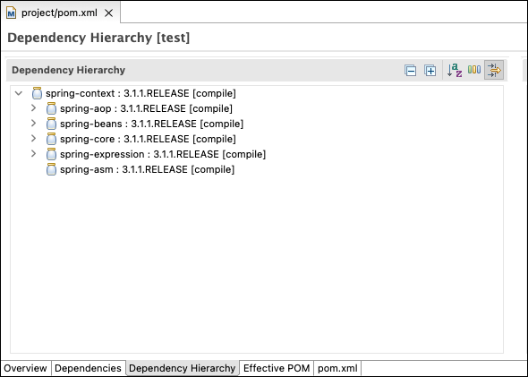
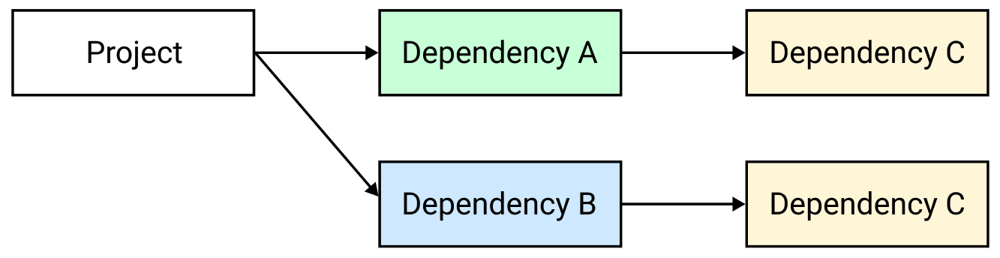
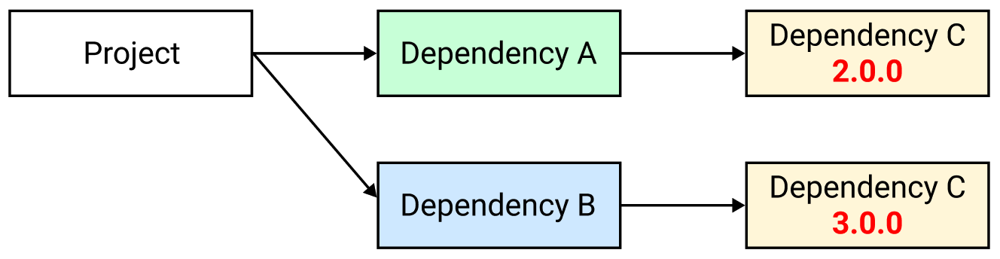
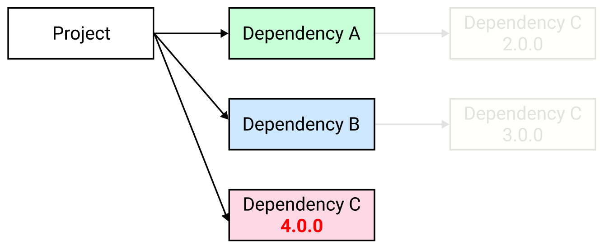
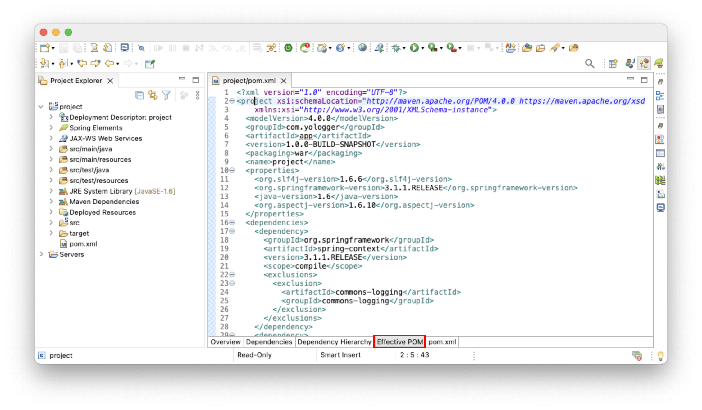

# Table of Contents
[[toc]]

# pom.xml
모든 Maven 프로젝트는 `pom.xml`파일을 포함한다. 이 파일에는 프로젝트를 빌드하는데 필요한 정보들이 나열되어있다.

## 프로젝트 기본 정보
``` xml
<project xmlns="http://maven.apache.org/POM/4.0.0" 
  xmlns:xsi="http://www.w3.org/2001/XMLSchema-instance"
  xsi:schemaLocation="http://maven.apache.org/POM/4.0.0 http://maven.apache.org/maven-v4_0_0.xsd">

    <modelVersion>4.0.0</modelVersion>
    <groupId>com.yologger.project</groupId>
    <artifactId>maven_project</artifactId>
    <version>0.0.1</version>
    <name>maven_project</name>
    <packaging>jar</packaging>
    <url>http://maven.apache.org</url>

</project> 
```
- `<project>`: 최상위 태그
- `<modelVersion>`: pom.xml 파일의 버전이며, 항상 4.0.0 값으로 설정한다.
- `<groupId>`: 조직의 고유 id를 입력한다. 보통 조직 도메인 네임의 역순을 입력한다.
- `<artifactId>`: 애플리케이션을 구분하는 고유 id를 입력한다.
- `<version>`: 해당 artifact의 버전을 입력한다.
- `<packaging>`: 어떤 파일 형식으로 패키징할지 정의한다. jar, war, exe 등이 올 수 있다.
- `<name>`: 애플리케이션의 이름을 입력한다.

## 의존성
`<dependencies>`태그를 사용하면 외부 의존성을 추가할 수 있다. 다음 예제에서는 JUnit 라이브러리를 추가하고있다.
``` xml
<project>

    <!-- .. -->

    <dependencies>
        <dependency>
            <groupId>junit</groupId>
            <artifactId>junit</artifactId>
            <version>3.8.1</version>
            <scope>test</scope>
        </dependency>
    </dependencies>

</project>
```

Maven의 의존성은 `scope`를 가진다. `scope`는 <u>의존성의 적용 범위를 제한하는데 사용</u>한다. 예를 들어 `scope`를 사용하면 의존성을 컴파일 과정에만 적용할 수 도 있고, 런타임에만 적용할 수 있다.

- `compile`: 컴파일 타임과 런타임에 모두 필요한 의존성이다. spring-context.jar, spring-webmvc.jar가 대표적이다.
- `provided`: 컴파일 타임과 런타임에 모두 필요하지만, 런타임에서는 JDK나 Tomcat의 의존성을 사용한다. 예를 들어 JSP(jsp-api.jar), Servlet(servlet-api.jar)은 컴파일 과정에서 필요하지만 런타임 환경에서는 Tomcat에서 제공하는 라이브러리를 사용한다.
- `runtime`: 컴파일 타임에서는 필요없으나 런타임에서는 필요한 의존성이다. 예를 들어 JDBC Driver(mysql-connector-java.jar)가 대표적이다.
- `test`: 테스트 코드를 컴파일할 때는 의존성을 포함하지만 배포할 때는 제외한다. JUnit(junit.jar)가 대표적이다.

## 추이적 의존성
의존성을 다른 의존성을 가질 수 있다. 예를 들어 spring-context.jar는 다른 의존성을 가지고 있다. 이를 `추이적 의존성`이라고 한다.
```
spring-context.jar
├───── spring-core.jar
├───── spring-aop.jar
├───── spring-beans.jar
├───── spring-asm.jar
└───── spring-asm.jar
```


추이적 의존성은 문제를 일으킬 수 있다. 아래 그림을 보자. Dependency A와 Dependency B는 모두 Dependency C에 의존하고 있다.


만약 Dependency C는 버전이 다르다면 어떻게 될까?


이러한 경우 문제가 발생할 수 있기 때문에 다음과 같이 의존 관계를 수정해야한다.


이때 Dependency A와 Dependency B에서 `<exclusion>`태그를 사용하여 Dependency C를 제외할 수 있다. 아래 예제에서는 spring-context.jar에서 commons-logging.jar를 제외하고 있다.
``` xml
<!-- pom.xml -->
<?xml version="1.0" encoding="UTF-8"?>
<project xmlns="http://maven.apache.org/POM/4.0.0" xmlns:xsi="http://www.w3.org/2001/XMLSchema-instance"
	xsi:schemaLocation="http://maven.apache.org/POM/4.0.0 https://maven.apache.org/maven-v4_0_0.xsd">
    <!-- ... -->

    <dependencies>
        <dependency>
            <groupId>org.springframework</groupId>
            <artifactId>spring-context</artifactId>
            <version>${org.springframework-version}</version>
            <exclusions>
                <exclusion>
                    <groupId>commons-logging</groupId>
                    <artifactId>commons-logging</artifactId>
                </exclusion>
            </exclusions>
        </dependency>			 
    </dependencies>

</project>
```

## properties 태그
`<properties>`태그는 pom.xml 파일 내에서 반복적으로 사용되는 상수를 정의할 때 사용한다.
``` xml
<project>

    <!-- properties -->
    <properties>
        <junit-version>3.8.1</junit-version>
        <org.springframework-version>3.1.1.RELEASE</org.springframework-version>
    </properties>

    <!-- dependencies -->
    <dependencies>
        <dependency>
            <groupId>junit</groupId>
            <artifactId>junit</artifactId>
            <version>${junit-version}</version>
            <scope>test</scope>
        </dependency>
        <dependency>
            <groupId>org.springframework</groupId>
            <artifactId>spring-context</artifactId>
            <version>${org.springframework-version}</version>
            <exclusions>
                <exclusion>
                    <groupId>commons-logging</groupId>
                    <artifactId>commons-logging</artifactId>
                </exclusion>
            </exclusions>
            <scope>provided</scope>
        </dependency>
    </dependencies>

</project>
```

## build 태그
`<build>`태그 내부에는 Maven이 프로젝트를 빌드할 때 필요로 하는 정보를 나열한다.
``` xml
<project>
    <build>
        <sourceDirectory>src/main/java</sourceDirectory>
        <testSourceDirectory>src/test/java</testSourceDirectory>
        <outputDirectory>${project.basedir}/target/classes</outputDirectory>
        <resources>
            <resource>
                <directory>src/main/resources</directory>
                <filtering>true</filtering>
            </resource>
        </resources>
        <plugins>
            <plugin>
                <groupId>org.apache.maven.plugins</groupId>
                <artifactId>maven-compiler-plugin</artifactId>
                <version>2.5.1</version>
                <configuration>
                    <source>1.6</source>
                    <target>1.6</target>
                    <compilerArgument>-Xlint:all</compilerArgument>
                    <showWarnings>true</showWarnings>
                    <showDeprecation>true</showDeprecation>
                </configuration>
            </plugin>
            </plugin>
        </plugins>
    </build>
</project>
```
- `<build>`: 빌드 시 사용할 옵션을 나열한다.
- `<sourceDirectory>`: 자바 소스 코드를 관리하는 디렉토리
- `<testSourceDirectory>`: 테스트 소스를 관리하기 위한 디렉토리
- `<outputDirectory>`: sourceDirectory의 소스를 컴파일한 결과물이 위치하는 디렉토리
- `<testOutputDirectory>`: testSourceDirectory의 소스를 컴파일한 결과물이 위치하는 디렉토리
- `<resources>`: 프로젝트에서 사용하는 자원이 위치하는 디렉토리. 이 디렉토리에 포함된 파일들은 빌드 시 포함됩니다.
- `<testResources>`: 테스트에서 사용하는 자원이 위치하는 디렉토리
- `<plugins>`: 플러그인은 Maven이 애플리케이션을 빌드할 때 사용하는 도구다. 이 태그 안에 사용할 플러그인을 나열한다. 모든 Maven 플러그인은 [이 곳](https://maven.apache.org/plugins/index.html)에서 확인할 수 있다.

## Repository 태그
의존성을 다운받을 원격 저장소를 나열한다. 별도로 기술하지 않을 때는 [Maven 저장소](https://mvnrepository.com/)가 기본적으로 사용된다.

조직에서 사용하는 사설 저장소가 있다면 다음과 같이 추가할 수 있다. 자주 사용되는 메이븐 사설 저장소에는 [JBoss 저장소](https://repository.jboss.org/), [Spirng 저장소](https://repo.springsource.org/)가 있다.

``` xml
<project>
    <!-- .. -->

    <!-- Repository -->
    <repositories>
        <repository>
            <id>springsource-repo</id	
            <url>http://repo.springsource.org/release</url>
        </repository>
        <repository>
            <id>jboss-repo</id>
            <url>https://repository.jboss.org/nexus/content/groups/public/</url>
        </repository>
    </repositories>

</project>
```

원격 저장소에서 다운받은 의존성은 로컬 저장소에 저장된다. 로컬 저장소의 위치는 보통 `/[user_home_directory]/.m2/repository`에 위치한다.
``` 
$ pwd
/yologger/.m2/repository

$ ls
antlr                    classworlds              commons-collections      dom4j                    net                      xpp3
aopalliance              com                      commons-digester         index                    org
asm                      commons-beanutils        commons-io               javax                    oro
avalon-framework         commons-chain            commons-lang             junit                    sslext
backport-util-concurrent commons-cli              commons-logging          log4j                    xerces
ch                       commons-codec            commons-validator        logkit 
```

## Plugin Repository
`<pluginRepository>`에는 Maven 플러그인을 다운받을 수 있는 저장소를 나열한다.
``` xml
<project>
    <pluginRepositories>
        <pluginRepository>
            <id>acme corp</id>
            <name>Acme Internal Corporate Repository</name>
            <url>http://acmecorp.com/plugins</url>
            <snapshots>
                <enabled>true</enabled>
            </snapshots>
            <releases>
                <enabled>false</enabled>
            </releases>
        </pluginRepository>
    </pluginRepositories>
</project>
```

## distributionManagement 태그
`deploy goal`을 실행했을 때 배포되는 위치를 기술한다.
``` xml
<project>
<distributionManagement>
    <repository>
        <id>releases-repo</id>
        <name>Releases Repository</name>
        <url>일반적인 회사 내부 repository url</url>
    </repository>
    <snapshotRepository>
        <id>snapshots-repo</id>
        <name>Snapshots Repository</name>
        <url>일반적인 회사 내부 repository url</url>
    </snapshotRepository>
</distributionManagement>s
</project>
``` 

## Super pom.xml
Maven 프로젝트의 모든 pom.xml은 사전에 정의된 `Super pom.xml`을 암시적으로 상속한다. Super pom.xml에는 사전에 합리적으로 정의한 환경설정이 포함되어있다. 프로젝트의 pom.xml은 이 Super pom.xml을 암시적으로 상속하기 때문에 모든 환경설정을 번거롭게 구성할 필요가 없다.

이처럼 사전에 합리적으로 정의된 환경설정을 제공하여 환경설정 비용을 줄이는 것을 `설정보다 관습(CoC, Convention over Configuration)`이라고 한다.

`Super pom.xml`내용은 다음과 같다.
``` xml
<project>
  <modelVersion>4.0.0</modelVersion>

  <repositories>
    <repository>
      <id>central</id>
      <name>Central Repository</name>
      <url>http://repo.maven.apache.org/maven2</url>
      <layout>default</layout>
      <snapshots>
        <enabled>false</enabled>
      </snapshots>
    </repository>
  </repositories>

  <pluginRepositories>
    <pluginRepository>
      <id>central</id>
      <name>Central Repository</name>
      <url>http://repo.maven.apache.org/maven2</url>
      <layout>default</layout>
      <snapshots>
        <enabled>false</enabled>
      </snapshots>
      <releases>
        <updatePolicy>never</updatePolicy>
      </releases>
    </pluginRepository>
  </pluginRepositories>

  <build>
    <directory>${project.basedir}/target</directory>
    <outputDirectory>${project.build.directory}/classes</outputDirectory>
    <finalName>${project.artifactId}-${project.version}</finalName>
    <testOutputDirectory>${project.build.directory}/test-classes</testOutputDirectory>
    <sourceDirectory>${project.basedir}/src/main/java</sourceDirectory>
    <scriptSourceDirectory>src/main/scripts</scriptSourceDirectory>
    <testSourceDirectory>${project.basedir}/src/test/java</testSourceDirectory>
    <resources>
      <resource>
        <directory>${project.basedir}/src/main/resources</directory>
      </resource>
    </resources>
    <testResources>
      <testResource>
        <directory>${project.basedir}/src/test/resources</directory>
      </testResource>
    </testResources>
    <pluginManagement>
      <!-- NOTE: These plugins will be removed from future versions of the super POM -->
      <!-- They are kept for the moment as they are very unlikely to conflict with lifecycle mappings (MNG-4453) -->
      <plugins>
        <plugin>
          <artifactId>maven-antrun-plugin</artifactId>
          <version>1.3</version>
        </plugin>
        <plugin>
          <artifactId>maven-assembly-plugin</artifactId>
          <version>2.2-beta-5</version>
        </plugin>
        <plugin>
          <artifactId>maven-dependency-plugin</artifactId>
          <version>2.1</version>
        </plugin>
        <plugin>
          <artifactId>maven-release-plugin</artifactId>
          <version>2.0</version>
        </plugin>
      </plugins>
    </pluginManagement>
  </build>

  <reporting>
    <outputDirectory>${project.build.directory}/site</outputDirectory>
  </reporting>

  <profiles>
    <!-- NOTE: The release profile will be removed from future versions of the super POM -->
    <profile>
      <id>release-profile</id>

      <activation>
        <property>
          <name>performRelease</name>
          <value>true</value>
        </property>
      </activation>

      <build>
        <plugins>
          <plugin>
            <inherited>true</inherited>
            <artifactId>maven-source-plugin</artifactId>
            <executions>
              <execution>
                <id>attach-sources</id>
                <goals>
                  <goal>jar</goal>
                </goals>
              </execution>
            </executions>
          </plugin>
          <plugin>
            <inherited>true</inherited>
            <artifactId>maven-javadoc-plugin</artifactId>
            <executions>
              <execution>
                <id>attach-javadocs</id>
                <goals>
                  <goal>jar</goal>
                </goals>
              </execution>
            </executions>
          </plugin>
          <plugin>
            <inherited>true</inherited>
            <artifactId>maven-deploy-plugin</artifactId>
            <configuration>
              <updateReleaseInfo>true</updateReleaseInfo>
            </configuration>
          </plugin>
        </plugins>
      </build>
    </profile>
  </profiles>

</project>
```
Eclipse 환경에서 프로젝트의 pom.xml 파일을 오픈한 후 `Effective POM` 탭을 확인할 수 있다.


Effective POM은 Super pom과 프로젝트의 pom.xml을 병합하여 프로젝트에 최종 적용되는 pom.xml이다.