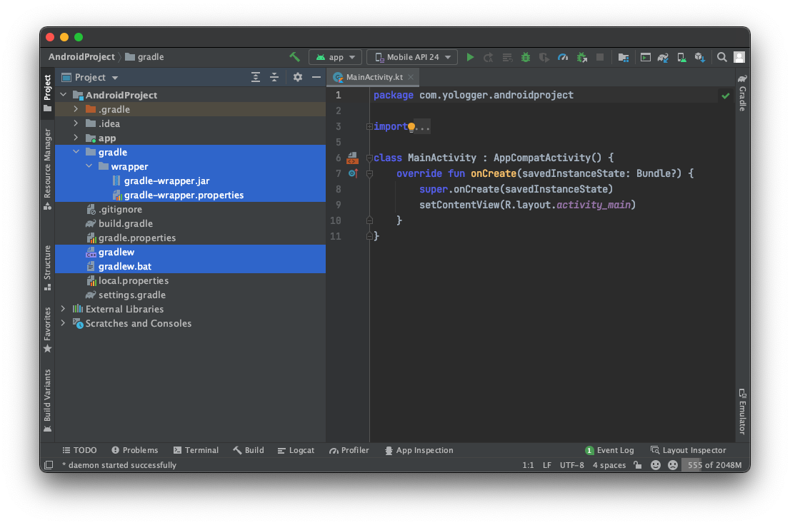

# Table of Contents
[[toc]]

# Gradle 시작하기
`Gradle`은 그루비 언어를 기반으로 한 빌드 도구다. Gradle은 Ant나 Maven같은 이전 세대의 빌드 도구의 단점을 보완하고 장점을 취합하여 만든 오픈소스 빌드 도구다.

## Gradle 설치
Mac OS 환경에서 Homebrew로 Gradle을 설치해보자.
```
$ brew install gradle
```

다음 명령어로 Gradle의 설치여부와 버전을 확인할 수 있다.
```
$ gradle --v
```
```
Welcome to Gradle 7.3.1!
```
Homebrew로 설치 경로 등의 정보를 확인할 수 있다.
```
$ brew info gradle
```
```
gradle: stable 7.3.1 (bottled)
Open-source build automation tool based on the Groovy and Kotlin DSL
https://www.gradle.org/
/usr/local/Cellar/gradle/7.3.1 (11,110 files, 266.3MB) *
  Poured from bottle on 2021-12-13 at 14:31:46
From: https://github.com/Homebrew/homebrew-core/blob/HEAD/Formula/gradle.rb
License: Apache-2.0
==> Dependencies
Required: openjdk ✔
==> Analytics
install: 49,077 (30 days), 120,116 (90 days), 552,595 (365 days)
install-on-request: 48,775 (30 days), 119,457 (90 days), 547,531 (365 days)
build-error: 0 (30 days)
```

## Gradle 프로젝트 생성하기
Gradle로 간단한 프로젝트를 생성해보자. 먼저 디렉토리를 생성하자.
```
$ mkdir myProject
$ cd myProject
```
`gradle init`명령어로 해당 프로젝트를 Gradle 프로젝트로 초기화할 수 있다.
``` 
$ gradle init
```
생성할 프로젝트 정보를 입력해야한다. 일단 아래와 같이 입력하자.
```
Select type of project to generate:
  1: basic
  2: application
  3: library
  4: Gradle plugin
Enter selection (default: basic) [1..4] 1

Select build script DSL:
  1: Groovy
  2: Kotlin
Enter selection (default: Groovy) [1..2] 1

Generate build using new APIs and behavior (some features may change in the next minor release)? (default: no) [yes, no] no

Project name (default: myProject): myProject
```
프로젝트가 성공적으로 생성되면 다음과 같이 출력된다.
```
> Task :init
Get more help with your project: Learn more about Gradle by exploring our samples at https://docs.gradle.org/7.3.1/samples
```
Gradle 프로젝트는 다음과 같은 구조를 가진다.
```
$ tree .
.
├── build.gradle
├── settings.gradle
├── gradle
│   └── wrapper
│       ├── gradle-wrapper.jar
│       └── gradle-wrapper.properties
├── gradlew
├── gradlew.bat
└── .gradle

2 directories, 6 files
```
각 파일 및 폴더의 역할은 다음과 같다.

### build.gradle
`build.gradle`은 Gradle 프로젝트의 핵심 파일이다. Gradle이 프로젝트를 빌드할 때 필요한 작업을 나열한다. 이러한 파일을 `빌드 스크립트`라고 한다.

### settings.gradle
프로젝트에 대한 설정 정보가 포함된다. 프로젝트의 타입을 `1: basic`으로 선택했다면 다음과 같은 내용이 포함되어있다.
``` groovy 
// settings.gradle
rootProject.name = 'myProject'
```
만약 프로젝트가 여러 모듈로 구성되어 있다면 다음과 같이 작성해야한다.
``` groovy
settings.gradle
rootProject.name = 'myProject'

include('moduleA')
include('moduleB')
include('moduleC')
```
### .gradle
Gradle이 관리하는 프로젝트는 `.gradle`디렉토리를 포함한다. 개발자가 이 디렉토리를 직접 편집하는 일은 거의 없다.

### 그 외의 파일
그 외의 파일은 뒤에서 배울 `Gradle Wrapper`와 관련되어있다.
- `gradlew`
- `gradlew.bat`
- `gradle/wrapper/gradle-wrapper.jar`
- `gradle/wrapper/gradle-wrapper.properties`

## Java 소스코드 작성
이제 Java 소스코드를 작성해보자. 우선 `src/java/main` 디렉토리를 생성한다.
``` console
$ mkdir -p src/java/main
$ cd src/java/main
```
이 디렉토리 안에 패키지를 생성한다.
```
$ mkdir -p com.yologger.app
```
디렉토리 구조는 다음과 같다.
```
$ tree
.
├── build.gradle
├── gradle
│   └── wrapper
│       ├── gradle-wrapper.jar
│       └── gradle-wrapper.properties
├── gradlew
├── gradlew.bat
├── settings.gradle
└── src
    └── main
        └── java
            └── com
                └── yologger
                    └── app
                        └── Main.java
```
`Main.java`파일을 생성하고 아래와 같이 코드를 작성한다.
``` java Main.java
package com.yologger.app;

public class Main {
    public static void main(String[] args) {
        System.out.println("Hello World!");
    }
}
```


## 빌드 스크립트 작성
`build.gradle`에는 프로젝트를 빌드할 때 필요한 작업들을 나열한다. 일단 다음과 같이 작성하자.
``` groovy build.gradle
// 플러그인 추가
apply plugin: 'java'
apply plugin: 'application'

application {
    // Main 함수가 포함된 클래스 지정
    mainClass = 'com.yologger.app.Main'
}
```

## 프로젝트 빌드
다음 명령어를 입력하여 프로젝트를 빌드할 수 있다.
```
$ gradle compileJava 
```
빌드가 정상적으로 수행되면 콘솔에 다음 내용이 출력된다.
```
BUILD SUCCESSFUL in 0s
1 actionable task: 1 executed
```
프로젝트의 루트 디렉토리에 `build`디렉토리가 생성된다. 컴파일된 코드가 이 곳에 저장된다.
```
$ ls
src
build           
...
```
```
$ tree
.
├── build
│   ├── classes
│   │   └── java
│   │       └── main
│   │           └── com
│   │               └── yologger
│   │                   └── app
│   │                       └── Main.class
│   └── ...
└── ...
```
앱을 실행할 수도 있다.
``` 
$ gradle run

> Task :run
Hello World!

BUILD SUCCESSFUL in 627ms
2 actionable tasks: 1 executed, 1 up-to-date
```
`build`디렉토리를 삭제할 수도 있다.
```
$ gradle clean
```


## Gradle Wrapper
안드로이드 스튜디오를 사용하는 개발자는 의문이 생길 수도 있다. Gradle을 별도로 설치하지 않고도 프로젝트를 빌드할 수 있기 때문이다. 이를 가능하게 하는 것이 `Gradle Wrapper`다.

`gradle init`명령어로 Gradle 프로젝트를 초기화하면 다음 파일들도 생성된다.
- `gradlew`
- `gradlew.bat`
- `gradle/wrapper/gradle-wrapper.jar`
- `gradle/wrapper/gradle-wrapper.properties`

이 네 가지 파일들이 `Gradle Wrapper`와 관련있다.

### gradlew
유닉스 기반 환경에서 Gradle 명렁어를 실행하기 위한 스크립트 파일

### gradlew.bat
윈도우 기반 환경에서 Gradle 명렁어를 실행하기 위한 스크립트 파일이다.

### gradle/wrapper/gradle-wrapper.jar
그래들 래퍼 파일. `gradlew` 또는 `gradlew.bat`이 실행되면 운영체제에 맞는 환경을 로컬 컴퓨터에 다운받아 구성한 후 빌드 작업을 실행합니다.

### gradle/wrapper/gradle-wrapper.properties
그래들 래퍼 설정 파일

## Gradle Wrapper로 프로젝트 빌드
이제 유닉스 계열인 Mac OS 환경에서 Gradle Wrapper를 통해 프로젝트를 빌드해보자.
```
$ ./gradlew build
```
위 명령어는 로컬 PC에 Gradle을 설치하고 `gradle build`명령어를 실행한 것과 동일하다.

## 안드로이드 스튜디오와 Gradle Wrapper
안드로이드 스튜디오에서 프로젝트를 생성하면 자동으로 `Gradle Wrapper`와 관련된 파일이 생성된다. 따라서 이 프로젝트를 다른 로컬 PC에 구성해도 `Gradle`을 설치하지 않고도 빌드할 수 있다.


## Gradle로 다양한 프로젝트 만들기
Gradle을 사용하면 다양한 어플리케이션을 생성할 수 있다. 

### Java 프로젝트 생성해보기
우선 Java 프로젝트를 생성해보자.
```{9,17}
$ mkdir JavaApplication

$ cd JavaApplication

$ gradle init

Select type of project to generate:
  1: basic
  2: application
  3: library
  4: Gradle plugin
Enter selection (default: basic) [1..4] 2

Select implementation language:
  1: C++
  2: Groovy
  3: Java
  4: Kotlin
  5: Scala
  6: Swift
Enter selection (default: Java) [1..6] 3

Split functionality across multiple subprojects?:
  1: no - only one application project
  2: yes - application and library projects
Enter selection (default: no - only one application project) [1..2] 

Select build script DSL:
  1: Groovy
  2: Kotlin
Enter selection (default: Groovy) [1..2] 1

Generate build using new APIs and behavior (some features may change in the next minor release)? (default: no) [yes, no] 
Select test framework:
  1: JUnit 4
  2: TestNG
  3: Spock
  4: JUnit Jupiter
Enter selection (default: JUnit Jupiter) [1..4] 

Project name (default: JavaApplication): 
Source package (default: JavaApplication): com.yologger.app    

> Task :init
Get more help with your project: https://docs.gradle.org/7.3.1/samples/sample_building_java_applications.html

BUILD SUCCESSFUL in 29s
2 actionable tasks: 2 executed
```
생성된 프로젝트의 구조는 다음과 같다.
```
$ tree
.
├── app
│   ├── build.gradle
│   └── src
│       ├── main
│       │   ├── java
│       │   │   └── com
│       │   │       └── yologger
│       │   │           └── app
│       │   │               └── App.java
│       │   └── resources
│       └── test
│           ├── java
│           │   └── com
│           │       └── yologger
│           │           └── app
│           │               └── AppTest.java
│           └── resources
├── gradle
│   └── wrapper
│       ├── gradle-wrapper.jar
│       └── gradle-wrapper.properties
├── gradlew
├── gradlew.bat
└── settings.gradle
```

### Kotlin 프로젝트 생성해보기
우선 Kotlin 프로젝트를 생성해보자.
``` {9,18}
$ mkdir KotlinApplication

$ cd KotlinApplication

$ gradle init

Select type of project to generate:
  1: basic
  2: application
  3: library
  4: Gradle plugin
Enter selection (default: basic) [1..4] 2

Select implementation language:
  1: C++
  2: Groovy
  3: Java
  4: Kotlin
  5: Scala
  6: Swift
Enter selection (default: Java) [1..6] 4

Split functionality across multiple subprojects?:
  1: no - only one application project
  2: yes - application and library projects
Enter selection (default: no - only one application project) [1..2] 

Select build script DSL:
  1: Groovy
  2: Kotlin
Enter selection (default: Kotlin) [1..2] 1

Generate build using new APIs and behavior (some features may change in the next minor release)? (default: no) [yes, no] 
Project name (default: KotlinApplication): 
Source package (default: KotlinApplication): com.yologger.app

> Task :init
Get more help with your project: https://docs.gradle.org/7.3.1/samples/sample_building_kotlin_applications.html

BUILD SUCCESSFUL in 24s
2 actionable tasks: 2 executed
```
프로젝트 구조는 다음과 같다.
```
$ tree
.
├── app
│   ├── build.gradle
│   └── src
│       ├── main
│       │   ├── kotlin
│       │   │   └── com
│       │   │       └── yologger
│       │   │           └── app
│       │   │               └── App.kt
│       │   └── resources
│       └── test
│           ├── kotlin
│           │   └── com
│           │       └── yologger
│           │           └── app
│           │               └── AppTest.kt
│           └── resources
├── gradle
│   └── wrapper
│       ├── gradle-wrapper.jar
│       └── gradle-wrapper.properties
├── gradlew
├── gradlew.bat
└── settings.gradle

16 directories, 8 files
```