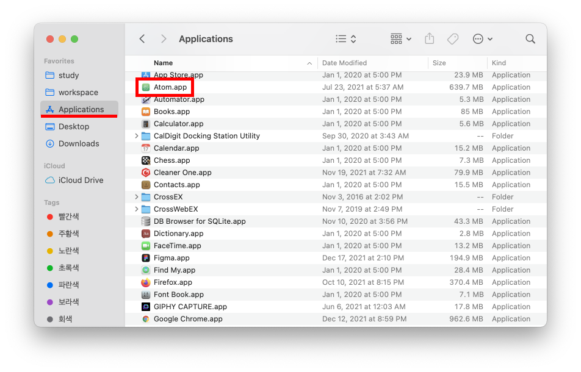
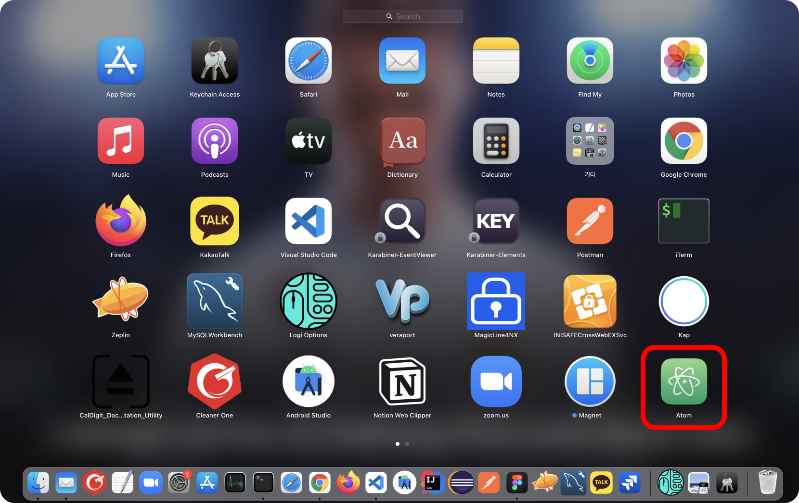

# Table of Contents
[[toc]]

# Homebrew
`Homebrew`는 MacOS용 패키지 관리자다. Homebrew를 사용하면 패키지를 쉽게 설치, 관리, 업데이트, 제거할 수 있다.


## Homebrew 설치
터미널에서 다음 명령어를 입력하면 Homebrew가 설치된다.
``` shellsession
$ /usr/bin/ruby -e "$(curl -fsSL https://raw.githubusercontent.com/Homebrew/install/master/install)"
```

Homebrew의 버전을 확인해보자.
``` shellsession
$ brew --version
```
```
Homebrew 3.3.7
Homebrew/homebrew-core (git revision 099747a08de; last commit 2021-12-13)
Homebrew/homebrew-cask (git revision e7bdec90ea; last commit 2021-12-13)
```

## Homebrew 명령어 요약
Homewbrew의 명령어는 다음과 같다.

|명령어|설명|비고|
|------|---|---|
|brew install <package_name>|패키지 설치|
|brew uninstall <package_name>|패키지 삭제|
|brew upgrade <package_name>|패키지 업그레이드|패키지명 미입력시, 전체 업그레이드|
|brew search <package_name>|패키지 검색|
|brew list|설치된 패키지 목록 확인하기|
|brew update|Homebrew 업데이트|

## 패키지 설치
이제 Homebrew로 `mysql`을 설치해보자. 우선 `brew search`명령어로 애플리케이션을 검색해보자.
``` shellsession
$ brew search mysql
```
```
==> Formulae
automysqlbackup             mysql-client                mysql-sandbox               mysql@5.7
mysql ✔                     mysql-client@5.7            mysql-search-replace        mysqltuner
mysql++                     mysql-connector-c++         mysql@5.6                   qt-mysql
==> Casks
mysql-connector-python      mysql-utilities             navicat-for-mysql
mysql-shell                 mysqlworkbench              sqlpro-for-mysql
```
mysql을 설치하자.
``` shellsession
$ brew install mysql
```

## 설치된 패키지 목록 확인
`brew list `명령어로 설치된 패키지 목록을 확인할 수 있다.
``` shellsession
$ brew list 
```
```
==> Formulae
gradle      maven       mysql       curl
git         curl        carthage    tree
...

==> Casks
adoptopenjdk8   android-platform-tools	iterm2
```

## 데몬 구동
`mysql`은 백그라운드에서 데몬 프로세스로 동작한다. mysql은 다음과 같이 구동할 수 있다.
``` shellsession
$ brew services start mysql
==> Successfully started `mysql` (label: homebrew.mxcl.mysql)
```

## 실행 중인 데몬 목록 확인
실행 중인 목록도 확인할 수 있다.
``` shellsession
$ brew services
Name  Status  User      File
mysql started yologger  ~/Library/LaunchAgents/homebrew.mxcl.mysql.plist
```

## 데몬 재시작
`brew services restart` 명령어로 데몬을 재시작할 수 있다.
``` shellsession
$ brew services restart mysql
Stopping `mysql`... (might take a while)
==> Successfully stopped `mysql` (label: homebrew.mxcl.mysql)
==> Successfully started `mysql` (label: homebrew.mxcl.mysql)
```

## 데몬 정지
데몬을 정지할 수 있다.
```
$ brew services stop mysql
Stopping `mysql`... (might take a while)
==> Successfully stopped `mysql` (label: homebrew.mxcl.mysql)
```

## 패키지 설치 경로
Homebrew로 설치한 패키지는 `/usr/local/Cellar`에 위치한다.
``` shellsession
$ cd /usr/local/Cellar
$ ls
mysql
grradle
carrthage
heroku
curl
openjdk
git
kootliin
maven
tree
...
```

## Homebrew Cask
`Homebrew Cask`를 사용하면 Chrome, Atom 등 GUI 기반의 어플리케이션을 설치할 수 있다.

우선 `Homebrew Cask`를 설치해야한다.
``` shellsession
$ brew install cask
```
잘 설치되었는지 확인해보자.
``` shellsession
$ brew list
cask
...
``` 
이제 `Atom`을 설치해보자.
``` shellsession
// $ brew install --cask <package_name>
$ brew install --cask atom
```
Atom이 잘 설치되었는지 확인해보자.
``` shellsession{2}
$ brew list --cask
atom
...
```
`Homebrew Cask`로 설치한 패키지는 `Application`디렉토리에서 확인할 수 있다.

`Launchpad`에서도 확인할 수 있다.
