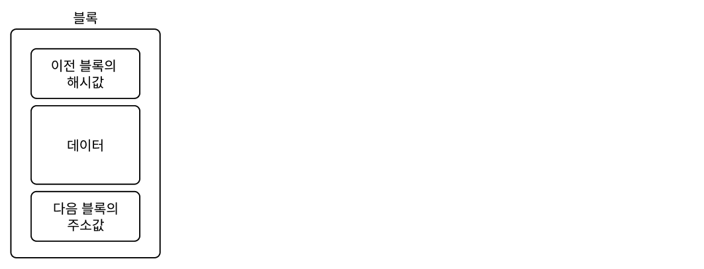
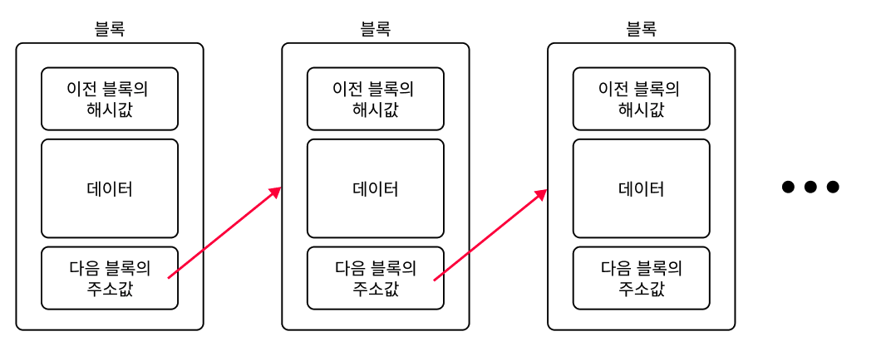

# 블록체인과 암호화폐, 그리고 NFT

2017년, 한국에서 비트코인 열풍이 불면서 암호화폐의 근간이 되는 블록체인 기술에도 많은 관심이 쏟아졌다. 그리고 2022년, NFT가 등장하면서 블록체인이 또 한번 주목을 받고 있다. 암호화폐와 NFT를 기술적으로 이해하려면 블록체인을 간단하게 살펴볼 필요가 있다.

## 블록체인
`블록체인(Blockchain)`은 데이터 위변조 방지 기술이다. 블록체인은 연결리스트와 유사한데 데이터가 저정되는 `블록(Block)`을 체인처럼 연결된다. 이 블록 하나는 `데이터`, `이전 블록의 해시값`, `다음블록의 주소값`으로 구성되어있다.

하나의 블록이 꽉차면 새로운 블록을 생성하고, 이전 블록의 해시값을 저장한 후 데이터를 계속 저장한다.

이러한 블록들은 여러 참여자에게 분산되어 저장되기 때문에 한 참여자가 데이터를 변경해도 다른 참여자들의 블록, 해시값과 비교하여 위변조를 탐지할 수 있다. 또한 한 블록의 데이터를 위변조하려면 뒤에 연결된 모든 블록의 `이전 블록의 해시값`도 모두 변경해야하는데, 데이터와 블록이 추가되는 속도를 사실상 따라갈 수가 없다. 이러한 특성 때문에 블록체인은 다음과 같은 장점이 있다.

- 데이터 위변조 방지
- 탈 중앙화

반면 데이터를 조회하거나 삽입하려면 첫 블록에서부터 끝 노드까지 순회탐색을 해야하며, 모든 참여자의 블록체인도 수정해야하기 때문에 속도가 느리다는 단점이 있다. 또한 전통적인 `RDBMS`도 금융정보, 개인정보 같은 민감한 데이터를 변경, 삭제할 때 별도의 테이블에 내역을 기록하도록 강제하기 때문에 데이터 위변조를 법적으로 어느 정도 방지할 수 있다.

## 암호화폐
이러한 탈중앙화, 위변조 불가능한 블록체인에 한정된 수량의 화폐를 데이터 형태로 저장한 것을 `암호화폐`라고 한다. 

## NFT
`NFT(대체불가능 토큰)` 역시 블록체인 기술을 사용하여 디지털 자산의 소유주를 증명하는 기술이다. 위변조 불가능한 특성을 사용하여 `디지털 자산(=데이터)`의 소유주를 증명하는 증명서, 즉 토큰을 블록체인에 저장하는 것이다. 

## 결론
필자는 블록체인과 암호화폐가 처음 등장했을 때 의구심이 있었다. 그 이유는 다음과 같다.
- 은행 같은 대용량 트래픽에 블록체인의 느린 속도는 치명적이다.
- 참여자가 블록의 51%를 차지하면 위변조가 가능한데 정부에서 통제하는 화폐보다 안전한가?

그러나 암호화폐는 투자 열풍과 결합되어 엄청난 광풍을 가져왔다. 필자도 소액의 코인 투자를 하는 입장이기 때문에 기술의 사회적 효용성, 유용성에 대한 개인적인 생각을 여기서 말하진 않겠다. 다만 암호화폐는 아직까지는 화폐에 가깝기보단 `금(Gold)`나 `은(Silver)`처럼 희소성있고 사회 구성원 다수가 의미를 부여한 자산을 만들어낸 것이라고 생각한다. 또한 암호화폐를 보고 기술의 가치와 사회적 활용은 일치하지 않는다는 것을 크게 느꼈다. 

솔직히 말하자면 앞으로의 암호화폐가 어떤 방향으로 흘러갈지는 잘 모르겠다. 다만 근간이 되는 블록체인 기술은 속도를 포기하더라도 반드시 위변조 방지를 보장해야하는 분야, 예를 들면 `디지털 창작물`과 `NFT`에 사용될 수 있을 것 같다. 또한 블록체인과 기존 데이터베이스는 경쟁관계가 아니며 상호보완하면서 사용해야 한다고 생각한다.

